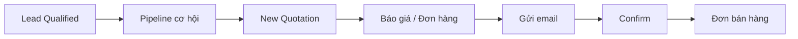

# Báo giá, đơn bán hàng và hợp đồng

!!! info "Nguồn tài liệu"
    Chức năng / Sales — Phiên bản 1.0 (CRM VAN — *06_Quotation_Order_Contract_Process*).

## Mục tiêu

Hướng dẫn TVV xử lý **báo giá** và **đơn bán hàng** sau khi cơ hội đủ điều kiện báo giá:

- Tạo báo giá: **New Quotation** | Mở lại: **View Quotation**
- Kiểm tra **Bảng giá/Pricelist**, mã hợp đồng, sản phẩm
- **Discount** (voucher) vs **Promotion** (ưu đãi công ty)
- Gửi email → **Confirm** → **Đơn bán hàng**
- Nguyên tắc đổi sản phẩm, hủy đơn, **KPI** (phối hợp kế toán)

Trọng tâm: thao tác **CRM cho TVV**. Phần kế toán/KPI giúp TVV hiểu vì sao đơn có thể bị trả lại.

!!! tip "Lognote"
    Sau mỗi phiên làm việc báo giá/đơn hàng → ghi **Lognote** (trao đổi báo giá, voucher, promotion, đồng ý/không ký, cancel, đơn bị trả lại).

## Vị trí trong quy trình CRM



Trước đó: [Tạo Lead & Qualified](tao-lead-qualified.md) → [Pipeline cơ hội](pipeline.md). Sau **Confirm**, cơ hội tự **Thành công**.

## Đối tượng sử dụng

| Nhóm | Vai trò |
|------|---------|
| Tư vấn viên | Kiểm tra báo giá, gửi email, Confirm |
| Quản lý KD | Kiểm tra báo giá, đơn bán |
| Kế toán | Kiểm tra đơn cuối, hủy đơn, hợp đồng, KPI |
| CRM Admin | Lỗi bảng giá, mã HĐ, sản phẩm |

---

## Trạng thái báo giá / đơn hàng

| Trạng thái | Ý nghĩa | TVV |
|------------|---------|-----|
| **Báo giá** | Quotation mới từ **New Quotation** | Kiểm tra Pricelist, mã HĐ, sản phẩm |
| **Báo giá đã gửi** | Đã gửi email | Theo dõi phản hồi khách |
| **Đơn bán hàng** | Đã **Confirm** | Kiểm tra đơn; phối hợp kế toán |

- Gửi email thành công → **Báo giá đã gửi**
- Khách đồng ý + **Confirm** → **Đơn bán hàng**
- Khách không ký → **Cancel** báo giá → automation pipeline **Thất bại**

---

## Dữ liệu báo giá bắt buộc đúng

| Trường | Ghi chú |
|--------|---------|
| Báo giá/Quotation | Đúng cơ hội và khách |
| Khách hàng | Đúng KH hoặc người đại diện |
| Email | Bắt buộc nếu gửi email |
| Ngày sinh, Địa chỉ | Bắt buộc trước Confirm nếu hệ thống yêu cầu |
| Nhu cầu, Chương trình, Thị trường | **Khớp bảng giá** |
| Năm chương trình | Năm kinh doanh thực tế |
| **Bảng giá/Pricelist** | Theo 4 trường trên |
| **Order Lines** | Sản phẩm đúng, đủ |
| VP tư vấn | Đúng chi nhánh |

Hệ thống lấy dữ liệu từ **Opportunity** để xác định Pricelist và sản phẩm.

### Thông tin khách hàng — tab Other Info (team Docs)

Dữ liệu đầu vào cho team **Docs** xử lý hồ sơ. Thiếu/sai → kế toán **trả lại** đơn.

**Định cư:**

| Trường | Ghi chú |
|--------|---------|
| Hãng xưởng | Bắt buộc nếu CT yêu cầu |

**Du học:**

| Trường | Ghi chú |
|--------|---------|
| Lớp | Lớp hiện tại / theo tư vấn |
| Kỳ nhập học | Dự kiến |
| Tên trường | Theo CT tư vấn |
| Tổ chức, Ngành học | Tùy chương trình |

---

## Discount và Promotion

| Nút | Dùng khi | Lưu ý |
|-----|----------|--------|
| **Discount** | **Voucher** tặng riêng khách | **Add note** ghi rõ voucher |
| **Promotion** | Ưu đãi hội thảo, sự kiện, CT công ty | **Không** dùng Discount thay Promotion |

Kế toán kiểm tra đơn cuối — dùng sai → **không duyệt**, trả TVV.

### Discount (voucher)

1. Kiểm tra voucher hợp lệ.
2. **Discount** → nhập mức chiết khấu.
3. **Add note**, ví dụ: `Khách sử dụng voucher [mã] theo chương trình [tên].`

### Promotion (công ty)

- Khách đủ điều kiện theo cấu hình hệ thống.

**Theo campaign/sự kiện:**

1. **Contact** khách → **Register Campaign** → chọn đúng campaign.
2. Khách đăng ký đúng sự kiện; Nhu cầu + Chương trình khớp tiêu chí.
3. Còn hiệu lực; check-in nếu yêu cầu.

**Theo nhóm liên hệ** (DHS ký định cư, phụ huynh…):

- Kiểm tra **Related Contacts** đã gom đúng nhóm — xem [Pipeline](pipeline.md).

---

## Thay đổi sản phẩm, hủy đơn và KPI

### Khách đổi sản phẩm **trước khi ký**

**Không** sửa tạm trên báo giá → quay **Opportunity**:

```text
Khách đổi sản phẩm/CT/thị trường/năm
→ Cập nhật pipeline trên Opportunity
→ View Quotation hoặc New Quotation
→ Gửi email → Confirm nếu đồng ý
```

### Khách đổi sản phẩm **sau khi đã ký**

**Không** sửa tay đơn cũ:

```text
Tạo cơ hội mới → Đơn hàng mới
→ Kế toán hủy toàn bộ đơn cũ
```

Ghi Lognote lý do đổi sản phẩm.

### Nguyên tắc KPI (TVV cần biết)

- KPI tính theo **Hợp đồng** + **Ngày đóng tiền** khách.
- Kế toán hoàn thành hợp đồng trên hệ thống → điểm KPI TVV cập nhật.
- TVV không tự kết luận KPI đã ghi nếu kế toán chưa xong bước hợp đồng.

| Hủy đơn | KPI |
|--------|-----|
| Hủy **hoàn tiền** | Hủy toàn bộ điểm đơn đó |
| Hủy **không hoàn tiền** | **Giữ** điểm |

### Chuyển điểm giữa TVV

Một **kỳ KPI** = **4 tháng** trong năm kinh doanh công ty.

| Trường hợp | Xử lý |
|------------|--------|
| Cùng kỳ KPI | Chuyển điểm cho người phụ trách cuối |
| Khác kỳ | **Không** chuyển điểm |

Ví dụ:

```text
TVV A ký khách tháng 10 → tháng 12 nghỉ, bàn giao TVV B (cùng kỳ) → điểm chuyển cho B
TVV A ký khách tháng 10 → tháng 1 nghỉ, bàn giao TVV B (sang kỳ mới) → không chuyển điểm
```

Ghi Lognote khi bàn giao khách.

---

## Quy trình thực hiện

### Bước 1 — Tạo hoặc mở báo giá

1. Mở cơ hội (stage **Cân nhắc đăng ký** / **Chuyển hợp đồng**).
2. Chưa có báo giá → **New Quotation**.
3. Đã có → **View Quotation**.
4. Kiểm tra đúng khách và cơ hội.

### Bước 2 — Kiểm tra thông tin báo giá

Kiểm tra: Khách, Nhu cầu, Chương trình, Thị trường, Năm CT, **Pricelist**, mã HĐ, **Order Lines**, tab **Other Info**.

Sai Nhu cầu/Chương trình/Thị trường/Năm → **sửa Opportunity** trước, không chọn sản phẩm “gần đúng”.

### Bước 3 — Discount / Promotion

Voucher → **Discount** + note. Ưu đãi công ty → **Promotion** + kiểm tra điều kiện.

### Bước 4 — Gửi email

1. Kiểm tra email khách.
2. **Gửi email** → trạng thái **Báo giá đã gửi**.
3. Thiếu email → bổ sung → gửi lại.
4. Ghi Lognote nếu có trao đổi quan trọng.

### Bước 5 — Confirm

1. Xác nhận khách **đồng ý**.
2. Kiểm tra ngày sinh, địa chỉ, **Other Info** (Docs).
3. **Confirm** → **Đơn bán hàng**.
4. Thiếu thông tin → bổ sung → Confirm lại.
5. Kế toán trả đơn → sửa theo yêu cầu → ghi Lognote.

Sau Confirm: cơ hội tự **Thành công**; tiếp tục xử lý hợp đồng với kế toán.

---

## Lỗi thường gặp

| Lỗi | Cách xử lý |
|-----|------------|
| Không có đơn giá sản phẩm | Kiểm tra Opportunity + Pricelist |
| Pricelist / mã HĐ sai | Sửa Nhu cầu, CT, Thị trường, Năm trên Opportunity |
| Discount thay Promotion | Dùng lại **Promotion**; báo KT nếu cần |
| Promotion không áp dụng | Kiểm tra campaign, check-in, Related Contacts |
| Gửi email thiếu email KH | Bổ sung email |
| Confirm thiếu ngày sinh/địa chỉ | Bổ sung trên hồ sơ KH |
| KT trả đơn thiếu thông tin Docs | Bổ sung **Other Info** |
| Đổi SP trước ký | Sửa Opportunity, không sửa tạm báo giá |
| Đổi SP sau ký | Cơ hội mới + đơn mới; KT hủy đơn cũ |
| Confirm khi KH chưa đồng ý | Không Confirm |

---

## Checklist TVV

- [ ] Cơ hội đủ điều kiện; New vs View Quotation đúng
- [ ] Pricelist, mã HĐ, Order Lines đúng
- [ ] Other Info đủ (định cư / du học)
- [ ] Discount + note (voucher) hoặc Promotion (CT công ty)
- [ ] Email gửi → **Báo giá đã gửi**
- [ ] Khách đồng ý → Confirm → **Đơn bán hàng**
- [ ] Lognote đầy đủ; hiểu KPI / hủy đơn / chuyển điểm

---

## Bài thực hành

| Bài | Nội dung |
|-----|----------|
| **1** | Kiểm tra báo giá, Pricelist, Order Lines, Other Info |
| **2** | Phân biệt Discount vs Promotion |
| **3** | Gửi email + xử lý thiếu email |
| **4** | Confirm + bổ sung ngày sinh/địa chỉ |
| **5** | Khách đổi SP sau ký → cơ hội/đơn mới |
| **6** | KPI: hủy hoàn tiền vs không hoàn; chuyển điểm cùng/khác kỳ |

---

Xem lại: [Chương III — Pipeline](pipeline.md) | [Chương IV — Sale Order](chuong-iv-sale-order.md) | [Chương V — Báo cáo](bao-cao.md)
