# Chương II — Leads

!!! info "Nguồn tài liệu"
    Functional / CRM / Lead Management — CRM VAN (*ChuongII Lead.md*).

## I. Giới thiệu

### Mục tiêu

Hướng dẫn TVV **nhận Lead mới**, **tạo Lead** khi khách chưa có trên hệ thống, cập nhật đúng **loại khách hàng**, nhập đủ trường bắt buộc và **đánh giá chất lượng Lead** trước khi chuyển **cơ hội**.

!!! tip "Đọc trước"
    [Chương I — Thao tác chung](thao-tac-chung.md): tìm kiếm, lognote, activity, thu hồi Lead.

### Sơ đồ tổng quan

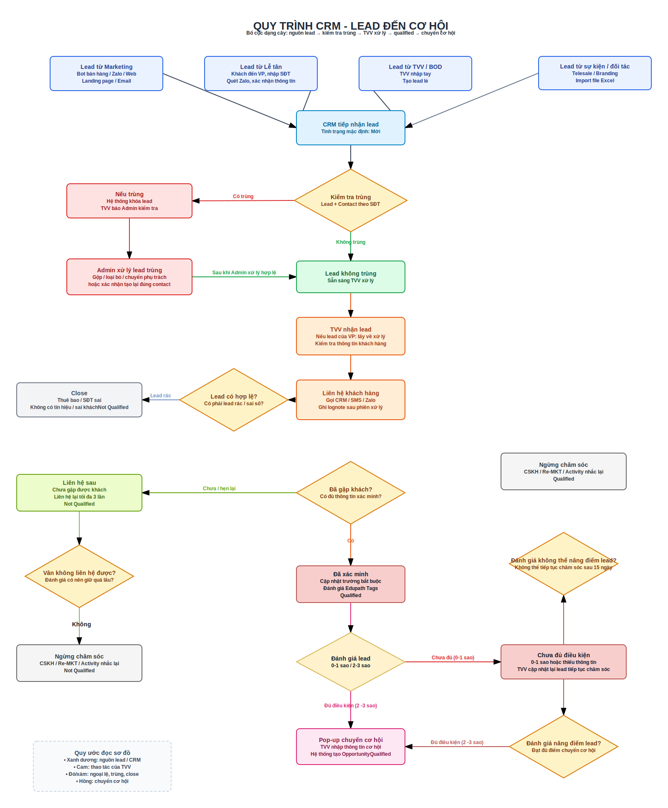{ .doc-screenshot }

```text
Lead vào CRM hoặc TVV tạo Lead mới
→ Kiểm tra trùng
→ Nhận/Tạo Lead — Tình trạng Mới
→ TVV liên hệ khách hàng
→ Cập nhật loại KH + thông tin bắt buộc
→ Đánh giá Qualified Lead + điểm sao
→ Chuyển cơ hội nếu đạt điều kiện
```

### Đối tượng sử dụng

| Nhóm | Vai trò |
|------|---------|
| Tư vấn viên | Liên hệ khách, cập nhật thông tin, đánh giá Lead |
| Marketing | Theo dõi chất lượng Lead từ nguồn Marketing |
| Telesale | Xác minh thông tin ban đầu |
| CRM Admin | Kiểm tra dữ liệu, xử lý trùng |
| Quản lý | Theo dõi Lead qualified và chuyển đổi |

### Mở trang làm việc với Lead

1. Thanh công cụ trái → **Việc cần làm**
2. Menu ngang → **CRM**
3. Nhóm **Lead** → **All Leads**
4. Nếu đang lọc (vd. `My New Leads`) → bấm **x** để vào danh sách chính

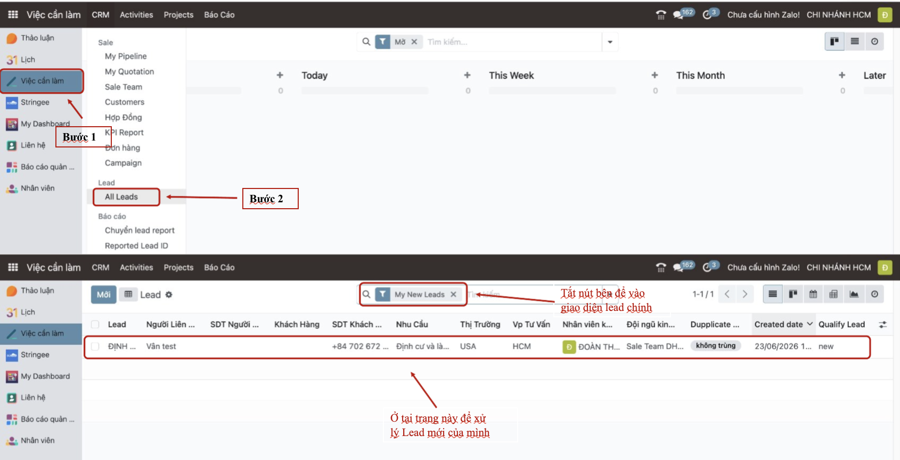{ .doc-screenshot }

Cột cần chú ý:

| Cột | Ý nghĩa |
|-----|---------|
| **Nhân viên kinh doanh** | Lead thuộc TVV hay VP chung |
| **Tình trạng** | Mới, Liên hệ sau, Đã xác minh, Ngừng chăm sóc… |

TVV chỉ thấy Lead của mình và Lead VP/chi nhánh được phân quyền. Lead **VP chung** → lấy về mình trước khi xử lý.

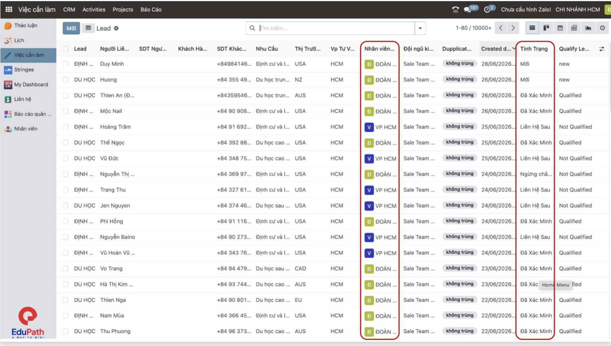{ .doc-screenshot }

---

## II. Làm việc với Lead

### 1. Lấy Lead VP về xử lý

- Có thể lấy ở mọi **Tình trạng**, miễn Lead thuộc VP/chi nhánh được phân quyền.
- Sau khi lấy → TVV là **Nhân viên kinh doanh** phụ trách.
- Chỉ lấy Lead mình **thực sự** sẽ xử lý.

**Các bước trên danh sách Lead:**

1. Tích chọn Lead cần lấy.
2. Chọn ô trong cột **Nhân viên kinh doanh**.
3. Gõ đúng tên TVV (có dấu) trong gợi ý.
4. **Xác nhận** — cập nhật hàng loạt.
5. Kiểm tra cột **Nhân viên kinh doanh** đã đúng.

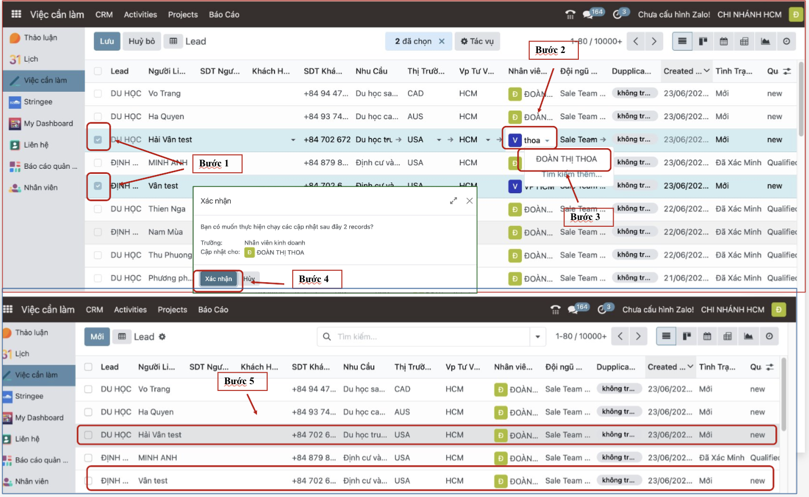{ .doc-screenshot }

### 2. Liên hệ khách hàng

Từ **My Dashboard** → **XỬ LÝ LEAD MỚI** → click dòng Lead cần xử lý.

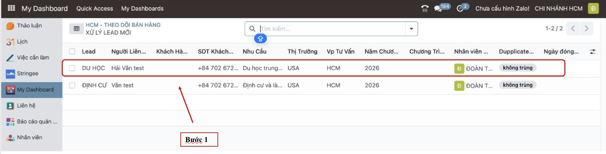{ .doc-screenshot }

Khi mở Lead, hệ thống có thể đã điền sẵn: **Loại khách hàng**, **VP tư vấn**, **Nhu cầu**, **Thị trường**, **Tình trạng**, **Nguồn** — TVV **kiểm tra lại** trước khi gọi.

**Gọi qua Stringee:**

1. Mở đúng Lead.
2. Đổi **mã quốc gia** kiểm tra SĐT.
3. **Gọi** tại dòng số cần liên hệ.

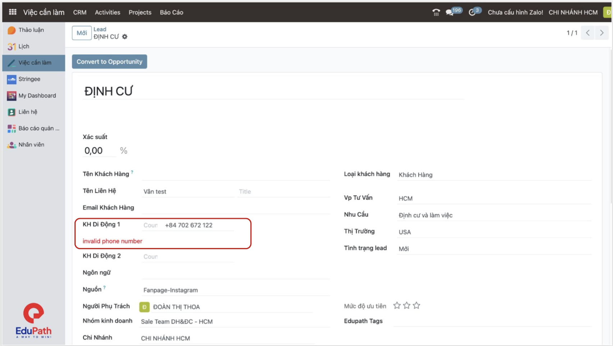{ .doc-screenshot }

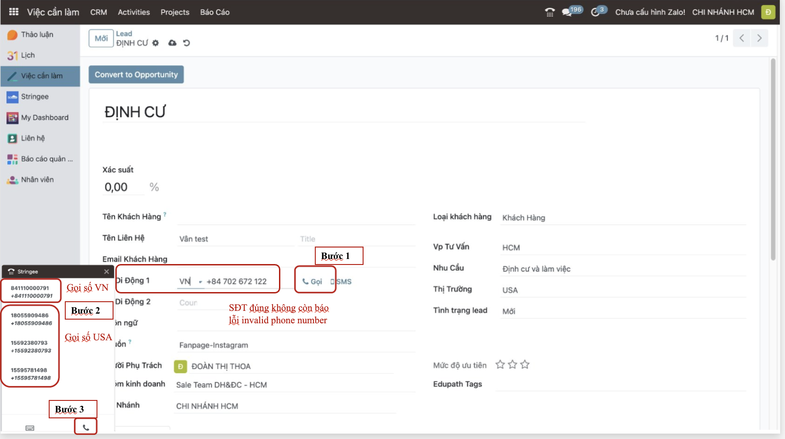{ .doc-screenshot }

!!! warning
    Nhiều số → chọn đúng số theo mã quốc gia (VN / US / quốc tế). Không gọi nhầm.

### 3. Cập nhật sau khi liên hệ

1. Xác định **Loại khách hàng**.
2. Cập nhật **Tên liên hệ**, **Title** (giới tính) sau khi biết thông tin khách.
3. **VP tư vấn**, **Nhu cầu**, **Thị trường**, **Nguồn** — giữ nguyên nếu đúng.
4. Đổi **Nhân viên kinh doanh** chỉ khi giao người khác.
5. Cập nhật **Tình trạng lead**.
6. Cập nhật **Edupath Tags** nếu đã xác minh.
7. **Lưu**.

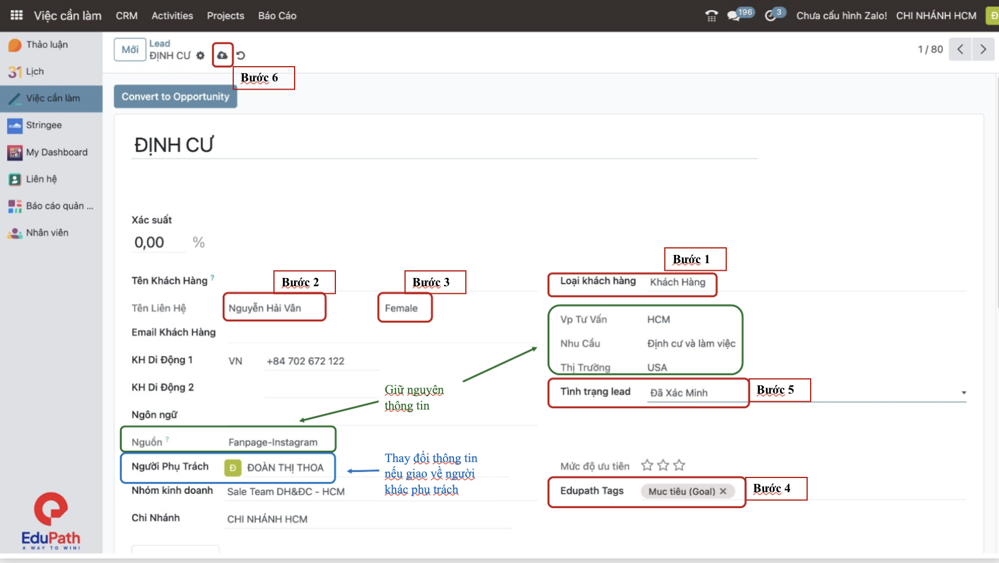{ .doc-screenshot }

Trùng/khóa sau lưu → xem [Kiểm tra trùng Lead](kiem-tra-trung-lead.md).

### 4. Bắt buộc ghi Ghi chú (Lognote)

Dùng tổ hợp phím thu phóng màn hình (Mac: `Command +` / `Command -`) để vừa thấy form Lead vừa thấy **Ghi chú**.

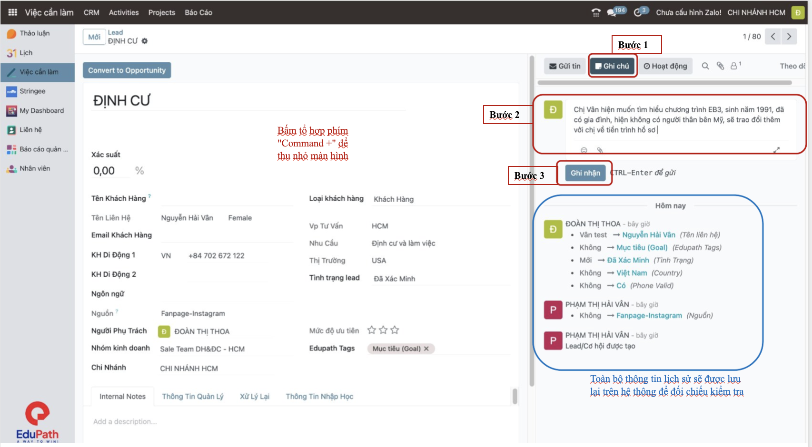{ .doc-screenshot }

Nội dung cần ghi: khách nghe máy hay không; SMS/Zalo; phản hồi khách; nội dung tư vấn; lý do hẹn lại/ngừng chăm sóc; bước tiếp theo.

---

## III. Loại khách hàng

### Vì sao cần cập nhật đúng?

| Ví dụ | Loại |
|-------|------|
| Người có nhu cầu trực tiếp | **Khách hàng** |
| Phụ huynh / người liên hệ thay | **Người đại diện** |
| Agent / đơn vị giới thiệu | **Đối tác** (thông qua BM) |

### Khách hàng

Chọn khi người trao đổi là người **có nhu cầu trực tiếp**. Nếu chưa xin được thông tin KH chính → tạm giữ **Khách hàng**, sau đó cập nhật lại.

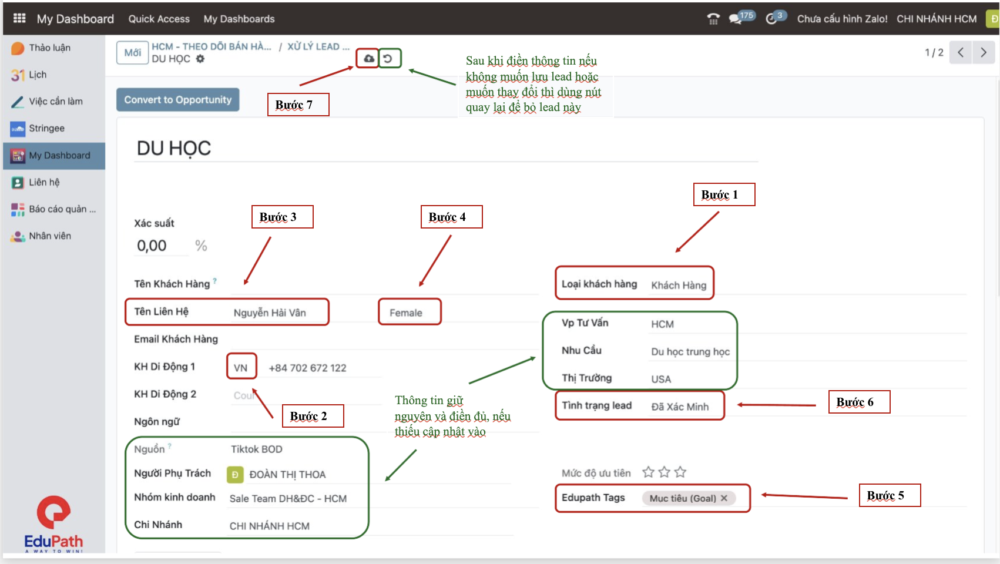{ .doc-screenshot }

1. Chọn **Khách hàng**.
2. Kiểm tra **Mã quốc gia**.
3. **Tên liên hệ** — đủ họ tên.
4. **Title** theo giới tính.
5. Nếu đã biết mục tiêu → tag **Mục tiêu (Goal)**.
6. Có **Mục tiêu** + đã xác minh → **Tình trạng** = **Đã xác minh**.
7. Kiểm tra các trường còn lại → **Lưu**.

### Người đại diện

Bố/mẹ, người thân, người bảo hộ — **không phải** khách chính.

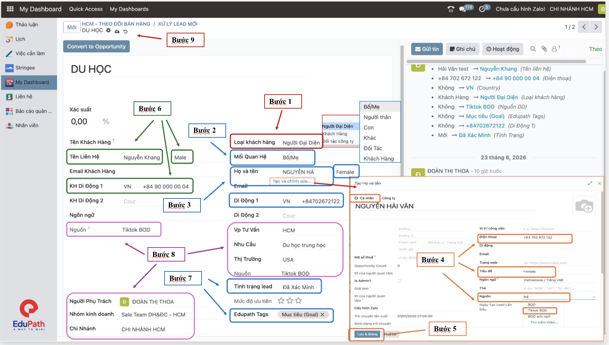{ .doc-screenshot }

1. **Loại khách hàng** = **Người đại diện** — nhập cụm bên phải.
2. **Mối quan hệ** (Bố/Mẹ, Người thân…).
3. **Họ và tên** người đại diện → hộp **Tạo và chỉnh sửa** → SĐT, Title, Nguồn → **Lưu & Đóng**.
4. Bên trái: **Tên liên hệ**, Title, SĐT, mã QG của **khách hàng chính** (con/người thân).
5. **Tình trạng**, **Edupath Tags** → **Lưu**.

Tách rõ đại diện và KH chính — tránh nhầm khi tư vấn / promotion nhóm.

Chi tiết thêm: [Tạo Lead & Qualified](tao-lead-qualified.md).

---

## IV. Đánh giá chất lượng Lead (Tình trạng)

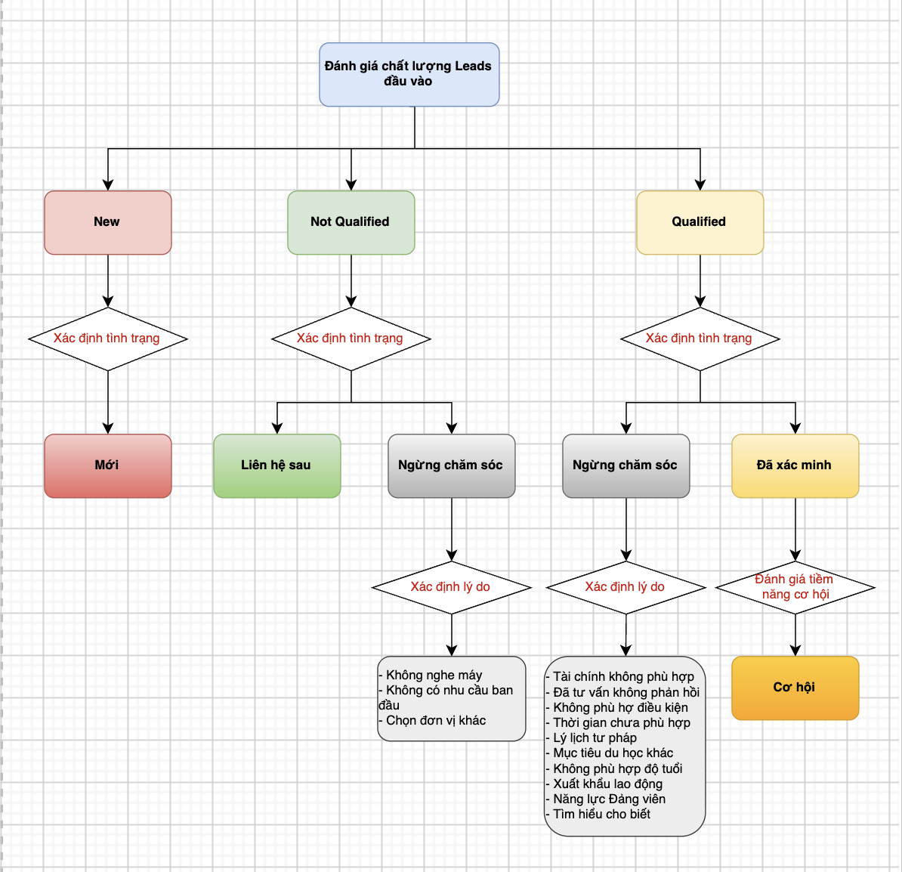{ .doc-screenshot }

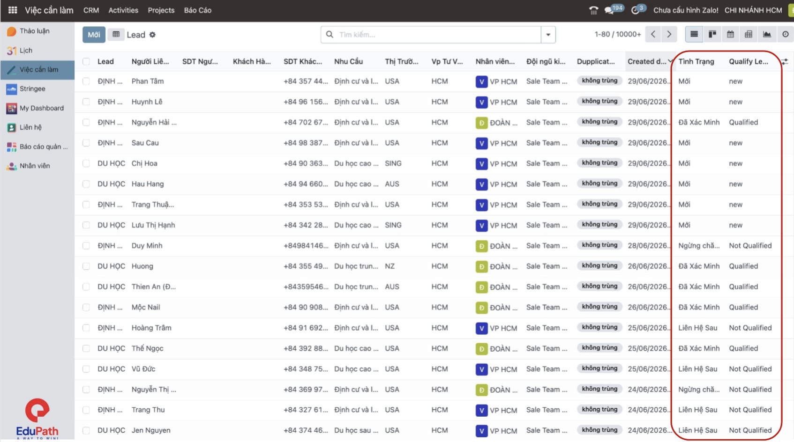{ .doc-screenshot }

Sau mỗi thao tác chăm sóc → cập nhật **Tình trạng lead** đúng thực tế (automation dùng để phân loại Qualified).

### Mới

Mặc định khi Lead vừa vào hoặc TVV vừa lấy từ VP. **Chỉ giữ Mới** khi chưa gọi/nhắn/xử lý.

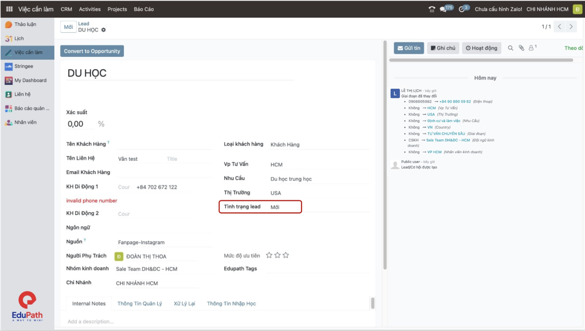{ .doc-screenshot }

### Liên hệ sau

Đã gọi/nhắn nhưng khách **chưa** nghe máy/phản hồi, vẫn follow-up.

- Lần gọi đầu không nghe → **Liên hệ sau**.
- Số đúng format nhưng báo **thuê bao** → vẫn **Liên hệ sau**.
- Tối đa **3 cuộc gọi**, cách nhau tối đa **24 giờ** nếu không liên lạc được.
- Mỗi lần không nghe → ghi **Ghi chú**.
- Zalo: nên chụp màn hình đính kèm **Ghi chú**.

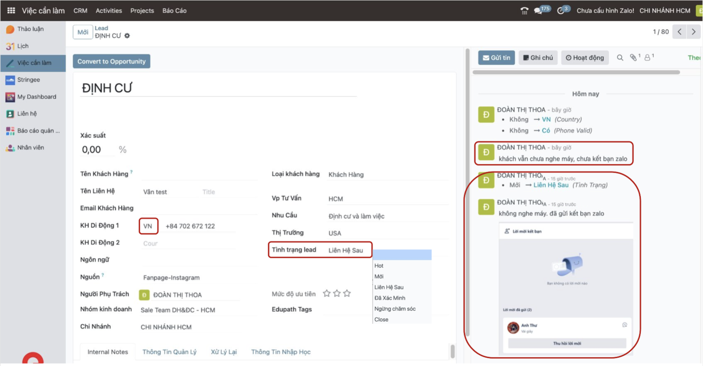{ .doc-screenshot }

### Đã xác minh

Đã gọi/gặp và xác nhận thông tin tư vấn. **Chỉ gắn Edupath Tags sau khi xác minh.**

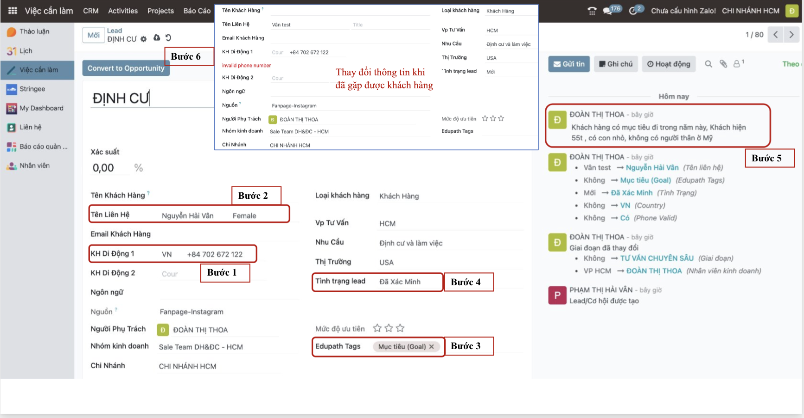{ .doc-screenshot }

1. Nhập đúng **Tên liên hệ**, giới tính.
2. Gắn **Edupath Tags** (chỉ sau xác minh).
3. **Tình trạng** = **Đã xác minh**.
4. Ghi **Ghi chú**: nhu cầu, thời điểm, mục tiêu, tài chính, năng lực hồ sơ…
5. **Lưu**.

### Ngừng chăm sóc

**Bắt buộc** chọn **Lý do mất**.

**Sau 3 lần gọi không nghe** (lần cuối ở Liên hệ sau):

- **Tình trạng** = **Ngừng chăm sóc**
- **Lý do** = **Không nghe máy**
- **Ghi chú**: ghi rõ lần gọi thứ 3

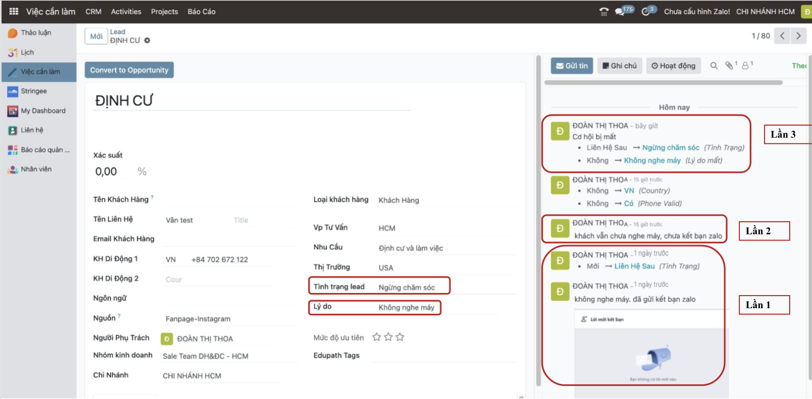{ .doc-screenshot }

**Đã gọi được** nhưng không tiếp tục tư vấn — chọn **Lý do** phù hợp:

| Lý do | Mô tả |
|-------|--------|
| Không có nhu cầu | Không muốn tìm hiểu tiếp |
| Chọn đơn vị khác | Đã chọn đơn vị khác |
| Tài chính không phù hợp | Chưa đủ tài chính |
| Đã tư vấn không phản hồi | Sau tư vấn khách im lặng |
| Không phù hợp điều kiện | Không đủ điều kiện CT |
| Thời gian chưa phù hợp | Chưa đến lúc triển khai |
| Lý lịch tư pháp | Tiền án, tị nạn, bất hợp pháp |
| Mục tiêu du học khác | Ngoài thị trường/ngành công ty |
| Không phù hợp độ tuổi | Quá nhỏ / quá tuổi |
| Xuất khẩu lao động | Chỉ muốn XKLĐ, không định cư |
| Năng lực đảng viên | Khách là đảng viên |
| Tìm hiểu cho biết | Chỉ tìm hiểu, không còn nhu cầu |

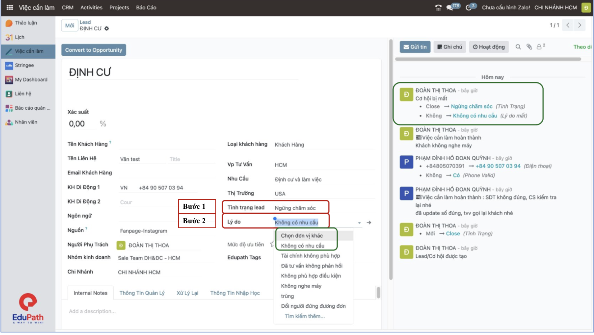{ .doc-screenshot }

### Close

Số **không hợp lệ** / dữ liệu rác: sai số, không tín hiệu, `invalid phone number`.

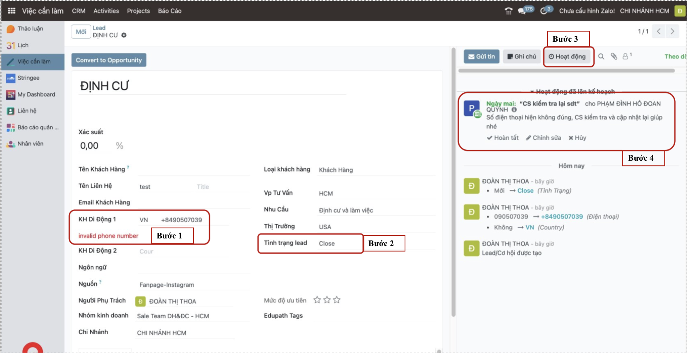{ .doc-screenshot }

1. Chọn đúng **Mã quốc gia** (VN, US, AU, CA, JP…).
2. Báo invalid → **Close**.
3. Tạo **Activity** giao CS kiểm tra SĐT (xem [Chương I](thao-tac-chung.md)).
4. Kiểm tra chatter đã gửi Activity.

**CS xác nhận SĐT vẫn sai** → giữ **Close**, không chăm sóc tiếp.

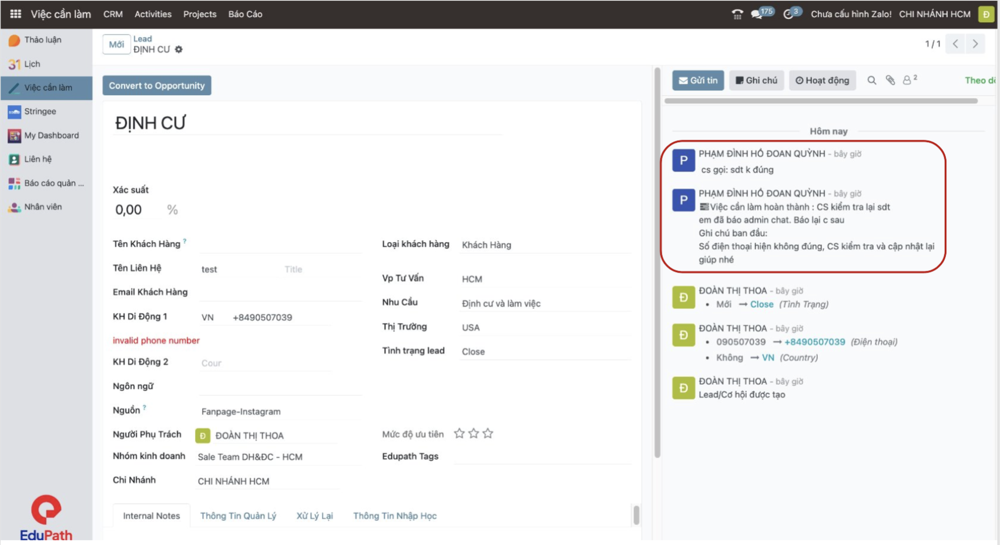{ .doc-screenshot }

**CS sửa SĐT đúng** → Activity cho TVV xử lý lại:

1. Mở Activity CS gửi — SĐT hết báo invalid.
2. **Gọi** — nếu có chuông → số thật.
3. Đổi **Tình trạng** (vd. **Liên hệ sau** nếu chưa nghe máy).
4. **Hoàn tất** Activity + ghi chú kết quả → **Lưu**.

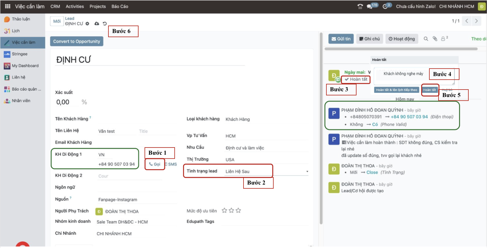{ .doc-screenshot }

---

## V. Đánh giá tiềm năng & chuyển cơ hội

### Quy tắc chấm sao (Edupath Tag)

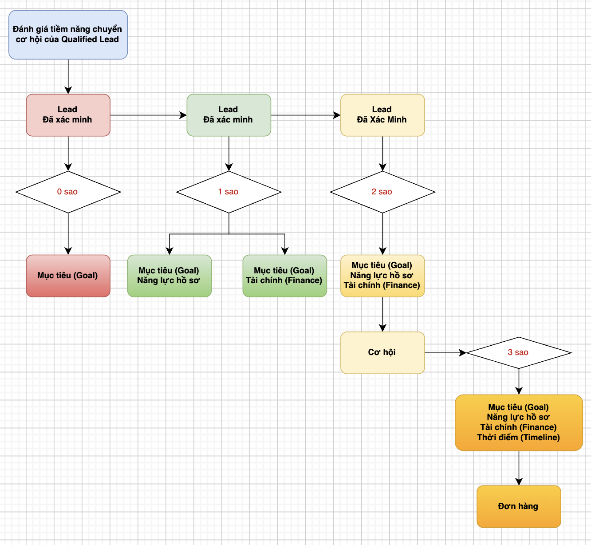{ .doc-screenshot }

| Mức sao | Điều kiện tag | Ý nghĩa |
|---------|---------------|---------|
| **0 sao** | Chỉ **Mục tiêu (Goal)** | Có mục tiêu / nhu cầu CT |
| **1 sao** | **Mục tiêu** + (**Tài chính** hoặc **Năng lực hồ sơ**) | Một tiêu chí quan trọng thêm |
| **2 sao** | **Mục tiêu** + **Tài chính** + **Năng lực hồ sơ** | Đủ điều kiện chuyển cơ hội |
| **3 sao** | Đủ 4 tag (thêm **Thời điểm**) | Dùng chủ yếu ở giai đoạn cơ hội |

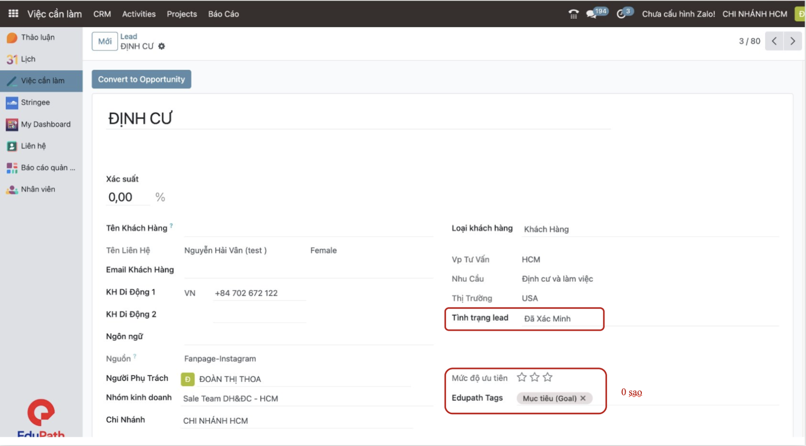{ .doc-screenshot }

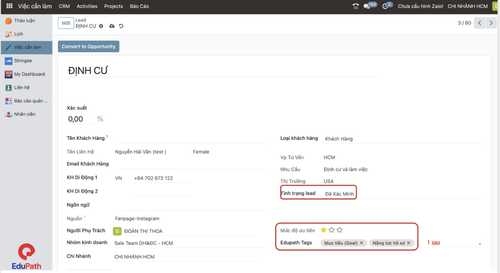{ .doc-screenshot }

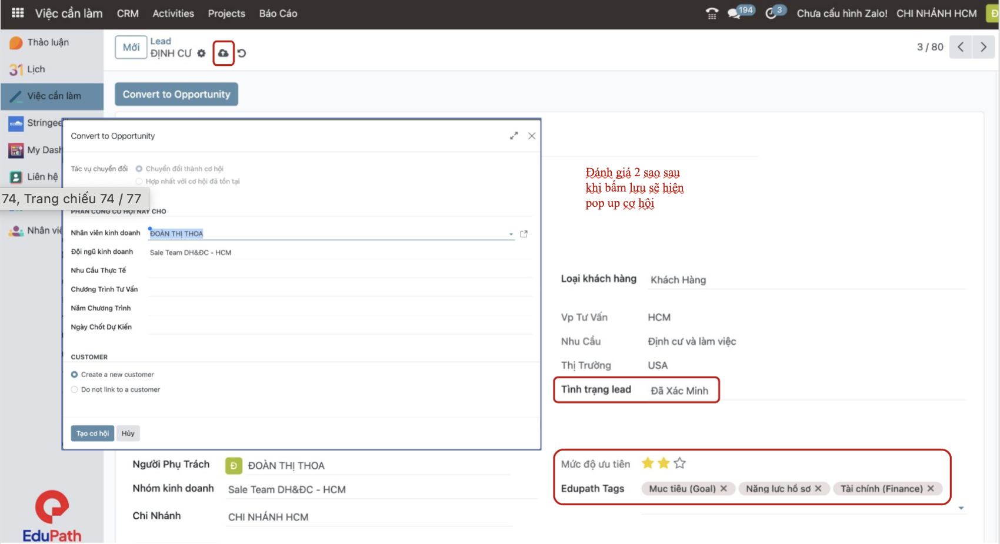{ .doc-screenshot }

Hệ thống ghi lịch sử đổi tag trong **Ghi chú** và cập nhật lại mức sao.

### Điều kiện pop-up chuyển cơ hội

**Cả hai:**

1. **Tình trạng lead** = **Đã xác minh**
2. **Mức ưu tiên** ≥ **2 sao** — cần đủ tag: **Mục tiêu** + **Tài chính** + **Năng lực hồ sơ**

Sau **Lưu** → pop-up **Convert to Opportunity**.

| Trường pop-up | Ghi chú |
|---------------|---------|
| Nhân viên kinh doanh | Người phụ trách |
| Đội ngũ kinh doanh | Team |
| Nhu cầu thực tế | Đã xác minh |
| Chương trình tư vấn | Khớp **bảng giá** |
| Năm chương trình | Năm KD (09/2025–08/2026 → **2026**) |
| Ngày chốt dự kiến | Dự kiến chốt |
| Customer | Tạo mới hoặc liên kết |

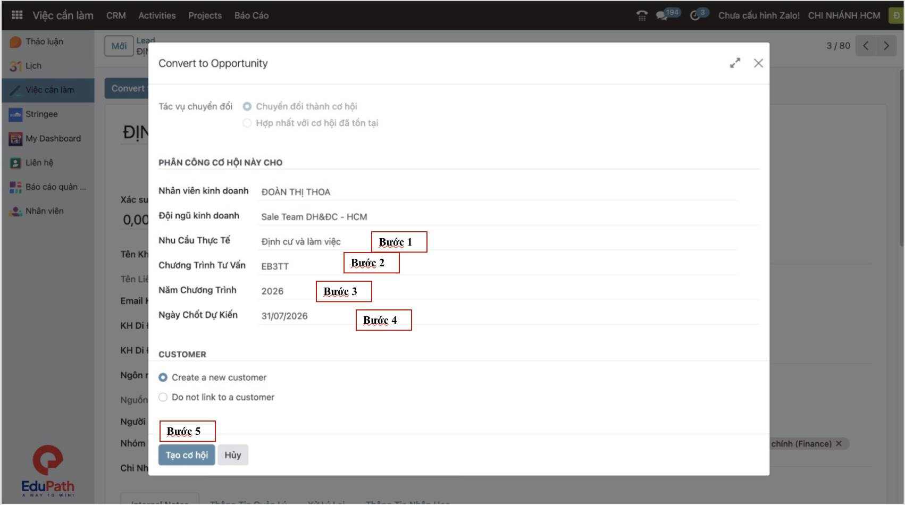{ .doc-screenshot }

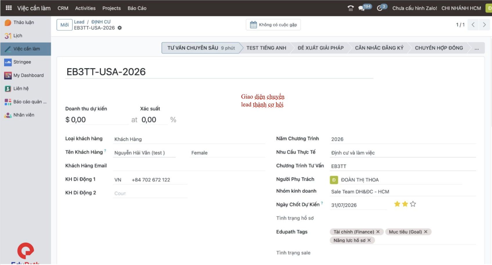{ .doc-screenshot }

!!! warning "Không tắt pop-up"
    Lead đủ điều kiện mà chưa tạo cơ hội → mở lại Lead → pop-up **hiện lại**.

**Convert thủ công khi chưa 2 sao** → bảng lỗi — bổ sung tag thiếu hoặc cập nhật **Đã xác minh**.

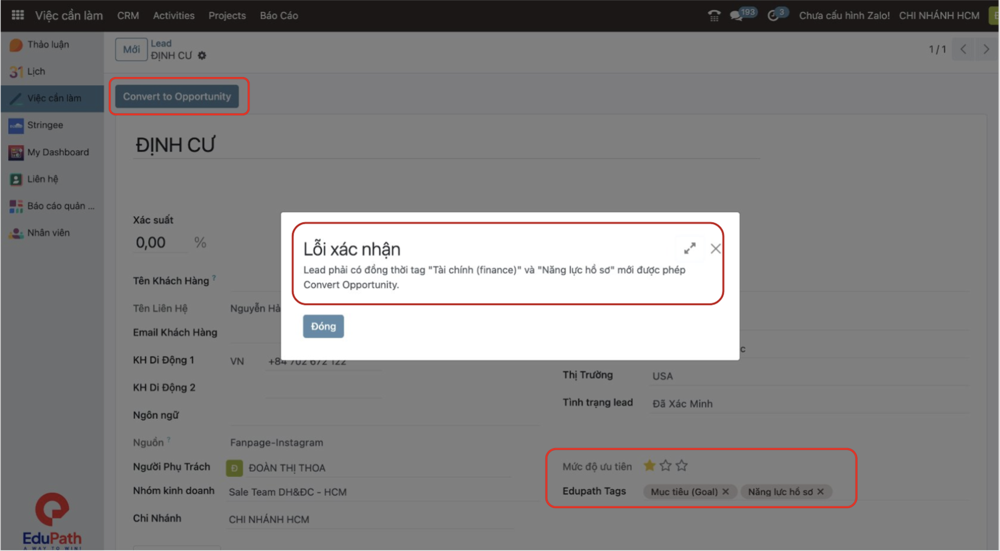{ .doc-screenshot }

Chi tiết: [Tạo Lead & Qualified](tao-lead-qualified.md) | [Chương III — Pipeline](pipeline.md).

---

## VI. TVV tự tạo Lead (nguồn TVV)

Khi: khách gọi/nhắn trực tiếp TVV; được giới thiệu trực tiếp.

**Trước khi tạo** — kiểm tra trùng (xem [Chương I](thao-tac-chung.md), [Kiểm tra trùng](kiem-tra-trung-lead.md)).

Lead nguồn TVV thường là **sau tư vấn** — cập nhật lên hệ thống, không phải Lead “mới” thuần marketing.

1. **Việc cần làm** → **CRM** → **All Leads** → **Mới**
2. Nhập đúng các trường → **Lưu**

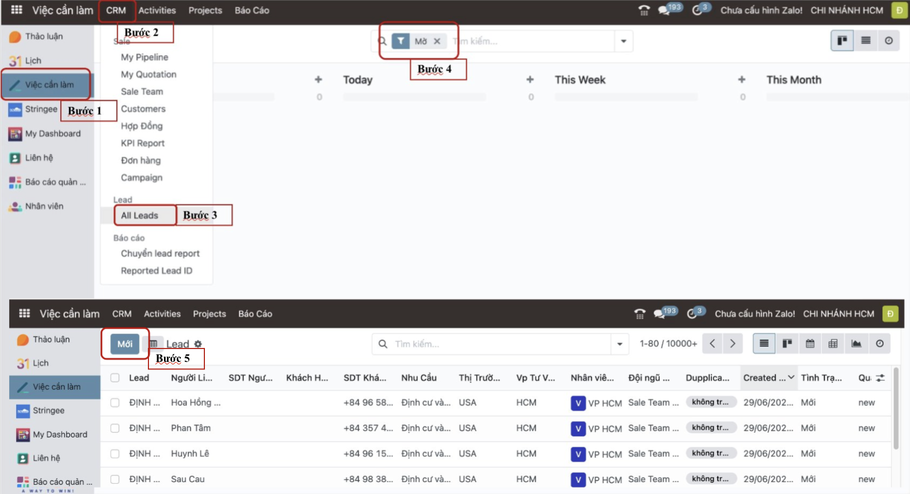{ .doc-screenshot }

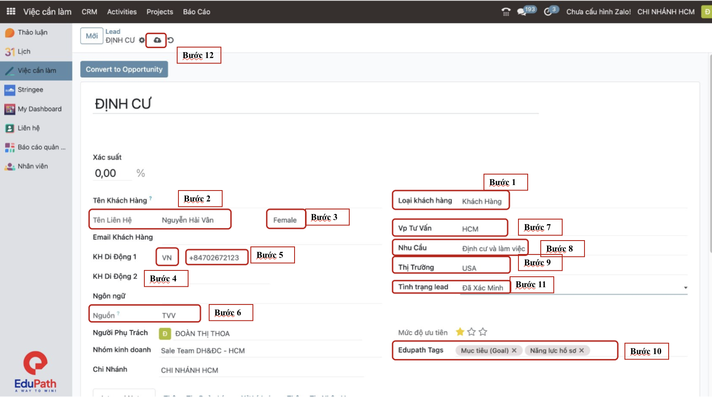{ .doc-screenshot }

### Lead bị trùng khi tạo

- Đang nhập → nút **Similar Lead**
- Hoặc sau **Lưu** → **Hộp báo lỗi**

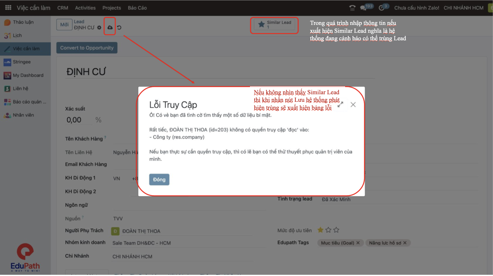{ .doc-screenshot }

→ **Không** tạo lại nhiều lần — báo **CRM Admin**.

---

## VII. Tài liệu chi tiết & bài thực hành

### Tài liệu liên quan

| Trang | Nội dung |
|-------|----------|
| [Kiểm tra trùng Lead](kiem-tra-trung-lead.md) | Duplicate, khóa Lead, Admin |
| [Tạo Lead & Qualified](tao-lead-qualified.md) | Qualified automation, pop-up, Contact |
| [Leads & Cơ hội](leads.md) | Cấu hình CRM cơ bản |
| [Lead Mining](lead-mining.md) | Khai thác Lead (nếu bật) |

### Bài thực hành

| Bài | Nội dung |
|-----|----------|
| **1** | Nhận Lead VP — cập nhật **NVKD** |
| **2** | Gọi Stringee, ghi **Ghi chú**, cập nhật tình trạng |
| **3** | Tạo Lead mới — kiểm tra 3 module, trường bắt buộc |
| **4** | Lead trùng / **Similar Lead** — báo Admin |
| **5** | Loại **Người đại diện** — mối quan hệ, KH chính |
| **6** | **Edupath Tag** và sao 0/1/2/3 |
| **7** | Pop-up chuyển cơ hội — **Đã xác minh** + 2 sao |
| **8** | **Convert** khi chưa 2 sao — đọc bảng lỗi |

---

Xem tiếp: [Chương III — Pipeline (Cơ hội)](pipeline.md)
