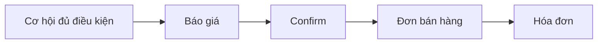

# Chương IV — Sale Order (Đơn hàng)

Quy trình **báo giá**, **xác nhận đơn bán hàng** và các bước Sales sau khi cơ hội đủ điều kiện — từ **New Quotation** / **View Quotation** đến **Confirm** và hóa đơn.

## Nội dung trong chương

| Thứ tự | Tài liệu | Mô tả |
|--------|----------|--------|
| 1 | [Báo giá & đơn hàng](bao-gia-don-hang.md) | New/View Quotation, Discount/Promotion, Confirm, KPI |
| 2 | [Đơn bán](../ban-hang/don-ban.md) | Sau Confirm, giao hàng, hủy đơn |
| 3 | [Hóa đơn khách hàng](../ban-hang/hoa-don.md) | Tạo invoice từ đơn bán |

!!! note "Vị trí trong CRM"
    Báo giá tạo từ **cơ hội** (stage Cân nhắc đăng ký / Chuyển hợp đồng). Sau **Confirm**, cơ hội tự **Thành công** — xem [Chương III — Pipeline](pipeline.md).

Xem tiếp: [Chương V — Báo cáo](bao-cao.md)
