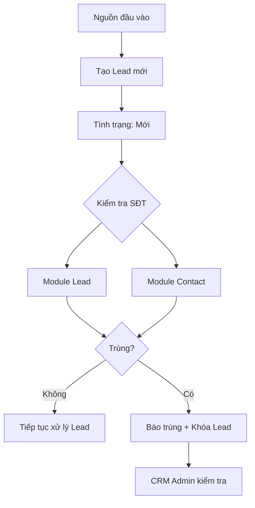

# Kiểm tra trùng khi tạo Lead mới

!!! tip "Nguồn CRM VAN"
    Nội dung chính: [Chương II — Leads](chuong-ii-leads.md). Phát hiện trùng khi tạo: nút **Similar Lead** hoặc **Hộp báo lỗi** sau Lưu — báo Admin.

## Mục tiêu

Hướng dẫn quy trình tiếp nhận Lead mới từ nhiều nguồn và cách hệ thống **kiểm tra trùng** trước khi Lead được xử lý tiếp — đảm bảo mỗi khách hàng chỉ có một hồ sơ chính xác, tránh nhiều nhân sự xử lý cùng một số điện thoại.

## Phạm vi áp dụng

Áp dụng cho mọi Lead mới vào CRM Odoo từ:

- Hệ thống Marketing
- Tư vấn viên nhập tay
- Data sự kiện / đối tác
- Import Excel
- Hotline, form, Zalo, website, landing page, email

## Đối tượng sử dụng

| Nhóm | Vai trò |
|------|---------|
| Marketing | Tạo/import Lead từ kênh Marketing |
| Tư vấn viên | Nhập tay hoặc tiếp nhận khách mới |
| Telesale | Nhập/xử lý data sự kiện, đối tác |
| CRM Admin | Kiểm tra và xử lý Lead báo trùng |
| Quản lý | Theo dõi chất lượng dữ liệu Lead |

## Tổng quan quy trình

Kiểm tra trùng dựa trên **số điện thoại** (sau chuẩn hóa). Hệ thống kiểm tra trong **Lead** và **Contact**. Nếu trùng → đánh dấu trùng, **khóa Lead** để CRM Admin xử lý.

## Dữ liệu đầu vào

### Nguồn tạo Lead

| Nguồn | Cách đưa vào | Người phụ trách |
|-------|--------------|-----------------|
| Marketing | Tự động import | Marketing / CRM Admin |
| Tư vấn viên | Nhập tay | Tư vấn viên |
| Sự kiện / Đối tác | Import Excel | Marketing / Telesale / CRM Admin |
| Hotline | Nhập tay / tích hợp | Tư vấn viên / Telesale |
| Website / Landing / Fanpage | Tự động import | Marketing |
| Zalo / Email | Tự động hoặc nhập tay | Marketing / Tư vấn viên |

### Trường bắt buộc khi tạo Lead

| Trường | Bắt buộc | Ghi chú |
|--------|----------|---------|
| Tên khách hàng | Có | Ghi theo thông tin khách cung cấp |
| Số điện thoại | Có | Dữ liệu chính để kiểm tra trùng |
| Nguồn Lead | Có | Website, Zalo, Hotline, Event, Partner… |
| Nhu cầu | Có | Khách quan tâm dịch vụ gì |
| Thị trường | Có | Ví dụ: USA, CAD, AUS |
| Chi nhánh / VP tư vấn | Có | Phân tuyến xử lý |
| Người phụ trách | Tùy quy trình | Gán tự động hoặc sau |

**Tình trạng mặc định** khi Lead mới vào hệ thống: **Mới**.

## Nguyên tắc kiểm tra trùng

### Chuẩn hóa số điện thoại

Các dạng sau phải được nhận là **cùng một số**:

- `0901234567`
- `+84 901 234 567`
- `84 901 234 567`

### Phạm vi kiểm tra

1. Module **Lead**
2. Module **Contact**

### Kết quả

| Kết quả | Hành động hệ thống |
|---------|-------------------|
| Không trùng | Giữ **Mới**, tiếp tục xử lý |
| Trùng trong Lead | Đánh dấu trùng, khóa — Admin kiểm tra |
| Trùng trong Contact | Đánh dấu trùng, khóa — Admin kiểm tra |

## Hướng dẫn theo nguồn Lead

### Lead từ Marketing

Lead tự động import (website, landing, Zalo, email, campaign, form…). Người dùng **không cần tạo tay** nhưng cần theo dõi Lead được phân công.

### Lead từ Tư vấn viên

1. **CRM › Lead › Mới**
2. Nhập thông tin, **SĐT**, nguồn Lead
3. **Lưu** → hệ thống tự kiểm tra trùng

- Không trùng → Lead **Mới**, xử lý tiếp
- Trùng → báo trùng, Lead bị khóa

### Lead từ sự kiện / đối tác (Excel)

1. Kiểm tra format file
2. Import vào CRM
3. Tình trạng **Mới** → kiểm tra trùng SĐT

!!! warning "Chuẩn bị file import"
    - Mỗi dòng một khách
    - SĐT không để trống
    - Không gộp nhiều SĐT một ô
    - Có cột **Nguồn Lead**
    - Kiểm tra lỗi định dạng trước khi import

## Đọc màn hình danh sách Lead

| Cột | Ý nghĩa |
|-----|---------|
| Lead | Tên Lead |
| Tên liên hệ | Tên khách nhập |
| SĐT khách hàng | Số dùng kiểm tra trùng |
| Nhu cầu / Thị trường | Phân loại tư vấn |
| VP tư vấn / Nhân viên / Đội ngũ | Phân công |
| **Duplicate** | Kết quả kiểm tra trùng |
| Created on | Ngày tạo |
| Tình trạng | Trạng thái xử lý |
| Qualify Lead | Trạng thái qualify |

### Cột Duplicate

| Giá trị | Ý nghĩa |
|---------|---------|
| Không trùng | SĐT chưa có trong Lead/Contact |
| Trùng | SĐT đã tồn tại — **không xử lý tiếp** cho đến khi Admin duyệt |

## Xử lý khi Lead bị trùng

### Hệ thống

- Đánh dấu **trùng**
- **Khóa** Lead — không qualify/xử lý khi chưa Admin kiểm tra
- Giữ thông tin nguồn để đối chiếu

### Người dùng

1. Báo **CRM Admin**
2. Chờ kết quả — **không** tự xử lý Lead trùng

### CRM Admin kiểm tra

- Trùng Lead/Contact nào, ai phụ trách, trạng thái cũ
- Nguồn và thông tin bổ sung của Lead mới

| Trường hợp | Hướng xử lý |
|------------|-------------|
| Trùng hoàn toàn Lead cũ | Không tạo mới; cập nhật ghi chú nếu cần |
| Lead mới có thông tin bổ sung | Gộp/cập nhật hồ sơ hiện có |
| Lead cũ lâu không xử lý | Rà soát phân công theo quy định |
| Trùng Contact đã là khách | Cập nhật lịch sử Contact/Opportunity |
| SĐT nhập sai | Sửa SĐT nếu có bằng chứng rõ |

## Lỗi thường gặp

| Lỗi | Nguyên nhân | Cách xử lý |
|-----|-------------|------------|
| Lead trùng vẫn bị xử lý | Chưa hiểu cột Duplicate | Dừng xử lý, báo Admin |
| Không phát hiện trùng | SĐT sai định dạng | Chuẩn hóa lại SĐT |
| Một khách nhiều Lead | Import nhiều nguồn | Admin gộp dữ liệu |
| Import thiếu SĐT | File thiếu trường bắt buộc | Bổ sung trước import |
| Không biết trùng hồ sơ nào | Thiếu quyền xem | Báo CRM Admin |

## Checklist người dùng

- [ ] Lead có số điện thoại
- [ ] Có nguồn Lead rõ ràng
- [ ] Tình trạng là **Mới**
- [ ] Đã xem cột **Duplicate**
- [ ] Nếu **Trùng**: dừng xử lý và báo CRM Admin

## Bài thực hành (Training)

**Bài 1 — Tạo Lead nhập tay:** Tạo Lead, kiểm tra **Tình trạng** = Mới và cột **Duplicate**.

**Bài 2 — Nhận biết Lead trùng:** Tìm Lead có Duplicate = trùng, ghi nhận Lead bị khóa, báo Admin — không tự xử lý.

---

Xem tiếp: [Chương I — Thao tác chung](thao-tac-chung.md) | [Chương II — Leads](chuong-ii-leads.md) | [Tạo Lead & Qualified](tao-lead-qualified.md)
