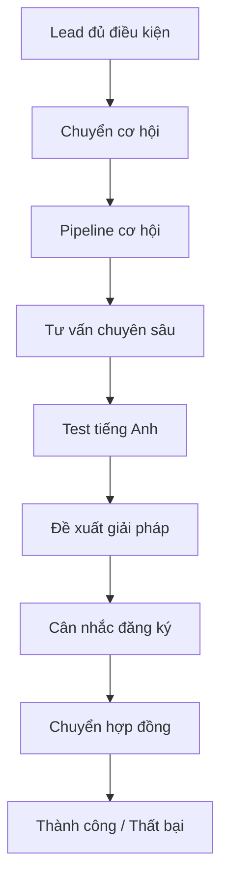

# Chương III — Pipeline (Cơ hội)

!!! info "Nguồn tài liệu"
    Chức năng / CRM / Opportunity Management — Phiên bản 1.0 (CRM VAN — *05_Opportunity_Pipeline_Process*).

## Mục tiêu

Hướng dẫn xử lý **cơ hội** sau khi Lead đã chuyển sang Opportunity: theo dõi đúng giai đoạn tư vấn, cập nhật pipeline kịp thời, ghi nhận kết quả và xác định cơ hội **tiếp tục / thành công / thất bại**.

## Vị trí trong quy trình CRM



!!! note "New Quotation / View Quotation"
    **Không phải stage** trong pipeline. `New Quotation` = tạo báo giá mới; `View Quotation` = mở lại báo giá đã có — thường dùng ở **Cân nhắc đăng ký** hoặc **Chuyển hợp đồng**. Chi tiết: [Báo giá & đơn bán hàng](bao-gia-don-hang.md).

## Đối tượng sử dụng

| Nhóm | Vai trò |
|------|---------|
| Tư vấn viên | Xử lý cơ hội, cập nhật pipeline |
| Quản lý kinh doanh | Theo dõi pipeline, tiến độ, kết quả |
| CSKH | Tiếp nhận thất bại hoặc chăm sóc lại |

---

## Tổng quan Pipeline

Pipeline là luồng theo dõi cơ hội từ khi khách được chuyển từ xác minh sang **Tư vấn chuyên sâu** đến kết quả cuối. Mỗi cột Kanban = một giai đoạn — TVV cập nhật **đúng giai đoạn thực tế**.

| Giai đoạn | Ý nghĩa |
|-----------|---------|
| **Tư vấn chuyên sâu** | TVV tư vấn chi tiết theo nhu cầu khách |
| **Test tiếng Anh** | Khách thực hiện / được sắp xếp test nếu cần |
| **Đề xuất giải pháp** | Đề xuất chương trình, lộ trình, phương án |
| **Cân nhắc đăng ký** | Khách đang cân nhắc trước khi đăng ký / ký HĐ |
| **Chuyển hợp đồng** | Khách đủ điều kiện chuyển sang bước hợp đồng |
| **Thành công** | **Tự động** khi báo giá được **Confirm** |
| **Thất bại** | Không tiếp tục — bị khóa stage, cần lý do |

---

## Nguyên tắc cập nhật Pipeline

- Cơ hội phải nằm **đúng giai đoạn** thực tế; cập nhật **kịp thời** khi có thay đổi.
- Sau mỗi phiên làm việc → ghi **Lognote/Ghi chú** (gọi, Zalo, tư vấn, lý do chuyển stage, bước tiếp theo).
- Cần follow-up → tạo **activity** hoặc lịch nhắc.
- **Thất bại** → chọn **lý do thất bại** rõ ràng.
- **Không** chuyển **Thành công** thủ công — chỉ **automation** khi báo giá **Confirm**.
- Từ **Thất bại** → **không** kéo ngược stage; khách đổi ý → mở lại cơ hội và làm quy trình từ đầu theo quy định nội bộ.
- Có **Người đại diện** / **Đối tác** → gom nhóm quan hệ bằng **Create Relationship** hoặc **Related Contacts**.

---

## Quy định tên cơ hội và kiểm tra trùng

### Cấu trúc tên

```text
Chương trình - Thị trường - Năm chương trình
```

Ví dụ: `AY-USA-2026` | `EB3TT-USA-2027` | `CD-DH-CAD-2026`

### Kiểm tra trùng

Trên **cùng khách hàng**, **không** tạo cơ hội trùng tên nếu cơ hội cũ **chưa** **Thất bại** hoặc **Thành công**. Hệ thống chặn → không tạo lại nhiều lần → báo **CRM Admin**.

| Khách hàng | Cơ hội | Hợp lệ |
|------------|--------|--------|
| Nguyễn Văn A | `AY-USA-2026` | Có |
| Nguyễn Văn A | `EB3TT-USA-2026` | Có |
| Nguyễn Văn A | `AY-USA-2026` đang xử lý | **Không** tạo thêm trùng |

Nhiều TVV có thể có nhiều cơ hội **khác tên** trên cùng khách.

---

## Tạo cơ hội từ Contact đã có

### Contact đã có cơ hội

1. Mở Contact → kiểm tra **Opportunity Count** / danh sách cơ hội.
2. Tránh trùng theo quy định tên.
3. Nếu hợp lệ → **Create Opportunity** → nhập nhu cầu, chương trình, thị trường, năm CT.
4. Ghi Lognote nếu mở thêm cơ hội.

### Contact chưa từng có cơ hội (`Opportunity Count = 0`)

**Không** tạo cơ hội trực tiếp từ Contact → quay **Lead** → tạo Lead chọn **Tên khách hàng** (Contact) → đánh giá Lead → chuyển cơ hội. Xem [Tạo Lead & Qualified Lead](tao-lead-qualified.md).

---

## Gom nhóm quan hệ (Create Relationship)

Khi **Người đại diện** hoặc **Đối tác** → bấm **Create Relationship** để gom Contact liên quan.

| Trường hợp | Hành động |
|------------|-----------|
| **Người đại diện** | Gom nhóm gia đình / người thân |
| **Đối tác** | Gom quan hệ đối tác – khách hàng |
| Nút không hiện | Kiểm tra **Related Contacts** thủ công |

Lợi ích: không mất khách trong nhóm gia đình; promotion nhóm; xác minh commission agent.

**Nút không tự hiện** (import cũ, mapping sai): tìm SĐT trong Contact → tab **Related Contacts** → thêm liên kết + mối quan hệ (Bố/Mẹ, Agent…).

---

## Trường thông tin Pipeline — phải điền đúng

Dùng để tạo báo giá, lấy **Bảng giá/Pricelist** và sản phẩm đúng:

| Trường | Ghi chú |
|--------|---------|
| **Nhu cầu thực tế** | Khớp cột `Nhu Cầu` bảng giá |
| **Chương trình tư vấn** | Khớp cột `Chương Trình` |
| **Thị trường** | Khớp cột `Tại Quốc Gia` |
| **Năm chương trình** | Năm kinh doanh / năm học công ty |
| Người phụ trách, Đội KD | TVV / team |
| Ngày chốt dự kiến | Dự kiến chốt |

Ví dụ khớp bảng giá:

| Nhu cầu | Chương trình | Thị trường |
|---------|--------------|------------|
| Du học CĐ-ĐH | CĐ-ĐH | USA |
| Du học sau ĐH | SAU ĐH | CAD |
| Định cư và làm việc | EB3 | USA |

### Năm chương trình

| Khoảng năm học | Năm chương trình |
|----------------|-----------------|
| 09/2025 – 08/2026 | **2026** |
| 09/2026 – 08/2027 | **2027** |

Lấy theo **năm kết thúc** chu kỳ năm học — ảnh hưởng pipeline, báo giá, báo cáo doanh thu.

---

## Các giai đoạn xử lý cơ hội

### 1. Tư vấn chuyên sâu

Xác nhận nhu cầu → cập nhật 4 trường pipeline → Lognote → activity follow-up → chuyển stage khi có kết quả.

### 2. Test tiếng Anh

Xác định có cần test → sắp xếp lịch → ghi kết quả → stage **Test tiếng Anh** nếu đang ở bước này.

### 3. Đề xuất giải pháp

Đối chiếu tài chính, hồ sơ, thời điểm, mục tiêu → đề xuất phương án → cập nhật Nhu cầu / Chương trình / Thị trường → stage **Đề xuất giải pháp**.

### 4. Cân nhắc đăng ký

Theo dõi khách cân nhắc: ghi lý do phân vân, follow-up, cập nhật ngày chốt, kiểm tra trường pipeline trước khi báo giá.

Thường gặp: trao đổi gia đình, cân nhắc tài chính, so sánh phương án khác.

### 5. Chuyển hợp đồng

Khách thống nhất chương trình, đồng ý phương án, sẵn sàng nhận báo giá/HĐ.

---

## New Quotation / View Quotation

| Nút | Ý nghĩa |
|-----|---------|
| **New Quotation** | Tạo báo giá mới → màn **Báo giá/Đơn hàng** |
| **View Quotation** | Mở lại báo giá đã có từ cơ hội |

Dùng khi cơ hội ở **Cân nhắc đăng ký** hoặc **Chuyển hợp đồng** — **không bắt buộc** ngay khi vừa vào Cân nhắc.

Trước khi tạo/mở báo giá: kiểm tra **Nhu cầu thực tế**, **Chương trình tư vấn**, **Thị trường**. Sai → không có đơn giá → sửa pipeline trước.

Chi tiết: [Báo giá & đơn bán hàng](bao-gia-don-hang.md).

---

## Thành công và Thất bại

### Thành công

**Không** chuyển tay. Automation khi báo giá **Confirm**:

```text
Cơ hội → New/View Quotation → Báo giá → Khách đồng ý → Confirm → Tự động Thành công
```

### Thất bại

Khách không tiếp tục → stage **Thất bại** + lý do. Hoặc **Cancel** báo giá → automation về **Thất bại**.

| Lý do thất bại (ví dụ) | Mô tả |
|------------------------|--------|
| Tài chính không phù hợp | Chưa đáp ứng tài chính |
| Đã tư vấn không phản hồi | Khách im lặng |
| Không phù hợp điều kiện | Không đủ điều kiện CT |
| Thời gian chưa phù hợp | Chưa đúng thời điểm |
| Tìm hiểu cho biết | Chưa có nhu cầu thực |
| Đơn hàng bị huỷ | Báo giá/đơn bị hủy |

Sau thất bại → CSKH nếu cần. **Không** kéo ngược stage.

---

## Các bước trên Odoo

1. **CRM › Bán hàng › Quy trình của tôi** — mở Kanban pipeline.
2. Mở cơ hội — kiểm tra nhu cầu, chương trình, thị trường, năm CT, NV phụ trách.
3. Cập nhật **stage** + Lognote + activity.
4. Cần báo giá → **New Quotation** / **View Quotation** → [Báo giá & đơn bán](bao-gia-don-hang.md).
5. **Confirm** báo giá → kiểm tra **Thành công** tự động; **Cancel** → **Thất bại** + lý do.

---

## Lỗi thường gặp

| Lỗi | Cách xử lý |
|-----|------------|
| Sai stage | Cập nhật theo thực tế |
| Báo giá không có giá | Kiểm tra Nhu cầu / Chương trình / Thị trường pipeline |
| Chuyển Thành công tay | Chỉ qua **Confirm** báo giá |
| Kéo từ Thất bại về stage khác | Không được — mở lại quy trình |
| Trùng tên cơ hội | Báo CRM Admin |
| Không có Create Opportunity trên Contact | Tạo Lead từ Contact → chuyển cơ hội |
| Tên cơ hội sai cú pháp | Sửa theo CT-Thị trường-Năm |

---

## Checklist TVV

- [ ] Lognote đầy đủ sau phiên làm việc
- [ ] Stage đúng thực tế; Nhu cầu / Chương trình / Thị trường khớp bảng giá
- [ ] Năm chương trình đúng; tên cơ hội đúng cú pháp
- [ ] Đã kiểm tra trùng cơ hội trên cùng khách
- [ ] Người đại diện/Đối tác → Create Relationship hoặc Related Contacts
- [ ] Báo giá: New vs View Quotation đúng tình huống
- [ ] Không chuyển Thành công thủ công
- [ ] Thất bại có lý do

---

## Bài thực hành

| Bài | Nội dung |
|-----|----------|
| **1** | Cập nhật stage + Lognote + activity |
| **2** | Create Relationship / Related Contacts |
| **3** | New vs View Quotation + khớp bảng giá |
| **4** | Đánh dấu Thất bại + lý do |
| **5** | Confirm báo giá → kiểm tra Thành công tự động |
| **6** | Kiểm tra trùng tên cơ hội |

---

Xem lại: [Chương II — Leads](chuong-ii-leads.md) | [Chương III — Pipeline](pipeline.md) | [Chương IV — Sale Order](chuong-iv-sale-order.md) | [Chương V — Báo cáo](bao-cao.md)
