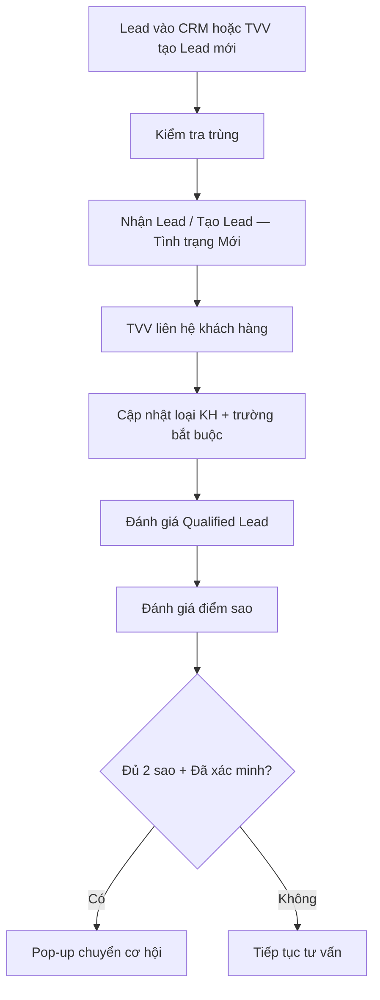

# Tạo Lead mới và đánh giá Qualified Lead

!!! info "Nguồn tài liệu"
    Chức năng / CRM / Lead Management — CRM VAN (*04_Create_Lead_And_Qualified_Lead*, *ChuongII Lead.md*). Tổng quan chương: [Chương II — Leads](chuong-ii-leads.md).

## Mục tiêu

Tài liệu hướng dẫn TVV cách **nhận Lead mới** để xử lý, **tạo Lead mới hoàn toàn** khi khách chưa có trên hệ thống, cập nhật đúng **loại khách hàng** sau khi liên hệ, nhập đầy đủ **trường bắt buộc** và đánh giá chất lượng Lead trước khi **chuyển thành cơ hội**.

Mục tiêu chính: ghi nhận đúng thông tin khách hàng, xác định đúng khả năng tư vấn và **chỉ chuyển cơ hội** đối với Lead đạt tiêu chí.

## Vị trí trong quy trình CRM

Quy trình này thực hiện khi Lead mới đi vào hệ thống hoặc khi TVV **chủ động tạo Lead** cho khách chưa có trên CRM.

Nếu TVV tạo Lead bằng tay, cần **tìm số điện thoại** trong `Lead`, `Cơ hội` và `Contact` trước khi tạo — xem [Thao tác chung CRM](thao-tac-chung.md) và [Kiểm tra trùng Lead](kiem-tra-trung-lead.md).

!!! tip "Lognote / Ghi chú"
    Sau mỗi phiên làm việc với khách, TVV **bắt buộc** ghi lại toàn bộ nội dung CSKH bằng **Lognote/Ghi chú** trên CRM (cuộc gọi, tin nhắn, Zalo, tư vấn, follow-up, bước tiếp theo). Lịch sử này đi theo khách từ Lead → cơ hội → đơn hàng và là căn cứ chính thức khi xác minh tranh chấp.



## Đối tượng sử dụng

| Nhóm người dùng | Vai trò |
|-----------------|---------|
| Tư vấn viên | Liên hệ khách, cập nhật thông tin, đánh giá Lead |
| Marketing | Theo dõi chất lượng Lead từ nguồn Marketing |
| Telesale | Xác minh thông tin ban đầu nếu có |
| CRM Admin | Hỗ trợ kiểm tra dữ liệu và cấu hình quy tắc |
| Quản lý | Theo dõi Lead qualified và hiệu quả chuyển đổi |

---

## Nhận Lead mới để xử lý

### Loại khách hàng mặc định

Khi Lead mới vào hệ thống, **Loại khách hàng** mặc định là **Khách hàng**. Đây chỉ là giá trị ban đầu — sau khi TVV liên hệ và xác minh, **phải điều chỉnh lại** cho chính xác.

### Mở trang làm việc với Lead

TVV vào **CRM › Lead** để mở danh sách Lead cần xử lý.

Đối với user là TVV:

- Nhìn thấy Lead của chính mình.
- Nhìn thấy Lead của VP/chi nhánh được phân quyền.
- Nếu Lead có **Nhân viên kinh doanh** là VP chung (chưa gán tên NV cụ thể), TVV cần **lấy Lead về mình** trước khi xử lý.

### Lấy Lead VP về xử lý

1. Tích chọn các Lead muốn lấy về.
2. Chọn một ô đại diện trong cột **Nhân viên kinh doanh**.
3. Cập nhật **Nhân viên kinh doanh** thành tên TVV phụ trách.
4. Xác nhận thay đổi.
5. Mở Lead để tiếp tục liên hệ.

### Liên hệ khách hàng từ Lead

1. Kiểm tra số điện thoại và **mã quốc gia**.
2. Chọn đúng nút **Gọi** theo số cần liên hệ (VN / US / quốc tế).
3. Nếu không liên hệ được qua cuộc gọi, dùng nút **SMS** gửi tin chờ tư vấn.
4. Ghi **Lognote/Ghi chú** kết quả liên hệ.

!!! warning "Lưu ý khi gọi"
    - Không gọi nhầm số VN/Mỹ nếu Lead có nhiều số.
    - Khách không nghe máy → ghi lịch sử và tạo **activity follow-up** nếu cần.

### Bắt buộc ghi Lognote sau mỗi phiên làm việc

Nội dung cần ghi:

- Đã gọi số nào, khách có nghe máy hay không.
- Đã gửi SMS/Zalo hay chưa.
- Khách phản hồi nội dung gì.
- Nội dung tư vấn hoặc thông tin đã xác minh.
- Lý do hẹn liên hệ lại hoặc ngừng chăm sóc.
- Bước xử lý tiếp theo.

### Cập nhật thông tin sau khi liên hệ

1. Kiểm tra và cập nhật **Loại khách hàng**.
2. Cập nhật tên, giới tính, email nếu có.
3. Kiểm tra SĐT và mã quốc gia.
4. Cập nhật VP tư vấn, nhu cầu, thị trường, nguồn.
5. Cập nhật **Nhân viên kinh doanh**.
6. Cập nhật **Tình trạng lead**.
7. Cập nhật **Edupath Tags** nếu đã xác minh.
8. **Lưu** Lead.

Nếu hệ thống báo trùng hoặc Lead bị khóa → xử lý theo mục [Xử lý Lead trùng hoặc Contact đã có](#xu-ly-lead-trung-hoac-contact-da-co) bên dưới.

### Quy định cập nhật tình trạng Lead

| Tình trạng lead | Khi nào sử dụng | Lưu ý thao tác |
|-----------------|-----------------|----------------|
| **Mới** | Lead mới vào hệ thống | Chỉ giữ **Mới** khi **chưa** gọi, nhắn tin hoặc xử lý nào đến khách |
| **Liên hệ sau** | Khách chưa nghe máy / chưa phản hồi, vẫn cần follow-up | Gọi: tối thiểu **3 cuộc** không nghe máy. Zalo: kết bạn + nhắn **3 tin**, mỗi tin cách **24 giờ**, chưa phản hồi → giữ **Liên hệ sau** |
| **Đã xác minh** | Đã gặp hoặc trao đổi được với khách để xác minh | **Không** chọn chỉ vì đã gọi hoặc nhắn tin |
| **Ngừng chăm sóc** | Không tiếp tục follow-up | **Bắt buộc** chọn thêm **Lý do mất** |
| **Close** | Khách rác / dữ liệu không hợp lệ | Số sai, không tín hiệu, dữ liệu rác |

!!! note
    - Mỗi lần gọi, nhắn, Zalo hoặc trao đổi → ghi **Lognote**.
    - **Ngừng chăm sóc** phải có **Lý do mất**.

---

## Tạo Lead mới hoàn toàn

### Khi nào tạo?

TVV tạo Lead mới hoàn toàn khi khách **chưa có** dữ liệu phù hợp trên hệ thống:

- Khách gọi trực tiếp cho TVV.
- Khách nhắn tin riêng / được giới thiệu trực tiếp.
- Chưa có Lead, Contact hoặc cơ hội phù hợp trên CRM.

### Kiểm tra trước khi tạo

Tìm kiếm trên hệ thống:

1. Module **Lead**.
2. Module **Cơ hội**.
3. Module **Contact**.

Chi tiết cách tìm theo SĐT, tên, email: [Kiểm tra trùng Lead](kiem-tra-trung-lead.md).

Nếu đã có Lead / Contact / cơ hội phù hợp → **không** tạo mới hoàn toàn.

### Các bước tạo Lead mới hoàn toàn

1. **CRM › Lead › Mới**.
2. Nếu khách chưa có trên hệ thống → nhập tại trường **Tên liên hệ**.
3. Nhập SĐT, mã quốc gia, nhu cầu, thị trường, VP tư vấn, nguồn, NVKD.
4. Kiểm tra **Loại khách hàng** mặc định = **Khách hàng**.
5. **Lưu** → liên hệ bằng **Gọi** hoặc **SMS** → cập nhật thông tin như quy trình nhận Lead mới.

Nếu sau khi lưu bị báo trùng → **không** tạo lại nhiều lần; kiểm tra Contact hoặc báo **CRM Admin**.

---

## Xử lý Lead trùng hoặc Contact đã có {#xu-ly-lead-trung-hoac-contact-da-co}

### Tạo Lead từ Contact đã tồn tại

Áp dụng khi khách phát sinh nhu cầu mới nhưng SĐT đã có trong **Contact**.

- Nếu Contact đã tồn tại → chọn Contact tại trường **Tên khách hàng**.
- **Không** nhập vào **Tên liên hệ** như khách mới hoàn toàn nếu Contact đã có.
- Muốn tạo cơ hội mới trực tiếp từ Contact → xem [Pipeline CRM](pipeline.md).

```text
Khách phát sinh nhu cầu mới → Contact đã tồn tại
→ Tạo Lead mới hoàn toàn cùng SĐT → Hệ thống báo trùng và khóa Lead
```

### Hai hướng xử lý

**Trường hợp 1 — Lead từ hệ thống / import tự động**

- Lead trùng Contact có thể bị **khóa**, user thường không thấy.
- Không tạo lại Lead nhiều lần cùng SĐT.
- Ghi nhận thông tin → báo **CRM Admin** kiểm tra.

**Trường hợp 2 — TVV chủ động tạo khi khách liên hệ trực tiếp**

Kiểm tra **Lead**, **Contact** (và khuyến nghị thêm **Cơ hội**).

| Tình huống | Xử lý |
|------------|--------|
| SĐT đã có trong **Lead** | Không tạo mới → báo Admin chuyển Lead về đúng người phụ trách |
| SĐT đã có trong **Contact** | Tạo Lead mới → trường **Tên khách hàng** → **Tìm kiếm thêm** → dán SĐT → chọn Contact → nhập thông tin còn thiếu → Lưu |

### Phân biệt `Tên liên hệ` và `Tên khách hàng`

| Trường | Khi nào dùng | Ý nghĩa |
|--------|--------------|---------|
| **Tên liên hệ** | Tạo Lead **mới hoàn toàn** | Liên hệ mới chưa có trên hệ thống |
| **Tên khách hàng** | Contact **đã có** | Chọn khách đã tồn tại → Lead hợp lệ |

!!! warning
    Nhập vào **Tên liên hệ** trong khi SĐT đã tồn tại → hệ thống có thể **báo trùng và khóa Lead**.

### Vì sao cần cập nhật loại khách hàng?

Mỗi loại có cách nhập liệu khác nhau. Chọn sai → dữ liệu CRM sai, ảnh hưởng tư vấn và báo cáo.

| Ví dụ | Loại |
|-------|------|
| Người có nhu cầu trực tiếp du học/định cư/dịch vụ | **Khách hàng** |
| Phụ huynh / người liên hệ thay | **Người đại diện** |
| Agent / đơn vị giới thiệu khách | **Đối tác** |

---

## Các loại khách hàng

### 1. Khách hàng

Người trên Lead là **khách hàng chính** hoặc có nhu cầu trực tiếp.

| Trường | Ghi chú |
|--------|---------|
| Tên khách hàng / Tên liên hệ | Họ tên khách chính — dùng **Tên liên hệ** khi tạo Lead mới hoàn toàn; **Tên khách hàng** khi chọn Contact có sẵn |
| Giới tính | Sau khi xác minh |
| Email khách hàng | Nếu có |
| SĐT / Mã quốc gia | Đúng format |
| VP tư vấn, Nhu cầu, Thị trường | Bắt buộc |
| Nhân viên kinh doanh, Nguồn, Tình trạng | Theo quy trình |
| Edupath Tag | Đánh giá chất lượng |

### 2. Người đại diện

Người liên hệ **không phải** khách chính (bố/mẹ, người thân, người bảo hộ…).

| Trường | Ghi chú |
|--------|---------|
| Loại khách hàng | **Người đại diện** |
| Mối quan hệ | Bố/Mẹ, Anh/Chị, Người thân… |
| Họ và tên, Giới tính, Email, SĐT | Người đại diện |
| Thông tin khách hàng chính | Bổ sung khi đã xác minh |

### 3. Đối tác

Lead từ đối tác hoặc người/đơn vị giới thiệu khách.

| Trường | Ghi chú |
|--------|---------|
| Loại khách hàng | **Đối tác** |
| Tên đối tác, SĐT, Email | Liên hệ đối tác |
| Nguồn, Ghi chú | Khách được giới thiệu / bối cảnh hợp tác |

Phân biệt rõ thông tin **đối tác** và **khách được giới thiệu**.

---

## Các trường bắt buộc

| Trường bắt buộc | Mục đích |
|-----------------|----------|
| Giới tính | Thông tin cá nhân cơ bản |
| SĐT / Mã quốc gia | Liên hệ + kiểm tra trùng |
| VP tư vấn | Đơn vị phụ trách tư vấn |
| Nhu cầu | Dịch vụ khách quan tâm |
| Thị trường | Quốc gia / thị trường |
| Nhân viên kinh doanh | Người phụ trách |
| Nguồn | Hiệu quả từng nguồn Lead |
| Tình trạng | Trạng thái xử lý Lead |
| **Edupath Tag** | Đánh giá chất lượng Lead qualified |

### Edupath Tag

| Edupath Tag | Ý nghĩa |
|-------------|---------|
| **Tài chính** | Khách có khả năng / điều kiện tài chính phù hợp |
| **Năng lực hồ sơ** | Hồ sơ / năng lực phù hợp |
| **Thời điểm** | Thời điểm dự kiến phù hợp triển khai |
| **Mục tiêu** | Mục tiêu rõ ràng |

---

## Đánh giá Qualified Lead

Sau khi liên hệ, TVV cập nhật đúng **Tình trạng lead**. Nếu **Ngừng chăm sóc** → chọn thêm **Lý do mất**.

Dựa trên **Tình trạng lead** và **Lý do mất**, **automation** tự đánh giá Lead thuộc **New**, **Not Qualified** hoặc **Qualified**. Người dùng **không** tự phân loại thủ công khi automation đã cấu hình.

| Dữ liệu | Người cập nhật | Mục đích |
|---------|----------------|----------|
| Tình trạng lead | TVV | Tình trạng xử lý thực tế |
| Lý do mất | TVV | Bắt buộc khi **Ngừng chăm sóc** |
| Edupath Tag | TVV | Chất lượng Lead + tính điểm sao |

| Trạng thái Qualified Lead | Ý nghĩa |
|---------------------------|---------|
| **New** | Lead mới, chưa xử lý hoặc vẫn ở tình trạng mới |
| **Not Qualified** | Liên hệ sau / Close / Ngừng chăm sóc — không đủ điều kiện tiếp tục tư vấn |
| **Qualified** | Đã xác minh / đủ thông tin để đánh giá tiếp |

---

## Quy tắc phân loại Lead

### 1. New

- Lead vừa tạo, **chưa** liên hệ khách.
- **Chưa** cập nhật tình trạng xử lý khác.

### 2. Not Qualified

Tình trạng liên quan: **Close**, **Liên hệ sau**, **Ngừng chăm sóc**.

| Lý do | Mô tả |
|-------|--------|
| Không nghe máy | Gọi nhiều lần không liên lạc được |
| Không có nhu cầu ngay từ đầu | Khách xác nhận không có nhu cầu |
| Trùng | Trùng Lead hoặc Contact |
| Chọn đơn vị khác | Khách đã chọn đơn vị tư vấn khác |

**Ngừng chăm sóc** → bắt buộc **Lý do mất** → automation phân loại.

### 3. Qualified

Lead đã **xác minh** hoặc xử lý đủ thông tin để tiếp tục đánh giá.

Có thể Qualified khi:

- Đã xác minh thông tin khách hàng.
- Đã gặp hoặc trao đổi được với khách hàng.
- Đã xác định được nhu cầu.
- Đã có đủ dữ liệu để đánh giá chất lượng Lead.
- **Ngừng chăm sóc** sau khi đã tư vấn nhưng không tiếp tục vì lý do cụ thể.

Lý do **Ngừng chăm sóc** nhưng vẫn thuộc nhóm Qualified (ví dụ):

| Lý do | Mô tả |
|-------|--------|
| Chọn đơn vị khác do giá | Khách đã chọn đơn vị tư vấn khác |
| Tài chính không phù hợp | Chưa đáp ứng tài chính |
| Đã tư vấn, không phản hồi | Khách chưa có kế hoạch hoặc im lặng |
| Chương trình không phù hợp | CT không khớp nhu cầu / điều kiện |
| Thời gian chưa phù hợp | Chưa đúng thời điểm |
| Tìm hiểu cho biết | Chưa có nhu cầu thực |

---

## Đánh giá điểm Qualified và chuyển cơ hội

Hệ thống dựa trên **Edupath Tag** để tính **số sao**. Khi đủ điều kiện, automation hiển thị **pop-up chuyển cơ hội** — TVV nhập thông tin trước khi tạo cơ hội chính thức.

### Quy tắc chấm sao

Theo **ChuongII Lead** (CRM VAN) — **Mục tiêu (Goal)** là tag bắt buộc trước khi tính sao cao hơn:

| Mức sao | Điều kiện Edupath Tag | Ý nghĩa |
|---------|----------------------|---------|
| **0 sao** | Chỉ **Mục tiêu (Goal)** | Có mục tiêu / nhu cầu chương trình |
| **1 sao** | **Mục tiêu** + (**Tài chính** hoặc **Năng lực hồ sơ**) | Thêm một tiêu chí quan trọng |
| **2 sao** | **Mục tiêu** + **Tài chính** + **Năng lực hồ sơ** | Đủ điều kiện chuyển cơ hội |
| **3 sao** | Đủ 4 tag (thêm **Thời điểm**) | Chủ yếu dùng ở giai đoạn cơ hội |

### Điều kiện hiện pop-up chuyển cơ hội

Pop-up chỉ hiện khi **cả hai**:

1. **Tình trạng lead** = **Đã xác minh**.
2. **Mức ưu tiên** ≥ **2 sao** — phải có đủ: **Mục tiêu** + **Tài chính** + **Năng lực hồ sơ**.

**3 sao** = thêm **Thời điểm** (4 tag).

### Tiêu chí chuyển cơ hội

Ngoài điều kiện sao và **Đã xác minh**, Lead nên chuyển cơ hội khi có tối thiểu:

- Tên khách hàng và số điện thoại.
- Đã đúng chức năng sau **2–3 cuộc gọi** tư vấn.
- Khách tương tác sau khi chuyển **hợp đồng mẫu** hoặc **tư vấn chuyên sâu**.
- Khách **lên văn phòng**.
- **Test tiếng Anh** (nếu chương trình yêu cầu).
- Khách có nhu cầu tham gia chương trình **trong năm**.

### Thao tác khi pop-up hiển thị

Nhập đầy đủ trên pop-up **Convert to Opportunity**:

| Trường trên pop-up | Ghi chú |
|--------------------|---------|
| Nhân viên kinh doanh | Người phụ trách cơ hội |
| Đội ngũ kinh doanh | Team xử lý |
| Nhu cầu thực tế | Nhu cầu đã xác minh |
| Chương trình tư vấn | Theo **bảng giá** |
| Năm chương trình | Năm kinh doanh công ty (vd. 09/2025–08/2026 → **2026**) |
| Ngày chốt dự kiến | Thời điểm dự kiến chốt |
| Customer | Tạo mới hoặc liên kết khách theo tình huống |

Sau khi nhập đủ → chọn **Tạo cơ hội**.

!!! tip "Nhu cầu, Chương trình, Thị trường"
    Ba thông tin phải **khớp bảng giá** — chọn sai có thể không tìm được đơn giá khi tạo báo giá.

### Trường hợp TVV tắt pop-up

Khi Lead đã đủ điều kiện, **không nên** tắt pop-up. Nếu tắt mà chưa chuyển cơ hội → mở lại Lead → pop-up **tiếp tục hiện**.

### Hệ thống báo lỗi thiếu thông tin chuyển cơ hội

Bấm **Convert to Opportunity** thủ công khi chưa đủ 2 sao → bảng lỗi. Kiểm tra:

| Nội dung | Cách xử lý |
|----------|------------|
| Chưa **Đã xác minh** | Cập nhật tình trạng đúng kết quả liên hệ |
| Chưa đạt 2 sao | Rà lại Edupath Tag |
| Thiếu **Mục tiêu** / **Tài chính** / **Năng lực hồ sơ** | Xác minh và cập nhật tag nếu đúng |

---

## Các bước thực hiện trên Odoo

### Bước 1 — Nhận Lead mới

**CRM › Lead** → kiểm tra NVKD → nếu VP chung → lấy Lead về tên TVV → mở Lead xử lý.

### Bước 2 — Liên hệ khách

Kiểm tra SĐT + mã quốc gia → **Gọi** / **SMS** → ghi **Lognote**.

### Bước 3 — Cập nhật và lưu Lead

Xác định loại KH → cập nhật trường → **Tình trạng** → **Edupath Tags** → **Lưu**. Trùng/khóa → xử lý Contact hoặc báo Admin.

### Bước 4 — Tạo Lead mới hoàn toàn

Kiểm tra Lead / Cơ hội / Contact → nếu chưa có → **Mới** → **Tên liên hệ** → các trường bắt buộc → Lưu → liên hệ như Bước 2–3.

### Bước 5 — Tạo Lead từ Contact đã có

**Mới** → **Tên khách hàng** → **Tìm kiếm thêm** → chọn Contact → nhập thông tin còn thiếu → Lưu.

### Bước 6 — Cập nhật loại khách hàng

**Khách hàng** / **Người đại diện** / **Đối tác** + trường tương ứng.

### Bước 7 — Trường bắt buộc

Giới tính, SĐT+mã QG, VP tư vấn, Nhu cầu, Thị trường, NVKD, Nguồn, Tình trạng, Edupath Tag.

### Bước 8 — Đánh giá Qualified Lead

Cập nhật tình trạng + lý do mất (nếu có) → Edupath Tag → Lưu → automation phân loại → kiểm tra **số sao**.

### Bước 9 — Chuyển cơ hội

**Đã xác minh** + **≥ 2 sao** → pop-up → nhập đủ thông tin → **Tạo cơ hội**. Xem [Pipeline CRM](pipeline.md).

---

## Kết quả mong đợi

- Lead mới có loại KH mặc định **Khách hàng**; TVV cập nhật đúng sau liên hệ.
- TVV biết nhận Lead VP/nhóm chung, gọi đúng số VN/US, dùng SMS, ghi Lognote đầy đủ.
- Kiểm tra trùng trước khi tạo; **Tên liên hệ** (mới) vs **Tên khách hàng** (Contact có sẵn).
- Trường bắt buộc đầy đủ; automation đánh giá **New / Not Qualified / Qualified** đúng.
- Lead **Đã xác minh** + **≥ 2 sao** + đủ **tiêu chí chuyển cơ hội** → pop-up; nhập đủ thông tin trước khi tạo.

---

## Lỗi thường gặp

| Lỗi | Nguyên nhân | Cách xử lý |
|-----|-------------|------------|
| Tạo Lead mới bị báo trùng Contact | Nhập **Tên liên hệ** khi Contact đã có | Chọn Contact tại **Tên khách hàng** |
| Không tạo được Lead từ Contact trống | Contact import cũ, chưa có cơ hội | Chọn **Tên khách hàng**; vẫn lỗi → báo Admin |
| Khách đã có Lead nhưng vẫn tạo thêm | Chưa kiểm tra module Lead | Tìm SĐT trong Lead → báo Admin chuyển phụ trách |
| Không đổi loại KH sau liên hệ | Giữ mặc định Khách hàng | Xác minh vai trò → đổi loại |
| Thiếu mã quốc gia | SĐT chưa đủ format | Bổ sung VN, US… |
| Sai số sao | Thiếu/sai Edupath Tag | Rà 4 tag |
| Không hiện pop-up chuyển cơ hội | Chưa **Đã xác minh** hoặc chưa 2 sao | Cập nhật tình trạng + tag |
| TVV tắt pop-up | Chưa tạo cơ hội | Mở lại Lead → pop-up hiện lại |
| Ngừng chăm sóc không có lý do mất | Quên chọn | Bổ sung **Lý do mất** |
| Not Qualified nhưng không có lý do | Quên nhập lý do / lý do mất | Cập nhật lý do rõ ràng trước khi đóng |
| Chuyển cơ hội khi chưa đủ điều kiện | Chưa xác minh, chưa 2 sao hoặc chưa đủ tiêu chí nghiệp vụ | Tiếp tục tư vấn; cập nhật tag/tình trạng |
| Chuyển cơ hội quá sớm | Chưa đủ 2–3 cuộc gọi hoặc chưa tương tác thực tế | Tiếp tục theo **tiêu chí chuyển cơ hội** |
| Automation phân loại sai | Tình trạng / lý do mất chưa đúng | Kiểm tra lại → báo Admin nếu vẫn sai |

---

## Checklist TVV

- [ ] Đã mở đúng danh sách Lead được phân quyền
- [ ] Lead VP/nhóm chung → đã lấy về đúng **NVKD**
- [ ] Đã kiểm tra SĐT + mã quốc gia trước khi **Gọi** (VN / US / quốc tế)
- [ ] Đã ghi **Lognote** đủ nội dung CSKH
- [ ] Đã kiểm tra SĐT trong **Lead**, **Cơ hội**, **Contact**
- [ ] Tạo mới: **Tên liên hệ** (chưa có Contact) hoặc **Tên khách hàng** (Contact có sẵn)
- [ ] Lead không trùng; tình trạng ban đầu **Mới**
- [ ] Đúng **loại khách hàng** + trường bắt buộc + **Edupath Tag**
- [ ] **Tình trạng lead** + **Lý do mất** (nếu Ngừng chăm sóc)
- [ ] Đã kiểm tra **số sao**
- [ ] Đủ **tiêu chí chuyển cơ hội** (2–3 cuộc gọi, tương tác thực tế, lên VP, test TA…)
- [ ] Pop-up chuyển cơ hội: nhập đủ NVKD, team, nhu cầu thực tế, chương trình, năm CT, ngày chốt
- [ ] **Tạo cơ hội** khi đủ điều kiện

---

## Bài thực hành training

| Bài | Nội dung |
|-----|----------|
| **1** | Nhận Lead VP về xử lý — cập nhật **NVKD** |
| **2** | Liên hệ từ Lead — **Gọi** đúng số, **SMS**, **Lognote**, cập nhật Lead |
| **3** | Tạo Lead **mới hoàn toàn** — kiểm tra 3 module, **Tên liên hệ**, trường bắt buộc |
| **4** | Tạo Lead từ **Contact** có sẵn — **Tên khách hàng**, không trùng/khóa |
| **5** | Đổi loại **Người đại diện** — mối quan hệ, họ tên, SĐT |
| **6** | **Edupath Tag** và điểm sao 0/1/2/3 |
| **7** | Pop-up chuyển cơ hội — **Đã xác minh** + 2 sao, nhập pop-up, **Tạo cơ hội** |
| **8** | **Convert** khi chưa 2 sao — đọc bảng lỗi, bổ sung tag thiếu |
| **9** | Rà **tiêu chí chuyển cơ hội** — 2–3 cuộc gọi, HĐ mẫu, lên VP, test TA |

---

Xem lại: [Chương I — Thao tác chung](thao-tac-chung.md) | [Chương II — Leads](chuong-ii-leads.md) | [Chương III — Pipeline](pipeline.md) | [Chương IV — Sale Order](chuong-iv-sale-order.md)
