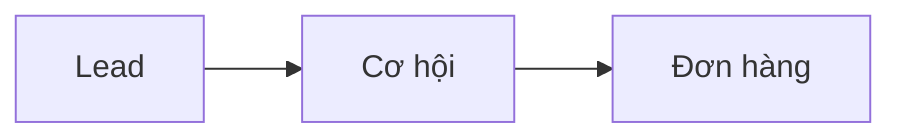

# Chương I — Thao tác chung

!!! info "Nguồn tài liệu"
    Chức năng / CRM — Phiên bản 1.0 (CRM VAN — *09_CRM_Common_Operations_Guide*).

## Mục tiêu

Hướng dẫn các thao tác dùng chung trên CRM mà TVV cần nắm **trước** khi xử lý Lead, Cơ hội hoặc Đơn hàng:

- **Tìm kiếm** khách hàng, Lead và Cơ hội
- Ghi **Lognote/Ghi chú** — lịch sử chăm sóc
- Tạo và theo dõi **Activity/Việc cần làm**
- Hiểu **automation thu hồi** Lead/Cơ hội không xử lý đúng hạn



Các kỹ năng này dùng xuyên suốt quy trình CRM — xem thêm [Tạo Lead & Qualified](tao-lead-qualified.md), [Pipeline](pipeline.md), [Báo giá & đơn hàng](bao-gia-don-hang.md).

---

## Phần 1 — Tìm kiếm khách hàng, Lead và Cơ hội

### Khi nào cần tìm kiếm

- Tìm khách để chăm sóc tiếp
- Tìm Lead được phân công
- Mở lại cơ hội cập nhật pipeline
- Kiểm tra Contact đã có trên hệ thống
- Kiểm tra trước khi **tạo Lead mới** — xem [Kiểm tra trùng Lead](kiem-tra-trung-lead.md)
- Kiểm tra trường hợp trùng dữ liệu

Tìm kiếm là thao tác hằng ngày để mở **đúng hồ sơ** cần xử lý.

### Chọn đúng trường tìm kiếm

Hệ thống gợi ý nhiều trường: **Tên**, **Email**, **Điện thoại/di động**, **Nhân viên kinh doanh**, **Công ty liên quan**, **Thẻ**…

| Nội dung đang có | Trường nên chọn |
|------------------|-----------------|
| Số điện thoại | **Điện thoại/di động** |
| Tên khách hàng | **Tên** |
| Email | **Email** |
| NV phụ trách | **Nhân viên kinh doanh** |
| Công ty/đối tác | **Công ty liên quan** |

!!! warning "Chọn sai trường"
    Nhập SĐT nhưng chọn **Tên** (hoặc ngược lại) → có thể **không ra kết quả**.

### Tìm theo số điện thoại

Cùng một số có thể nhập nhiều cách: `0345334928`, `+84 345 334 928`, `345334928`…

**Số Việt Nam** — chuẩn hóa trước khi tìm:

- Bỏ `0` đầu, bỏ `+84` / `84` đầu
- Bỏ dấu `+`, khoảng trắng, gạch ngang

| Số khách cung cấp | Số nên tìm |
|-------------------|------------|
| `0345334928` | `345334928` |
| `+84 345 334 928` | `345334928` |
| `+84-345-334-928` | `345334928` |

**Số nước ngoài** — bỏ `+` và ký tự phân cách, hoặc tìm phần số sau mã quốc gia (vd. `+1 714-909-7526` → `7149097526`).

### Tìm theo tên và email

**Tên:** nhập tên → chọn gợi ý **Tìm kiếm Tên cho…** → đối chiếu thêm email, SĐT, nguồn. Nhiều khách trùng tên; tên có thể thiếu dấu/sai chính tả.

**Email:** nhập email → chọn **Tìm kiếm Email cho…** → đối chiếu tên và SĐT. Không ra kết quả → thử SĐT hoặc tên.

### Tìm ở những module nào

| Module | Mục đích |
|--------|----------|
| **Lead** | Lead mới, đang xử lý, cần cập nhật tình trạng |
| **Cơ hội** | Cơ hội đang pipeline |
| **Contact** | Hồ sơ KH, người đại diện, đối tác |

**Không** chỉ tìm một module rồi kết luận khách chưa có trên CRM.

### Cách tìm trên từng module

**Lead:** CRM › Lead → nhập nội dung → chọn đúng trường → mở Lead → kiểm tra tình trạng, NV phụ trách, lognote. Lead thuộc người khác → báo quản lý/Admin. **Không** tạo Lead mới nếu Lead còn cần xử lý.

**Cơ hội:** CRM › Bán hàng / pipeline → tìm SĐT/tên/email → kiểm tra stage → cập nhật lognote/activity. Cần tiếp nhận lại → báo quản lý/Admin.

**Contact:** Liên hệ/Contact → tìm → kiểm tra Lead/cơ hội/đơn liên quan. Tạo Lead cho Contact có sẵn → chọn **Tên khách hàng** — xem [Tạo Lead & Qualified](tao-lead-qualified.md).

---

## Phần 2 — Lognote và lịch sử chăm sóc

### Lognote là gì

**Lognote/Ghi chú** lưu lịch sử chăm sóc trên CRM: trao đổi với khách, phản hồi, bước xử lý, lý do đổi tình trạng/stage, lý do mất, đơn bị trả lại, ai xử lý từng thời điểm.

### Vì sao quan trọng

Căn cứ khi xác minh: thông tin KH, nội dung tư vấn, tiến độ chăm sóc, lý do ngừng/mất, chuyển Lead → cơ hội, đơn KT trả lại, tranh chấp nhiều TVV/bán chung.

### Nguyên tắc bắt buộc

Mọi chăm sóc KH phải qua **Lognote** trên CRM. Ghi chú **ngoài hệ thống** (giấy, Zalo cá nhân không cập nhật CRM, file riêng, trao đổi miệng…) **không** là căn cứ chính thức.

### Vị trí trên màn hình

Khung trao đổi bên phải / lịch sử hoạt động:

| Nút | Mục đích |
|-----|----------|
| **Gửi tin** | Gửi tin/email (nếu có) |
| **Ghi chú** | Ghi **lognote** nội bộ |
| **Hoạt động** | Tạo activity, lịch hẹn, nhắc việc |

### Khi nào ghi lognote

| Tình huống | Nội dung cần ghi |
|------------|------------------|
| Gọi lần đầu | Nghe máy hay không, nhu cầu, thái độ |
| Không nghe máy | Thời điểm, số lần gọi, kế hoạch gọi lại |
| Khách hẹn gọi lại | Thời gian hẹn, nội dung cần trao đổi |
| Thông tin mới từ khách | Học tập, tài chính, hồ sơ, mục tiêu |
| Đổi tình trạng Lead | Lý do |
| Ngừng chăm sóc | Lý do mất |
| Chuyển cơ hội | Vì sao đủ điều kiện |
| Chuyển stage pipeline | Nội dung tư vấn, lý do chuyển |
| Báo giá/đơn hàng | Đã gửi gì, khách phản hồi |
| KT trả đơn | Lý do, TVV đã chỉnh gì |
| Tranh chấp xử lý KH | Mốc trao đổi liên quan |

### Cách ghi và nội dung nên có

1. Mở đúng hồ sơ → **Ghi chú** → nhập nội dung → **Ghi nhận** → kiểm tra hiển thị trong lịch sử.

| Nội dung | Gợi ý |
|----------|--------|
| Thời điểm | Ngày/giờ trao đổi |
| Kênh | Gọi, Zalo, email, gặp trực tiếp |
| Kết quả | Nghe máy, hẹn gọi lại, đã tư vấn |
| Nội dung chính | Quan tâm gì, tư vấn gì, phản hồi gì |
| Bước tiếp theo | Gọi lại, gửi thông tin, activity, chuyển stage |
| Người liên quan | Đại diện, phụ huynh, đối tác, TVV khác |

Ví dụ:

```text
03/06/2026 - Gọi khách qua số 0345xxx928.
Khách quan tâm EB3 USA, năm CT 2026.
Đã tư vấn tài chính và năng lực hồ sơ.
Khách hẹn 05/06 gửi thêm thông tin gia đình.
Tạo activity gọi lại 05/06/2026.
```

### Tranh chấp / bán chung

- TVV có lognote rõ trên CRM → có căn cứ xử lý.
- Chuyển TVV → ghi lý do và thời điểm trong lognote.
- Bán chung → ghi rõ vai trò từng người.

### Phân biệt Lognote và Hoạt động

| Chức năng | Mục đích |
|-----------|----------|
| **Ghi chú** / Lognote | Việc **đã xảy ra** |
| **Hoạt động** | Việc **cần làm** trong tương lai |

Thường làm **cả hai**: ghi lognote nội dung vừa trao đổi + tạo activity cho bước tiếp theo.

---

## Phần 3 — Activity / Việc cần làm

### Activity là gì

**Activity** giao việc nội bộ, hẹn lịch, theo dõi tiến độ trên CRM — **không** thay thế lognote.

| Chức năng | Mục đích |
|-----------|----------|
| Lognote | Đã xảy ra |
| Activity | Cần làm + tracking hoàn tất |

### Khi nào tạo Activity

- Hẹn gọi lại khách
- Giao Admin kiểm tra Lead trùng
- Giao KT kiểm tra đơn
- Giao Docs kiểm tra hồ sơ
- Nhắc TVV cập nhật thông tin KH
- Nhắc quản lý xử lý tình huống phát sinh

### My Activities và Created Activities

| Mục | Ý nghĩa | Ai xem |
|-----|---------|--------|
| **My Activities** | Việc được giao hoặc tự giao cho mình | Người nhận |
| **Created Activities** | Việc mình giao cho người khác | Người giao |

Nhóm theo hạn: **Overdue** (quá hạn), **Today**, **This Week**, **This Month** — ưu tiên Overdue và Today.

### Cách tạo Activity

1. Mở Lead / Cơ hội / Contact / Đơn hàng.
2. **Hoạt động** → chọn loại (Việc cần làm, cuộc gọi…).
3. **Tóm tắt** + **Ngày đến hạn** + **Phân công cho** + ghi chú chi tiết.
4. **Lịch trình**.

Ghi rõ: việc gì, ai xử lý, hạn nào, hồ sơ nào.

**Tự giao cho mình** (gọi lại ngày mai, nhắc gửi báo giá…) → hiện trong **My Activities**.

**Giao người khác** → người giao xem **Created Activities**, người nhận xem **My Activities**.

### Xử lý và theo dõi

**Nhận việc:** Activities › My Activities → xử lý → ghi lognote nếu cần → đánh dấu **hoàn tất**.

**Theo dõi đã giao:** Created Activities → kiểm tra còn mở hay đã xong → nhắc nếu quá hạn.

### Nguyên tắc

- Việc cần tracking trên CRM → dùng Activity, không chỉ email.
- Tóm tắt rõ; hạn đúng; phân công đúng người; tạo trên **đúng hồ sơ** KH.
- Xong việc → đánh dấu hoàn tất; nội dung quan trọng → thêm lognote.

---

## Phần 4 — Automation thu hồi Lead/Cơ hội

Hệ thống **tự thu hồi** Lead/Cơ hội không xử lý đúng hạn — tránh dữ liệu nằm lâu không chăm sóc.

### Thu hồi Lead (đang ở TVV)

| Tình trạng Lead | Tối đa | TVV cần làm trước hạn |
|-----------------|--------|------------------------|
| **Mới** | **2 giờ** | Liên hệ, lognote, cập nhật tình trạng |
| **Liên hệ sau** | **24 giờ** | Follow-up, lognote, kết quả mới |
| **Đã xác minh** | **15 ngày** | Chuyển cơ hội (nếu đủ) hoặc **Ngừng chăm sóc** + lý do |

Quá hạn → Lead **tự về VP**.

### Thu hồi Cơ hội (đang ở TVV)

| Loại cơ hội | Tối đa | Kết quả hợp lệ |
|-------------|--------|----------------|
| Du học | **60 ngày** | Đơn hàng hoặc **Thất bại** + lý do |
| Dịch vụ | **60 ngày** | Đơn hàng hoặc **Thất bại** + lý do |
| Định cư | **90 ngày** | Đơn hàng hoặc **Thất bại** + lý do |

Quá hạn → Cơ hội **tự về VP**.

### Lead/Cơ hội đang ở VP

Quá **4 giờ** không TVV tiếp cận/nhận về → tự chuyển **CSKH**.

### Tránh bị thu hồi

- Không để Lead **Mới** sau khi đã gọi/nhắn.
- **Liên hệ sau** → lognote + activity follow-up.
- **Đã xác minh** → chuyển cơ hội hoặc ngừng chăm sóc đúng hạn.
- Cơ hội: cập nhật stage, lognote; không tiếp tục → **Thất bại**; đồng ý ký → báo giá/đơn hàng.
- Bị thu hồi → có thể mất quyền xử lý; trao đổi quản lý/VP nếu cần nhận lại.

---

## Lỗi thường gặp

| Lỗi | Cách xử lý |
|-----|------------|
| SĐT không ra kết quả | Chọn **Điện thoại/di động**, chuẩn hóa số |
| Tên/email không ra | Chọn đúng trường; thử SĐT hoặc module khác |
| Chỉ tìm Lead rồi tạo mới | Tìm cả **Lead, Cơ hội, Contact** |
| Không ghi lognote | Ghi ngay sau trao đổi quan trọng |
| Ghi chú ngoài CRM | Cập nhật lại vào lognote |
| Lognote quá ngắn | Thêm bối cảnh, kết quả, bước tiếp theo |
| Không tạo Activity | Tạo trên đúng hồ sơ, phân công đúng người |
| Không đánh dấu hoàn tất Activity | Đánh dấu sau khi xử lý xong |
| Lead/Cơ hội bị thu hồi | Kiểm tra lognote/activity; trao đổi quản lý/VP |

---

## Checklist TVV

- [ ] Chọn đúng trường tìm kiếm (SĐT / Tên / Email)
- [ ] Đã tìm **Lead, Cơ hội, Contact** trước khi tạo mới
- [ ] Ghi **lognote** sau trao đổi quan trọng (đủ thời điểm, kết quả, bước tiếp)
- [ ] Tạo **Activity** cho việc cần theo dõi; đánh dấu hoàn tất khi xong
- [ ] Kiểm tra **My Activities** / **Created Activities**
- [ ] Lead **Mới** ≤ 2h | **Liên hệ sau** ≤ 24h | **Đã xác minh** ≤ 15 ngày
- [ ] Cơ hội du học/dịch vụ ≤ 60 ngày | định cư ≤ 90 ngày

---

## Bài thực hành

| Bài | Nội dung |
|-----|----------|
| **1** | Chọn đúng trường tìm kiếm (SĐT, Tên, Email) |
| **2** | Tìm khách trên Lead, Cơ hội, Contact |
| **3** | Ghi lognote sau cuộc gọi |
| **4** | Phân biệt lognote vs hoạt động |
| **5** | Tạo Activity giao việc |
| **6** | My Activities vs Created Activities |
| **7** | Nhận biết Lead/Cơ hội sắp bị thu hồi |

---

Xem tiếp: [Chương II — Leads](chuong-ii-leads.md) | [Chương III — Pipeline](pipeline.md) | [Chương IV — Sale Order](chuong-iv-sale-order.md)
