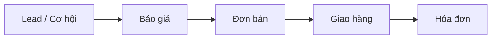

# Bán hàng

Module **Bán hàng** (Sales) quản lý quy trình từ báo giá đến đơn bán và giao hàng, thường đi kèm **CRM** để quản lý cơ hội và lead.

## Quy trình chuẩn

## Cài đặt ứng dụng

1. **Cài đặt › Ứng dụng** — tìm **Sales** / **Bán hàng** → **Cài đặt**
2. **Bán hàng › Cấu hình › Cài đặt**:
   - **Báo giá** — bật nếu dùng quotation
   - **Chữ ký trực tuyến** — khách ký báo giá trên portal
   - **Giá theo bảng giá** — pricelist

## 1. CRM — 5 chương

| Chương | Nội dung |
|--------|----------|
| **I** | [Thao tác chung](crm/thao-tac-chung.md) |
| **II** | [Leads](crm/chuong-ii-leads.md) — tiếp nhận, tình trạng, chấm sao, chuyển cơ hội |
| **III** | [Pipeline (Cơ hội)](crm/pipeline.md) |
| **IV** | [Sale Order (Đơn hàng)](crm/chuong-iv-sale-order.md) |
| **V** | [Báo cáo](crm/bao-cao.md) |

Tài liệu chi tiết Chương II: [Kiểm tra trùng](crm/kiem-tra-trung-lead.md) | [Tạo Lead & Qualified](crm/tao-lead-qualified.md)

## 2. Đơn bán

Phần bổ sung Sales (giao hàng, hóa đơn) — chi tiết báo giá/Confirm nằm ở **Chương IV CRM**.

| STT | Trang |
|-----|-------|
| 1 | [Báo giá](ban-hang/bao-gia.md) |
| 2 | [Đơn bán](ban-hang/don-ban.md) |
| 3 | [Hóa đơn khách hàng](ban-hang/hoa-don.md) |

## Liên kết module khác

- **Kho** — giao hàng, trừ tồn
- **Kế toán** — hóa đơn khách hàng
- **Project** — nếu bán dịch vụ theo dự án
