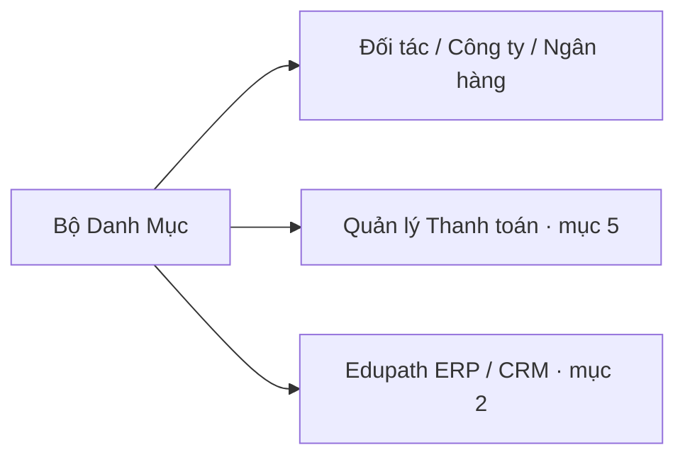

# 7 · Bộ Danh Mục (`danhmuc`)

!!! abstract "Tóm tắt"
    Module **dữ liệu danh mục dùng chung**: bổ sung các danh mục phân loại (vùng/miền, loại hình kinh doanh, loại khách hàng) và mở rộng thông tin **Đối tác / Công ty / Ngân hàng** để các module nghiệp vụ khác (thanh toán, CRM…) dùng lại.

## 1. Thông tin chung

| Mục | Nội dung |
|-----|----------|
| **STT** | 7 |
| **Tên** | Bộ Danh Mục |
| **Module kỹ thuật** | `danhmuc` |
| **Phiên bản** | 17.0.0.1 |
| **Phụ thuộc** | `base`, `contacts`, `uom`, `hr`, `utm`, `mail` |
| **Trạng thái** | 🔵 Đang phát triển / vận hành |
| **Ngày cập nhật** | 10/07/2026 |

## 2. Mục tiêu & bài toán

Nhiều module nội bộ cần chung một bộ **danh mục chuẩn** và các trường thông tin mở rộng trên đối tác/công ty. Tách riêng vào `danhmuc` để:

- Tránh khai trùng danh mục ở từng module.
- Chuẩn hoá dữ liệu đối tác (loại KH, vùng/miền, CCCD…) phục vụ hợp đồng, thanh toán, báo cáo.

## 3. Phạm vi chức năng

### 3.1 Danh mục phân loại (model mới)

| Model | Ý nghĩa |
|-------|---------|
| `res.region` | **Vùng / Miền** |
| `res.partner.loaihinhkd` | **Loại hình kinh doanh** |
| `res.partner.type` | **Loại khách hàng** |

### 3.2 Mở rộng Đối tác (`res.partner`)

Bổ sung: **Vùng/Miền**, **Loại hình kinh doanh**, **Loại khách hàng**, **Tên viết tắt**, **Số CCCD**, **Nơi cấp CCCD**, **Fax**, **Địa chỉ**.

### 3.3 Mở rộng Công ty & Ngân hàng

- **Công ty** (`res.company`): **Tên viết tắt**, **Tên ký HĐ** (dùng cho mẫu in hợp đồng).
- **Ngân hàng** (`res.bank`): ràng buộc **tên ngân hàng là duy nhất**.

## 4. Đối tượng sử dụng

| Vai trò | Dùng để |
|---------|---------|
| **Người dùng nghiệp vụ** | Chọn danh mục khi tạo đối tác/hồ sơ |
| **Quản trị dữ liệu** | Khai báo & chuẩn hoá danh mục dùng chung |

## 5. Quan hệ với module khác

## 6. Quy tắc nghiệp vụ

- **Tên ngân hàng** không được trùng trên toàn hệ thống.
- Các danh mục là **dữ liệu nền** — nên khai trước khi vận hành các module phụ thuộc.

## 7. Tiêu chí nghiệm thu (UAT)

- [ ] Tạo/chọn Vùng-Miền, Loại hình KD, Loại KH trên hồ sơ đối tác.
- [ ] Trường CCCD/Tên viết tắt hiển thị & lưu đúng trên đối tác.
- [ ] Tên ký HĐ của công ty đổ đúng vào mẫu in hợp đồng.
- [ ] Không tạo được 2 ngân hàng trùng tên.

## 8. Phụ thuộc & rủi ro

- **Là module nền** cho [Quản lý Thanh toán (5)](fin-qlthanhtoan.md) và dùng chung với [Edupath ERP (2)](lead-view.md).
- **Rủi ro:** đổi/xoá danh mục đang được tham chiếu có thể ảnh hưởng dữ liệu module khác.

## 9. Lịch sử thay đổi

| Ngày | Người sửa | Thay đổi |
|------|-----------|----------|
| 10/07/2026 | (tự động) | Khởi tạo đặc tả từ mã nguồn `danhmuc` |
