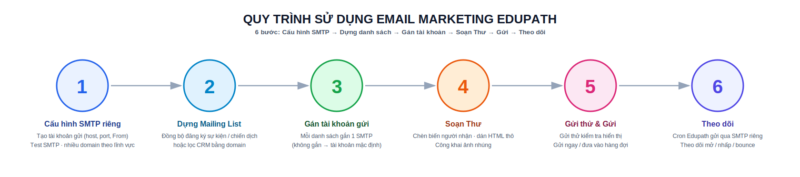
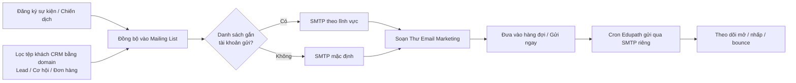

# 3 · Email Marketing Edupath (`Edupath_Email_Marketing`)

!!! abstract "Tóm tắt"
    Gửi **Email Marketing** qua **SMTP riêng** (tách hoàn toàn khỏi mail CRM / báo giá / hệ thống), dựng **tệp người nhận** từ **người đăng ký sự kiện / chiến dịch** và từ **bộ lọc CRM bằng domain** (Lead / Cơ hội / Đơn hàng) đổ vào **Mailing List** Odoo, rồi soạn & gửi **Thư** với công cụ chèn biến người nhận, dán HTML thô và hàng đợi gửi riêng. Hỗ trợ **nhiều tài khoản gửi** gán theo từng danh sách (Định cư, Du học, Anh Ngữ, F&B…), **tách nguồn** (utm.source) khỏi CRM, và tích hợp **Ladiflow** (mặc định **tắt & ẩn menu**).

## Quy trình sử dụng

Sáu bước để hoàn thiện một lượt gửi Email Marketing bằng module này:

{ .doc-screenshot-full }

```text
① Cấu hình SMTP riêng   — Tạo tài khoản gửi (host, port, From), Test SMTP; nhiều domain theo lĩnh vực
② Dựng Mailing List     — Đồng bộ đăng ký sự kiện/chiến dịch, hoặc lọc CRM bằng domain
③ Gán tài khoản gửi     — Mỗi danh sách gắn 1 SMTP (không gắn → dùng tài khoản mặc định)
④ Soạn Thư              — Chèn biến người nhận, dán HTML thô, công khai ảnh nhúng
⑤ Gửi thử & Gửi         — Gửi thử kiểm tra hiển thị, rồi Gửi ngay / đưa vào hàng đợi
⑥ Theo dõi              — Cron Edupath gửi qua SMTP riêng; theo dõi mở / nhấp / bounce
```

!!! tip "Chi tiết từng bước"
    Bước ① xem [4.1](#41-cau-hinh-smtp-rieng-edupathemailsmtpconfig) · bước ② xem [4.2](#42-dung-tep-nguoi-nhan-mailing-list) · bước ③ xem [4.3](#43-chon-tai-khoan-gui-tu-ong) · bước ④ xem [4.4](#44-soan-noi-dung-cong-cu-ho-tro) · bước ⑤ xem [4.5](#45-gui-hang-oi) · sơ đồ luồng nghiệp vụ đầy đủ ở [mục 7](#7-luong-nghiep-vu).

## 1. Thông tin chung

| Mục | Nội dung |
|-----|----------|
| **STT** | 3 |
| **Tên** | Email Marketing Edupath |
| **Module kỹ thuật** | `Edupath_Email_Marketing` |
| **Phiên bản** | 17.0.1.11.3 |
| **Danh mục** | Marketing / Email Marketing |
| **Tác giả** | Edupath |
| **Phụ thuộc** | `mass_mailing`, `mass_mailing_sale`, `contacts`, `crm`, `sale`, [`lead_view`](lead-view.md); Python `requests` |
| **License** | LGPL-3 |
| **Application** | Không (mở rộng app *Email Marketing* của Odoo) |
| **Trạng thái** | 🔵 Đang phát triển / vận hành |
| **Ngày cập nhật** | 16/07/2026 |

## 2. Mục tiêu & bài toán

- Gửi email marketing **không dùng chung** mail server với CRM / báo giá — tránh ảnh hưởng uy tín gửi (sender reputation) và tách bạch trách nhiệm vận hành.
- Cho phép **nhiều lĩnh vực** (Định cư, Du học, Anh Ngữ, F&B…) gửi bằng **tài khoản/domain riêng** thông qua cơ chế gán tài khoản gửi theo danh sách.
- Biến **người đăng ký sự kiện / chiến dịch** và **tệp khách CRM** thành **danh sách gửi** một cách có kiểm soát: chuẩn hoá & khử trùng email, loại email đã blacklist.
- **Tách nguồn** (utm.source) do Email Marketing tạo ra khỏi danh mục *Nguồn* của CRM để không lẫn báo cáo và không lẫn dropdown chọn nguồn trên các form.
- Giữ khả năng tích hợp **Ladiflow** nhưng **tắt & ẩn menu mặc định** để luồng chuẩn chạy hoàn toàn nội bộ Odoo.

## 3. Kiến trúc & mô hình dữ liệu

Module mở rộng app *Email Marketing* (`mass_mailing`) chuẩn của Odoo, thêm/kế thừa các model sau:

| Model | Kiểu | Vai trò |
|-------|------|---------|
| `edupath.email.smtp.config` | Mới | Cấu hình SMTP Email Marketing; tự sinh `ir.mail_server` `[Edupath]` tương ứng |
| `edupath.crm.audience.service` | Abstract | Dịch vụ dựng domain & trích xuất email từ Lead / Cơ hội / Đơn hàng |
| `edupath.crm.audience.wizard` (+ `.field.line`) | Wizard | Lọc tệp khách CRM bằng **domain** → Mailing List |
| `edupath.campaign.mailing.sync.wizard` | Wizard | Đồng bộ người đăng ký chiến dịch → Mailing List |
| `mailing.mailing` | Kế thừa | Chọn tài khoản gửi, hàng đợi riêng, công khai ảnh nhúng, dán HTML thô |
| `mailing.list` | Kế thừa | Gắn tài khoản gửi (`edupath_smtp_config_id`) & chiến dịch nguồn |
| `mailing.contact` | Kế thừa | Liên kết khách Ladiflow |
| `mailing.mailing.test` | Kế thừa | Áp SMTP Edupath + công khai ảnh khi *gửi thử* |
| `mail.mail` | Kế thừa | Xử lý hàng đợi gửi riêng cho server Edupath |
| `ir.mail_server` | Kế thừa | Ghi nhãn "đang được dùng" cho server Edupath |
| `ir.attachment` | Kế thừa | Bản vá phòng thủ `_compute_image_src` (checksum rỗng → không sập *Insert picture*) |
| `utm.campaign` | Kế thừa | Đồng bộ đăng ký → Mailing List, nhãn tên an toàn, (tuỳ chọn) đẩy Ladiflow |
| `utm.source` | Kế thừa | Cờ `is_email_marketing` để tách nguồn khỏi CRM |
| `ladiflow.config` / `ladiflow.customer` / `ladiflow.api.log` (+ `ladiflow.sync.wizard`, `edupath.campaign.ladiflow.push.wizard`) | Mới | Tích hợp Ladiflow (mặc định tắt) |

## 4. Phạm vi chức năng

### 4.1 Cấu hình SMTP riêng (`edupath.email.smtp.config`)

**Menu:** *Email Marketing › Edupath Email › SMTP Email Marketing* — **chỉ nhóm Quản lý** thấy menu này.

**Trường cấu hình:**

| Nhóm | Trường | Ghi chú |
|------|--------|---------|
| Chung | Tên, Công ty (multi-company), **Kích hoạt** (`active`) | |
| Kết nối | SMTP Server (host), Port (mặc định **587**), Mã hoá (**None / TLS STARTTLS / SSL·TLS**), Username, Password | Password chỉ **Quản lý** xem/sửa được (`groups`) |
| Gửi đi | **Gửi từ (From)** *(bắt buộc)*, Reply-To *(tuỳ chọn)* | Nên dùng domain đã cấu hình **SPF/DKIM/DMARC**. *Reply-To hiện chỉ lưu trên form, chưa áp dụng khi gửi.* |
| Phạm vi | **Chỉ dùng cho Email Marketing** (`isolate_mass_mailing`, mặc định **bật**) | Bật: mọi *Thư* dùng SMTP này; CRM/báo giá/hệ thống vẫn dùng Outgoing Mail Server mặc định |
| Ưu tiên | **Tài khoản mặc định** (`is_default`) | Mỗi công ty **chỉ một**; dùng cho Thư chưa gắn danh sách nào |
| Liên kết | Outgoing Mail Server (Odoo) (`mail_server_id`, chỉ đọc) | Server `[Edupath]` tự sinh |
| Kiểm tra | Kết quả test gần nhất (`last_test_at`, `last_test_message`) | Ghi lại thời điểm & thông báo lần test cuối |

**Nút trên form:** **Test SMTP** (kiểm tra kết nối) · **Đổi tên menu → Email Marketing** (chạy lại việc đổi nhãn menu/sidebar) · **Xem Mail Server Odoo** (mở nhanh server `[Edupath]` đã sinh).

**Cơ chế hoạt động (tự động):**

- Khi lưu, hệ thống **tự tạo/đồng bộ** một **Outgoing Mail Server** tên `[Edupath] <tên>` (sequence 100, `smtp_authentication = login`) và liên kết `mail_server_id` (chỉ đọc).
- **Cách ly bằng `from_filter`:** server Edupath chỉ khai báo **đúng địa chỉ From** của tài khoản (không phải `@domain`). Nhờ đó nó **không "hút"** email CRM/hệ thống cùng domain — giữ tách bạch với `lead_view` và server mặc định.
- Tài khoản **mặc định** của công ty (nếu bật *Chỉ dùng cho Email Marketing*) thiết lập tham số toàn cục `mass_mailing.mail_server_id` + `mass_mailing.outgoing_mail_server` làm **dự phòng** cho Thư không gắn danh sách. Khi xoá tài khoản, server `[Edupath]` bị dọn và tham số toàn cục trỏ lại tài khoản mặc định còn lại (nếu có).
- **Test SMTP** ngay trên form → gọi `test_smtp_connection()` của server và lưu kết quả (thời điểm + thông báo) vào *Lần test gần nhất*.

!!! tip "Nhiều tài khoản gửi theo lĩnh vực"
    Tạo nhiều bản ghi SMTP (ví dụ *Định cư*, *Du học*, *Anh Ngữ*, *F&B*), sau đó vào **Mailing List → Tài khoản gửi (Email Marketing)** để gán mỗi danh sách một tài khoản. Thư gửi cho danh sách nào sẽ dùng đúng tài khoản/domain của danh sách đó (xem [4.3](#43-chon-tai-khoan-gui-tu-ong)).

### 4.2 Dựng tệp người nhận (Mailing List)

| Chức năng | Menu / Nút | Mô tả |
|-----------|-----------|-------|
| **Đăng ký → Mailing List** | *Edupath Email* (và nút trên form Campaign / form Thư) | Đồng bộ người đăng ký chiến dịch (từ [`lead_view`](lead-view.md)) vào Mailing List |
| **Lọc CRM → Email MKT** | *Edupath Email* (và nút *Lọc tùy chỉnh → Mailing List* trên form Thư) | Wizard lọc **Lead / Cơ hội / Đơn hàng** bằng **domain Odoo**, đổ vào Mailing List (mới hoặc có sẵn) |

#### a) Từ người đăng ký chiến dịch — `edupath.campaign.mailing.sync.wizard`

- Chọn **Campaign Edupath** (loại trừ campaign tự động: `is_auto_campaign = False`), tuỳ chọn **Chi nhánh** (VP tư vấn — `edupath.crmvptuvan`), **Chỉ người đã check-in**, **Bỏ qua nếu không có email**.
- Wizard hiển thị **số đăng ký ước tính** theo bộ lọc; có thể để hệ thống **tạo Mailing List mới** tên `Sự kiện: <campaign>` gắn với campaign (nếu chưa có). Ô chọn Mailing List đích lọc theo campaign đang chọn.
- Đọc `edupath.campaign.register`, tạo/cập nhật `mailing.contact` (khử trùng theo email chuẩn hoá `=ilike`) và thêm vào danh sách. Trả kết quả **tạo mới / cập nhật / bỏ qua**, rồi mở danh sách liên hệ vừa dựng.

#### b) Từ bộ lọc CRM (domain) — `edupath.crm.audience.wizard`

Chọn **một hoặc nhiều nguồn**: **Lead**, **Cơ hội**, **Đơn hàng** và tuỳ chọn **Chỉ lấy bản ghi có email**. Với mỗi nguồn đã chọn, wizard hiển thị **một ô lọc `domain`** (widget dựng điều kiện của Odoo, **giống bộ lọc *Custom* trên CRM**):

- **Lead / Cơ hội:** ô domain trên model `crm.lead` (wizard tự thêm `type = lead` / `type = opportunity`).
- **Đơn hàng:** ô domain trên model `sale.order`.
- Để **trống** ô domain = lấy **tất cả** bản ghi của nguồn đó (kèm điều kiện có email nếu bật).

!!! note "Cách lọc thực tế"
    Toàn bộ tiêu chí lọc được nhập qua **ô domain** của từng nguồn (chọn trường bất kỳ: Nhu cầu, Thị trường, Chương trình, Giai đoạn, Nguồn KH, Team, Trạng thái đơn, ngày đặt hàng…). Wizard **không** có các ô lọc rời (dropdown Nhu cầu/Giai đoạn/Trạng thái…) hay nút "Lưu bộ lọc" trên giao diện — chỉ có ô domain cho mỗi nguồn.

- **Xem trước số lượng (realtime):** đếm số **Lead / Cơ hội / Đơn hàng** và **số email không trùng** theo domain đang nhập, trước khi chạy.
- **Đích:** *Tạo Mailing List mới* (nhập tên) **hoặc** chọn *Mailing List đích* có sẵn để append.
- Nếu wizard mở **từ một Thư** (nút *Lọc tùy chỉnh → Mailing List*): sau khi đồng bộ, danh sách được **gắn ngay vào Thư** và mở lại form Thư. Nếu mở từ **menu**: mở danh sách liên hệ vừa dựng.

!!! note "Quy tắc trích xuất & làm sạch email"
    - **Lead/Cơ hội:** lấy email theo thứ tự ưu tiên `email_from` → `contact_email` → `lead_nguoidaidien_email` → `partner_id.email` (dừng ở email **chuẩn hoá được** đầu tiên).
    - **Đơn hàng:** lấy `partner_id.email`.
    - Mọi email được **chuẩn hoá** (`email_normalize`, bỏ email rác), **khử trùng** trên toàn tệp (gộp nhiều nguồn không sinh liên hệ trùng), và **loại email đã nằm trong Blacklist** — nhờ đó **số liên hệ trong Mailing List ≈ số thực gửi**.

### 4.3 Chọn tài khoản gửi tự động

- Khi tạo/sửa Thư hoặc **đưa vào hàng đợi**, hệ thống chọn tài khoản gửi theo **danh sách đầu tiên (có gắn tài khoản, đang bật)** trong Thư; nếu không danh sách nào gắn → dùng **tài khoản mặc định** của công ty.
- Nếu các danh sách trong cùng Thư gắn **tài khoản khác nhau** → dùng danh sách đầu tiên và ghi **cảnh báo** vào log.
- `mail_server_id` và `email_from` của Thư được đặt tự động (kể cả giá trị mặc định khi mở form mới, và xem trước ngay khi đổi danh sách). **Không** đổi tài khoản của Thư đang **gửi / đã gửi**.

### 4.4 Soạn nội dung — công cụ hỗ trợ

- **Chèn biến người nhận** (nhóm lệnh *Marketing Tools* trong trình soạn thảo — gõ `/`): *Chèn tên người nhận*, *Chèn email người nhận*, *Chèn lời chào mẫu* (`Kính chào <tên>,`), *Chèn username email* (phần trước `@`), *Chèn tên + email*. Sinh placeholder `t-out` an toàn, có văn bản dự phòng `Anh/Chị`.
- **Dán HTML thô** (tab *HTML thô (Edupath)* → nút *Áp dụng HTML → Body*): ghi HTML chuẩn email (table + CSS inline) **thẳng** vào `body_arch`/`body_html`, **bỏ qua** bộ chuyển `toInline` của trình soạn thảo (vốn đo nhầm chiều rộng trong iframe ẩn → vỡ bố cục). Có nút *Nạp nội dung hiện tại* để đưa body đang có vào ô HTML thô mà chỉnh. Sau khi áp dụng, **đừng mở lại trình soạn thảo trực quan**.
- **Công khai ảnh nhúng:** ngay trước khi gửi (và cả khi *gửi thử*), module đặt `public=True` cho ảnh trong thân email để **người nhận chưa đăng nhập** xem được `/web/image/<id>`. Yêu cầu `web.base.url` trỏ tới tên miền công khai (không phải `localhost`).
- **Nút tiện ích trên form Thư:** *Gửi ngay Edupath*, *Thêm vào mẫu / Bỏ khỏi mẫu*, *Đồng bộ đăng ký* (kèm ô chọn campaign đăng ký), *Lọc tùy chỉnh → Mailing List*.

### 4.5 Gửi & hàng đợi

- **Gửi ngay (Edupath):** đưa Thư nháp vào hàng đợi rồi **chạy ngay** hai worker xử lý mà không chờ cron.
- **Hai cron 5 phút/lần** xử lý riêng cho **mọi server Edupath**: `Edupath Email: Process Mass Mailing Queue` (đẩy Thư `in_queue/sending` của server Edupath) và `Edupath Email: Email Queue Manager` (gửi `mail.mail` của Thư thuộc server Edupath, theo lô — mặc định 10.000/lần).
- **Chặn gửi khi không có người nhận:** nếu Thư không còn người nhận, báo lỗi rõ ràng kèm gợi ý dùng *Đăng ký → Mailing List* hoặc thêm liên hệ thủ công (danh sách rỗng chỉ là "nhãn").
- **Gửi thử** cũng áp dụng đúng SMTP Edupath và công khai ảnh nhúng trước khi gửi.

### 4.6 Tách nguồn Email Marketing khỏi CRM (`utm.source`)

- Nguồn (utm.source) do chiến dịch Email Marketing tạo ra được đánh dấu `is_email_marketing = True` (qua context `edupath_mailing_source` khi `mailing.mailing` tự sinh nguồn).
- Nguồn đó bị **ẩn khỏi** danh sách *Nguồn* của CRM và **mọi dropdown chọn Nguồn** trên các form dùng chung `utm.source`: Lead/Cơ hội (kể cả Nguồn Người đại diện, Kênh tiếp cận), Liên hệ/Khách hàng (`res.partner`), Booking (`edupath.booking`), Đơn bán (`sale.order`).
- Khi cài/nâng cấp, hook **quét & đánh dấu** cả nguồn cũ đã lẫn (theo tên auto-generate của mass mailing) và **thu hẹp domain** của mọi `ir.actions.act_window` mở `utm.source` (kể cả action tạo tay trong CRM không có XML id).

### 4.7 Tích hợp Ladiflow (tuỳ chọn, mặc định **tắt & ẩn menu**)

- Bật/tắt bằng system parameter **`Edupath_Email_Marketing.ladiflow_enabled`** (mặc định `False`). Ngoài ra **toàn bộ menu Ladiflow bị ẩn** (`active=False`) và chỉ nhóm **Quản lý** mới thấy khi bật lại. Khi **tắt**, mọi thao tác Ladiflow báo *"Tính năng Ladiflow đã tắt"*.
- Khi **bật** (chỉ **Quản lý**):
    - **Cấu hình** (`ladiflow.config`): API Key (ẩn với người dùng thường), API Base URL (Ladiflow thật hoặc **mock**), tiền tố tag đẩy, page size (**1–500**), lọc theo tag (JSON list), từ khoá tìm, tuỳ chọn *Tạo Contact (res.partner)*.
    - **Kéo khách** Ladiflow → Odoo (`customer/list`, phân trang) và **đẩy khách** Odoo → Ladiflow (`customer/create-or-update` + gán tag/segment).
    - **Đẩy đăng ký chiến dịch → Ladiflow** (`edupath.campaign.ladiflow.push.wizard`) kèm **tag** để lọc segment khi tạo Campaign Email trên Ladiflow. *Odoo chỉ đẩy danh sách khách; việc gửi email thực hiện trên Ladiflow.*
    - **Nhật ký API** (`ladiflow.api.log`) ghi mọi request/response; **cron đồng bộ ngày** (mặc định **tắt**).
    - Hỗ trợ **mock API** để kiểm thử không cần Ladiflow thật (xem module `edupath_ladiflow_mock_api`; module này cũng kèm controller mock nội bộ `/ladiflow-mock/...`).

## 5. Menu & điều hướng

Toàn bộ nằm dưới app **Email Marketing** (menu gốc `mass_mailing` được đổi nhãn thành *Email Marketing*):

```text
Email Marketing
├── Edupath Email                         (nhóm Người dùng Email MKT)
│   ├── SMTP Email Marketing              (seq 8 — chỉ Quản lý)
│   ├── Đăng ký → Mailing List            (seq 10)
│   └── Lọc CRM → Email MKT               (seq 15)
└── Ladiflow (API)                        (seq 91 — ẩn active=False; chỉ Quản lý)
    ├── Đẩy đăng ký → Ladiflow
    ├── Configuration
    ├── Customers
    └── Nhật ký API
```

## 6. Đối tượng sử dụng & phân quyền

Module định nghĩa hai nhóm (XML id giữ tên cũ `group_ladiflow_*`; kế thừa gắn qua hook để an toàn production):

| Nhóm (tên hiển thị) | XML id | Kế thừa | Dùng để |
|---------------------|--------|---------|---------|
| **Edupath Email User** | `group_ladiflow_user` | `mass_mailing.group_mass_mailing_user` | Dựng tệp (đồng bộ đăng ký, lọc CRM), soạn & gửi Thư, gán tài khoản gửi cho danh sách |
| **Edupath Email Manager** | `group_ladiflow_manager` | `group_ladiflow_user` | Cấu hình SMTP (xem mật khẩu), quản lý & bật/tắt Ladiflow |

Quyền truy cập chi tiết (`ir.model.access.csv`):

- `edupath.email.smtp.config`: **User chỉ đọc**, **Manager** tạo/sửa/xoá. *Lưu ý: menu SMTP chỉ hiện với Manager*, nên trên thực tế User thường không thấy màn hình cấu hình SMTP.
- `edupath.crm.audience.wizard` / `.field.line`, `edupath.campaign.mailing.sync.wizard`: User đầy đủ (wizard tạm).
- `ladiflow.config`: User đọc + sửa (không tạo/xoá); Manager đầy đủ. `ladiflow.customer`: User đọc/sửa/tạo (không xoá); Manager đầy đủ. `ladiflow.api.log`: **User chỉ đọc**, Manager đầy đủ.

## 7. Luồng nghiệp vụ



## 8. Cron & tự động hoá

| Cron | Chu kỳ | Trạng thái | Việc |
|------|--------|-----------|------|
| Edupath Email: Process Mass Mailing Queue | 5 phút | Bật | Đẩy Thư `in_queue/sending` của server Edupath |
| Edupath Email: Email Queue Manager | 5 phút | Bật | Gửi `mail.mail` (theo lô) của Thư thuộc server Edupath |
| Ladiflow: Sync customers to Odoo | 1 ngày | **Tắt** | Kéo khách từ Ladiflow (chỉ khi bật tích hợp) |

## 9. Cài đặt & khởi tạo (hook / migration)

- **`pre_init_hook`:** kiểm tra app **Email Marketing (`mass_mailing`)** đã sẵn sàng (có `group_mass_mailing_user`); nếu chưa, báo lỗi hướng dẫn cài trước.
- **`post_init_hook`:** tạo/gắn nhóm quyền & kế thừa (gán admin vào Manager); dọn view mồ côi `mass_mailing_sale` nếu cần; **đổi nhãn** menu/sidebar thành *Email Marketing*; **sửa checksum** ảnh nhúng hỏng (tránh RPC_ERROR khi *Insert picture*); **đánh dấu & tách nguồn** Email Marketing khỏi CRM.
- **Migration:** `17.0.1.10.9` chạy lại việc tách nguồn khi **nâng cấp** (post_init chỉ chạy khi cài mới); `17.0.1.11.0` bỏ ràng buộc "mỗi công ty 1 SMTP", đánh dấu cấu hình sẵn có là *Tài khoản mặc định* và đồng bộ lại `from_filter`.

## 10. Quy tắc nghiệp vụ

- SMTP Edupath **chỉ "hút" đúng địa chỉ From** của tài khoản (`from_filter`) — không chiếm email CRM/hệ thống cùng domain.
- Mỗi công ty **chỉ một** tài khoản SMTP mặc định.
- Thư chọn tài khoản gửi theo **danh sách đầu tiên có gắn tài khoản**; nhiều danh sách khác tài khoản → dùng danh sách đầu + cảnh báo log.
- **Không** đổi tài khoản gửi của Thư đang gửi / đã gửi.
- Danh sách gửi rỗng **không gửi được** — cần ít nhất một `mailing.contact` có email.
- Tệp dựng từ CRM/đăng ký được **chuẩn hoá, khử trùng, loại blacklist**.
- Nguồn do Email Marketing tạo **luôn tách** khỏi danh mục *Nguồn* của CRM (danh sách + dropdown form).
- Ladiflow **mặc định tắt & ẩn menu**; mọi luồng chuẩn chạy hoàn toàn nội bộ Odoo.

## 11. Tiêu chí nghiệm thu (UAT)

- [ ] Gửi Thư marketing đi qua SMTP Edupath; mail CRM/báo giá vẫn qua server mặc định.
- [ ] "Test SMTP" trả kết quả rõ ràng, lưu thời điểm/nội dung test.
- [ ] Gán tài khoản gửi cho từng Mailing List → Thư dùng đúng domain theo lĩnh vực.
- [ ] Đồng bộ đăng ký chiến dịch tạo/append đúng Mailing List, khử trùng email.
- [ ] Wizard lọc CRM bằng **domain** ra đúng tệp; xem trước số Lead/Cơ hội/Đơn hàng & số email khớp; loại email rỗng khi bật *Chỉ lấy bản ghi có email*; loại email blacklist.
- [ ] Gửi Thư không người nhận bị chặn với thông báo hướng dẫn.
- [ ] Ảnh nhúng hiển thị được với người nhận (khi `web.base.url` là domain công khai).
- [ ] "Gửi ngay" đẩy Thư đi mà không phải chờ cron; cron 5 phút vẫn xử lý hàng đợi tồn.
- [ ] Nguồn Email Marketing không xuất hiện trong danh sách *Nguồn* và dropdown chọn nguồn của CRM.
- [ ] Tắt Ladiflow → menu ẩn, không gọi API ngoài; bật lại → thao tác đẩy/kéo hoạt động và ghi nhật ký API.

## 12. Phụ thuộc & rủi ro

- **Phụ thuộc:** [Edupath ERP — CRM & Hồ sơ dịch vụ (2)](lead-view.md) (nguồn đăng ký & tệp CRM); domain gửi cần **SPF/DKIM/DMARC**; `web.base.url` phải là domain công khai để ảnh hiển thị.
- **Rủi ro:** cấu hình `from_filter` sai có thể khiến mail marketing lẫn mail hệ thống → kiểm tra kỹ khi đổi domain; nhiều danh sách khác tài khoản trong một Thư chỉ dùng tài khoản đầu tiên (theo dõi log cảnh báo); lọc CRM bằng domain đòi hỏi người dùng hiểu điều kiện trường (không có ô lọc rời).
- **Liên kết:** tích hợp/mock Ladiflow xem module `edupath_ladiflow_mock_api`.

## 13. Lịch sử thay đổi

| Ngày | Người sửa | Thay đổi |
|------|-----------|----------|
| 16/07/2026 | (tự động) | Bổ sung mục **Quy trình sử dụng** ở đầu trang: sơ đồ 6 bước dạng vòng tròn (Cấu hình SMTP → Dựng danh sách → Gán tài khoản → Soạn Thư → Gửi → Theo dõi) kèm liên kết tới từng mục chi tiết |
| 16/07/2026 | (tự động) | Rà soát & chuẩn hoá theo mã nguồn v17.0.1.11.3: sửa mô tả **wizard lọc CRM** (thực tế dùng **ô domain** cho từng nguồn, giống Custom filter CRM — không có ô lọc rời/lưu bộ lọc); bổ sung **loại email blacklist**; đính chính **phân quyền** (menu SMTP chỉ Quản lý), **thứ tự & trạng thái menu** (Ladiflow ẩn `active=False`); ghi chú Reply-To chưa áp dụng khi gửi; bổ sung hook & migration |
| 15/07/2026 | (tự động) | Bổ sung theo mã nguồn v17.0.1.11.2: tài khoản gửi theo danh sách, quy tắc trích xuất email, công cụ soạn thảo, hàng đợi & cron, tách nguồn utm.source, menu & phân quyền, hook cài đặt |
| 10/07/2026 | (tự động) | Khởi tạo đặc tả từ mã nguồn `Edupath_Email_Marketing` |
