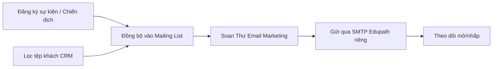

# 3 · Email Marketing Edupath (`Edupath_Email_Marketing`)

!!! abstract "Tóm tắt"
    Gửi **Email Marketing** qua **SMTP riêng** (cách ly hoàn toàn khỏi mail CRM/báo giá), dựng **tệp người nhận** từ **người đăng ký sự kiện/chiến dịch** và từ **bộ lọc CRM** (Lead/Cơ hội/Đơn hàng) đổ vào **Mailing List** Odoo. Có tích hợp **Ladiflow** (mặc định **tắt**).

## 1. Thông tin chung

| Mục | Nội dung |
|-----|----------|
| **STT** | 3 |
| **Tên** | Email Marketing Edupath |
| **Module kỹ thuật** | `Edupath_Email_Marketing` |
| **Phiên bản** | 17.0.1.11.0 |
| **Tác giả** | Edupath |
| **Phụ thuộc** | `mass_mailing`, `mass_mailing_sale`, `contacts`, `crm`, `sale`, `lead_view` (mục 2); Python `requests` |
| **Trạng thái** | 🔵 Đang phát triển / vận hành |
| **Ngày cập nhật** | 10/07/2026 |

## 2. Mục tiêu & bài toán

- Gửi email marketing **không dùng chung** mail server với CRM/báo giá (tránh ảnh hưởng uy tín gửi & tách trách nhiệm).
- Biến **người đăng ký sự kiện/chiến dịch** và **tệp khách CRM** thành **danh sách gửi** một cách có kiểm soát.
- Giữ khả năng tích hợp **Ladiflow** nhưng **tắt mặc định** để không phụ thuộc dịch vụ ngoài.

## 3. Phạm vi chức năng

### 3.1 Cấu hình SMTP riêng (`edupath.email.smtp.config`)

- Khai báo **SMTP Host/Port/Mã hoá (None/STARTTLS/SSL)/User/Password**, **Gửi từ (From)**, **Reply-To**.
- **Chỉ dùng cho Email Marketing** (`isolate_mass_mailing`): mọi *Thư* (mass mailing) đi qua SMTP này; CRM/báo giá/thông báo hệ thống vẫn dùng Outgoing Mail Server mặc định của Odoo.
- **Tài khoản mặc định** (mỗi công ty 1) — dùng cho Thư chưa gắn danh sách.
- Tự tạo/đồng bộ **Outgoing Mail Server** `[Edupath]` tương ứng; **Kiểm tra kết nối SMTP** ngay trên form.

### 3.2 Dựng tệp người nhận

| Chức năng | Menu | Mô tả |
|-----------|------|-------|
| **Đăng ký → Mailing List** | *Email Marketing › Edupath Email* | Đồng bộ người đăng ký chiến dịch (từ `lead_view`) vào Mailing List |
| **Lọc CRM → Email MKT** | *Email Marketing › Edupath Email* | Wizard lọc **Lead / Cơ hội / Đơn hàng** theo nhiều tiêu chí, đổ vào Mailing List (mới hoặc có sẵn) |

**Bộ lọc CRM** hỗ trợ: Nhu cầu, Thị trường, Chương trình, VP tư vấn, Tình trạng lead, Giai đoạn, Năm chương trình, Nguồn KH, Team, Phụ trách, Loại khách, Qualify — kèm tuỳ chọn *chỉ lấy có email*, *loại trùng*, *bỏ giai đoạn THÀNH CÔNG/THẤT BẠI*.

### 3.3 Gửi & theo dõi

- Soạn **Thư (mass_mailing)** như Odoo chuẩn nhưng gửi qua **SMTP Edupath**.
- Cron đồng bộ định kỳ (đăng ký ↔ danh sách).

### 3.4 Tích hợp Ladiflow (tuỳ chọn, mặc định tắt)

- Bật/tắt bằng system parameter `Edupath_Email_Marketing.ladiflow_enabled` (mặc định `False`).
- Khi bật: **cấu hình Ladiflow**, **đồng bộ khách**, **đẩy tag/campaign**, **nhật ký API**. Khi tắt: menu Ladiflow ẩn, thao tác báo *"đã tắt"*.

## 4. Đối tượng sử dụng

| Vai trò (nhóm quyền) | Dùng để |
|----------------------|---------|
| **Người dùng Email MKT** (`group_ladiflow_user`) | Dựng tệp, soạn & gửi Thư |
| **Quản lý Email MKT** (`group_ladiflow_manager`) | Cấu hình SMTP (xem mật khẩu), bật/tắt Ladiflow |

## 5. Luồng nghiệp vụ

## 6. Quy tắc nghiệp vụ

- SMTP Edupath **chỉ "hút" đúng địa chỉ From** của tài khoản (from_filter) — không chiếm email CRM/hệ thống cùng domain.
- Mỗi công ty **chỉ một** tài khoản SMTP mặc định.
- Ladiflow **mặc định tắt**; mọi luồng chuẩn chạy hoàn toàn nội bộ Odoo.

## 7. Tiêu chí nghiệm thu (UAT)

- [ ] Gửi Thư marketing đi qua SMTP Edupath; mail CRM/báo giá vẫn qua server mặc định.
- [ ] "Kiểm tra kết nối SMTP" trả kết quả rõ ràng, lưu thời điểm/nội dung test.
- [ ] Đồng bộ đăng ký chiến dịch tạo/append đúng Mailing List.
- [ ] Wizard lọc CRM ra đúng tệp theo tiêu chí, loại trùng & bỏ email rỗng khi chọn.
- [ ] Tắt Ladiflow → menu ẩn, không gọi API ngoài.

## 8. Phụ thuộc & rủi ro

- **Phụ thuộc:** [Edupath ERP (2)](lead-view.md) (nguồn đăng ký/tệp CRM), domain gửi cần **SPF/DKIM**.
- **Rủi ro:** cấu hình from_filter sai có thể khiến mail marketing lẫn mail hệ thống → kiểm tra kỹ khi đổi domain.
- **Liên kết:** tích hợp mock Ladiflow xem `edupath_ladiflow_mock_api`.

## 9. Lịch sử thay đổi

| Ngày | Người sửa | Thay đổi |
|------|-----------|----------|
| 10/07/2026 | (tự động) | Khởi tạo đặc tả từ mã nguồn `Edupath_Email_Marketing` |
