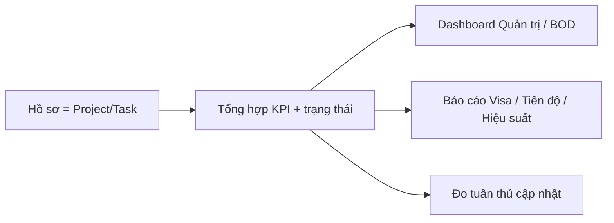

# 4 · Dashboard Quản trị Hồ sơ (`edupath_project_dashboard`)

!!! abstract "Tóm tắt"
    Bộ **dashboard & báo cáo** trên module Project để lãnh đạo/BOD theo dõi **hồ sơ (case) khách hàng**: KPI tổng quan, tiến độ theo nhóm trạng thái, **tỷ lệ đậu Visa**, hiệu suất nhân viên và **mức độ tuân thủ cập nhật** hồ sơ trên Odoo.

## 1. Thông tin chung

| Mục | Nội dung |
|-----|----------|
| **STT** | 4 |
| **Tên** | Dashboard Quản trị Hồ sơ |
| **Module kỹ thuật** | `edupath_project_dashboard` |
| **Phiên bản** | 17.0.1.8.5 |
| **Tác giả** | Edupath |
| **Phụ thuộc** | `lead_view` (mục 2), `project`, `hr`, `mail` |
| **Trạng thái** | 🔵 Đang phát triển / vận hành |
| **Ngày cập nhật** | 10/07/2026 |

## 2. Mục tiêu & bài toán

Hồ sơ khách hàng được quản lý dưới dạng **Project/Task**. Lãnh đạo cần bức tranh tổng hợp mà Project chuẩn không cung cấp:

- **KPI thời gian thực**: bao nhiêu hồ sơ đang xử lý, quá hạn, tồn đọng, ưu tiên cao.
- **Chất lượng vận hành**: hồ sơ **chưa cập nhật lâu** (>7, >30 ngày) → đo **tỷ lệ tuân thủ**.
- **Kết quả nghiệp vụ**: tiến độ theo nhóm trạng thái, **tỷ lệ đậu Visa**, hiệu suất theo nhân viên.

## 3. Phạm vi chức năng (theo menu *Dashboard Quản trị*)

| Nhóm menu | Màn hình | Nội dung |
|-----------|----------|----------|
| **Quản trị Hồ sơ** | Dashboard KPI | Các thẻ KPI + bộ lọc |
| **Báo cáo BOD** | Dashboard BOD + biểu đồ | Bảng điều khiển cho ban lãnh đạo |
| **Báo cáo chi tiết BOD** | Tiến độ theo nhóm trạng thái · **Tỷ lệ đậu Visa** · Tracking 2 team (XLHS/Visa) | Báo cáo chuyên sâu |
| **Hiệu suất Vận hành** | Theo nhân viên · Hoàn thành theo tháng | Năng suất xử lý |
| **Biểu đồ** | Theo loại dịch vụ · nhóm trạng thái · tình trạng chi tiết · mức độ ưu tiên | Phân tích cơ cấu hồ sơ |
| **Tuân thủ Odoo** | Top cập nhật User | Ai cập nhật nhiều/ít |
| **Danh sách hồ sơ** | Toàn bộ hồ sơ | Tra cứu chi tiết |

### Chỉ số KPI chính

Tổng số hồ sơ · Đang xử lý · Hoàn thành · Quá hạn · Tồn đọng · Ưu tiên cao · Hồ sơ mới tháng này · Chưa cập nhật > 7 ngày · Chưa cập nhật > 30 ngày · **Tỷ lệ tuân thủ (%)**.

**Bộ lọc**: Loại dịch vụ, Thị trường, Nhân viên phụ trách, Mức độ ưu tiên, Khoảng ngày.

## 4. Đối tượng sử dụng

| Vai trò | Dùng để |
|---------|---------|
| **BOD / lãnh đạo** | Bức tranh tổng thể, tỷ lệ đậu visa, hiệu suất |
| **Trưởng nhóm XLHS / Visa** | Theo dõi tiến độ, tồn đọng, quá hạn của nhóm |
| **Quản lý vận hành** | Đo tuân thủ cập nhật hồ sơ |

## 5. Luồng sử dụng

## 6. Quy tắc nghiệp vụ

- **Tuân thủ** đo theo thời gian **kể từ lần cập nhật gần nhất** của hồ sơ (mốc 7 / 30 ngày).
- Nhóm trạng thái & tiêu chí đánh giá theo tài liệu *"Tiêu chí đánh giá trạng thái hồ sơ BOD"* (kèm trong module).
- Dữ liệu hồ sơ, loại dịch vụ, thị trường lấy từ [Edupath ERP (2)](lead-view.md).

## 7. Tiêu chí nghiệm thu (UAT)

- [ ] KPI khớp số liệu thực tế khi lọc theo dịch vụ/nhân viên/khoảng ngày.
- [ ] Báo cáo tỷ lệ đậu Visa & tiến độ theo nhóm trạng thái ra đúng.
- [ ] Chỉ số "chưa cập nhật > 7/30 ngày" và tỷ lệ tuân thủ phản ánh đúng lịch sử cập nhật.
- [ ] Biểu đồ theo loại dịch vụ/trạng thái/ưu tiên hiển thị đúng cơ cấu.

## 8. Phụ thuộc & rủi ro

- **Phụ thuộc:** dữ liệu Project/Task và danh mục dịch vụ/thị trường của [mục 2](lead-view.md); nhân sự (HR).
- **Rủi ro:** KPI sai nếu hồ sơ không được gắn đúng loại dịch vụ/trạng thái → cần chuẩn hoá dữ liệu nguồn.

## 9. Lịch sử thay đổi

| Ngày | Người sửa | Thay đổi |
|------|-----------|----------|
| 10/07/2026 | (tự động) | Khởi tạo đặc tả từ mã nguồn `edupath_project_dashboard` |
