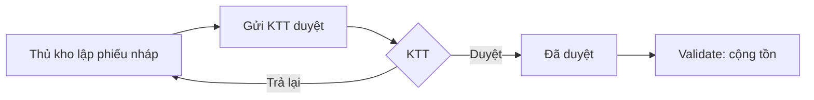
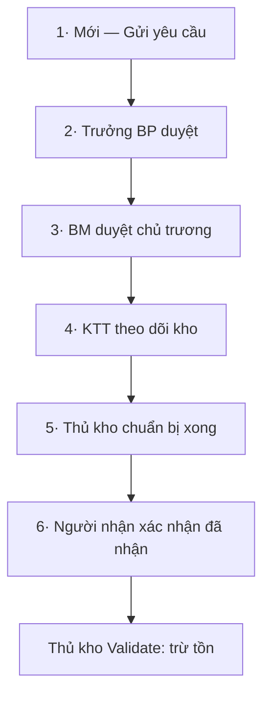

# 1 · Phiếu nhập/xuất kho Edupath (`edupath_stock`)

!!! abstract "Tóm tắt"
    Bổ sung quy trình **phê duyệt phiếu nhập/xuất kho** riêng của Edupath lên module Kho (Inventory) chuẩn: nhập kho phải qua **Kế toán trưởng (KTT)**; xuất kho đi qua **5–6 bước** (Trưởng BP → BM → KTT → Thủ kho → Người nhận), kèm **kiểm tra tồn khả dụng** và **báo cáo tồn/luân chuyển** theo ngày/tháng.

## 1. Thông tin chung

| Mục | Nội dung |
|-----|----------|
| **STT** | 1 |
| **Tên chức năng** | Phiếu nhập/xuất kho Edupath |
| **Module kỹ thuật** | `edupath_stock` — *Edupath: Stock* |
| **Phiên bản** | 17.0.3.0.120 |
| **Tác giả** | Edupath |
| **Phụ thuộc** | `product`, `stock`, `mail`, `web`, `hr` |
| **Trạng thái** | 🔵 Đang phát triển / vận hành (nhiều bản migrate) |
| **Ngày cập nhật** | 10/07/2026 |

## 2. Mục tiêu & bài toán

Kho chuẩn của Odoo cho phép Validate phiếu ngay, **không có tầng phê duyệt nội bộ**. Edupath cần:

- **Kiểm soát nhập kho**: hàng chỉ được cộng tồn sau khi **KTT** duyệt.
- **Kiểm soát xuất kho** theo đúng thẩm quyền: bộ phận đề nghị → lãnh đạo duyệt chủ trương → kế toán theo dõi kho → thủ kho chuẩn bị → người nhận xác nhận, **rồi mới** trừ tồn.
- **Chặn xuất vượt tồn** khả dụng để tránh âm kho ngoài ý muốn.
- Cung cấp **báo cáo tồn kho** và **luân chuyển** theo kỳ.

## 3. Phạm vi

**Trong phạm vi (In-scope)**

- Quy trình duyệt **phiếu nhập** (incoming) qua KTT.
- Quy trình duyệt **phiếu xuất** (outgoing) 5–6 bước có thanh tiến trình trực quan.
- Kiểm tra tồn khả dụng khi Gửi yêu cầu / Xác nhận / Validate phiếu xuất.
- **Luân chuyển nội bộ**: thông báo nhân viên đơn vị nhận để lập phiếu nhập.
- Cấu hình **BM / Thủ kho / Người nhận** theo từng kho.
- Báo cáo **tồn kho** và **luân chuyển** (wizard theo ngày/tháng).

**Ngoài phạm vi (Out-of-scope)**

- Không thay đổi công thức tính tồn/định giá của Odoo.
- Không xử lý mua hàng (PO) — chỉ nhận kết quả nhập kho.
- Chi tiết kỹ thuật (model, migrate, hook) → xem tab **Kỹ thuật**.

## 4. Đối tượng sử dụng

| Vai trò | Bước phụ trách |
|---------|----------------|
| **Người đề nghị / nhận hàng** | Lập phiếu xuất, xác nhận **Đã nhận hàng** (bước cuối) |
| **Trưởng bộ phận (Trưởng BP)** | Duyệt bước 1 — lấy theo phòng ban người nhận (sơ đồ tổ chức HR) |
| **BM (Business Manager)** | Duyệt **chủ trương** — cấu hình trên kho/chi nhánh |
| **Kế toán trưởng (KTT)** | Duyệt **nhập kho**, và duyệt **theo dõi kho** ở bước xuất |
| **Thủ kho** | Xác nhận **chuẩn bị hàng xong**; Validate để trừ/cộng tồn |

## 5. Luồng nghiệp vụ

### 5.1 Phiếu nhập kho (Incoming)

Trạng thái: `draft` → `to_approve` → `approved`. **Không cho Validate** khi phiếu nhập chưa `approved`.

### 5.2 Phiếu xuất kho (Outgoing) — 5–6 bước

Trạng thái (`edupath_outgoing_release_state`): `draft` → `waiting_dept_head` → `waiting_bm` → `waiting_ktt` → `waiting_warehouse_prep` → `waiting_receiver` → `receive_ok`. Chỉ khi `receive_ok` mới **Validate** được để trừ tồn.

!!! note "Người phụ trách mỗi bước tự suy ra"
    - **Trưởng BP** ← phòng ban của người nhận (hồ sơ Nhân viên / quản lý trực tiếp / sơ đồ tổ chức).
    - **BM & Thủ kho** ← cấu hình trên **Kho** của phiếu.
    - Nếu thiếu cấu hình, hệ thống báo lỗi rõ ràng và chỉ chỗ khai báo.

## 6. Màn hình & trường dữ liệu chính

| Màn hình | Trường / Thành phần | Ghi chú |
|----------|---------------------|---------|
| Phiếu xuất kho | **Người nhận hàng** (`edupath_outgoing_requester_id`) | Mặc định = người lập; quyết định phòng ban & bước cuối |
| Phiếu xuất kho | **Tiến trình phê duyệt xuất** (thanh HTML) | Hiển thị 6 bước, bước đang chờ + người phụ trách |
| Phiếu xuất kho | **Chi tiết thiếu tồn** | Cảnh báo sản phẩm/vị trí thiếu hàng |
| Phiếu nhập kho | **Prepared by / Approved by (KTT)** | Người lập & người duyệt nhập |
| Kho (Warehouse) | **BM**, **Thủ kho**, **Nhân viên nhận (luân chuyển)** | Cấu hình người phụ trách theo kho |

Menu: **Tồn kho › Vận hành › Phiếu xuất kho** (ẩn menu *Deliveries* chuẩn của Odoo).

## 7. Quy tắc nghiệp vụ

- **Xuất không vượt tồn khả dụng**: `khả dụng = tồn thực − giữ cho phiếu khác`. Vượt → chặn ở **Gửi yêu cầu / Xác nhận / Validate**, kèm bảng chi tiết (cần / xuất được / phiếu khác đang giữ). Xuất hết về 0 được, không xuất âm.
- **Thứ tự duyệt bắt buộc**: không được nhảy bước; mỗi nút chỉ chạy đúng trạng thái của nó.
- **Nhập kho**: bắt buộc `approved` (KTT) trước khi Validate cộng tồn.
- **Xuất kho**: bắt buộc `receive_ok` trước khi Validate trừ tồn.
- **Luân chuyển nội bộ**: khi tạo, tự gợi ý danh sách **nhân viên nhận** của kho đích để thông báo lập phiếu nhập.

## 8. Phân quyền

| Nhóm quyền (kỹ thuật) | Ý nghĩa |
|-----------------------|---------|
| `group_edupath_incoming_ktt` | Duyệt **phiếu nhập** (KTT) |
| `group_edupath_outgoing_bm` | Duyệt **xuất — chủ trương (BM)** |
| `group_edupath_outgoing_ktt` | Duyệt **xuất — theo dõi kho (KTT)** |

Kế thừa quyền *User Tồn kho* được gắn khi cài (qua hook), không khai trong XML để tránh lỗi nâng cấp.

## 9. Cấu hình

- **Tồn kho › Cấu hình › Kho**: chọn **BM**, **Thủ kho**, **Nhân viên nhận (luân chuyển nội bộ)** cho từng kho.
- **Tồn kho › Cấu hình › Cài đặt**: *"Cho phép xuất kho khi thiếu tồn (Edupath)"* — bật để bỏ chặn thiếu tồn (tham số `edupath_stock.allow_outgoing_without_stock`).

## 10. Tiêu chí nghiệm thu (UAT)

- [ ] Phiếu nhập không Validate được khi chưa KTT duyệt.
- [ ] Phiếu xuất không Validate được khi chưa đủ 6 bước.
- [ ] Gửi yêu cầu xuất số lượng > tồn khả dụng bị chặn với thông báo chi tiết.
- [ ] Trưởng BP / BM / Thủ kho tự suy đúng theo phòng ban người nhận & cấu hình kho.
- [ ] Báo cáo tồn & luân chuyển ra đúng số theo kỳ chọn.

## 11. Phụ thuộc & rủi ro

- **Phụ thuộc:** module **Nhân viên (HR)** phải cài & khai đủ phòng ban/quản lý; kho phải cấu hình BM/Thủ kho.
- **Rủi ro:** sơ đồ tổ chức HR thiếu → không suy ra được Trưởng BP (đã có thông báo lỗi hướng dẫn).
- **Liên kết kỹ thuật:** chi tiết model/migrate → tab **Kỹ thuật** (khi bổ sung).

## 12. Lịch sử thay đổi

| Ngày | Người sửa | Thay đổi |
|------|-----------|----------|
| 10/07/2026 | (tự động) | Khởi tạo đặc tả từ mã nguồn `edupath_stock` |
