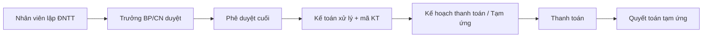

# 5 · Quản lý Thanh toán (`fin_qlthanhtoan`)

!!! abstract "Tóm tắt"
    Hệ thống **Đề nghị thanh toán (ĐNTT)** nội bộ: nhân viên lập đề nghị → duyệt qua **cây phê duyệt** nhiều cấp (Trưởng BP/CN → phê duyệt cuối → kế toán) → gắn **kế hoạch thanh toán**, **tạm ứng / quyết toán**, kiểm soát theo **định mức** và in **phiếu ĐNTT / tiếp nhận**. Có cổng **portal** cho người đề nghị.

## 1. Thông tin chung

| Mục | Nội dung |
|-----|----------|
| **STT** | 5 |
| **Tên** | Quản lý Thanh toán |
| **Module kỹ thuật** | `fin_qlthanhtoan` |
| **Phiên bản** | 17.0.17.2 |
| **Tác giả** | Đoàn Văn Út (nội bộ) |
| **Phụ thuộc** | `account`, `purchase`, `project`, `hr`, `utm`, `base_automation`, `danhmuc` (mục 7), `lead_view` (mục 2) |
| **Trạng thái** | 🔵 Đang phát triển / vận hành |
| **Ngày cập nhật** | 10/07/2026 |

## 2. Mục tiêu & bài toán

Quy trình chi tiền của công ty cần kiểm soát chặt hơn Odoo chuẩn:

- Chuẩn hoá **đề nghị thanh toán** theo phòng ban, loại chi phí, mã kế toán.
- **Phê duyệt nhiều cấp** linh hoạt (cây phê duyệt) tuỳ loại/khoản tiền.
- Kiểm soát **định mức** chi và liên kết **kế hoạch dòng tiền**, **tạm ứng – quyết toán**.
- Minh bạch: lịch sử phê duyệt, checklist chứng từ, cổng portal cho người đề nghị.

## 3. Phạm vi chức năng

### 3.1 Đề nghị thanh toán (`fin.qlthanhtoan` — ĐNTT)

- Trường chính: **Số ĐNTT**, **Số tiền ĐNTT**, **Phòng/Ban** (bắt buộc), **Công ty lập** & **Chi tại công ty**, **Mã kế toán**, **Loại/Phân loại thanh toán**, **Tags**, **Ưu tiên (Bình thường/Gấp)**.
- **Trạng thái** theo **stage cấu hình được** (`fin.qlthanhtoan.stage`, có stage đóng `is_closed`).
- Cờ nghiệp vụ: **Đã thanh toán**, **Cấn trừ**, **Gấp**; người đang xử lý (`user_ids`).

### 3.2 Cây phê duyệt

- **Loại thanh toán** cấu hình: *không cần phê duyệt* (`khongcan_pheduyet`) hoặc cần **QLPB phê duyệt** (`qlpb_pheduyet`).
- **Trưởng BP/Trưởng CN duyệt** (`fin.qlthanhtoan.manager`) → **Phê duyệt cuối** (`fin.pheduyetcuoi`) theo công ty.
- **Cây phê duyệt** (`fin.qlthanhtoan.caypheduyet`) + **Lịch sử phê duyệt** (thời gian xử lý từng bước).
- **Phân quyền xử lý yêu cầu** (`fin.qlthanhtoan.assign`).

### 3.3 Kế hoạch thanh toán, tạm ứng, quyết toán

- **Kế hoạch thanh toán** (`fin.khthanhtoan`) — KHTT *dự kiến* / *thực tế* gắn với ĐNTT.
- **Tạm ứng** và **Quyết toán tạm ứng** (`fin.quyettoan`): theo dõi đã tạm ứng / đã quyết toán / còn lại.
- **Bảng kê** chi tiết khoản chi.

### 3.4 Danh mục & kiểm soát

- **Loại chi phí**, **Định mức** (`fin.dinhmuc` + chi tiết) — kiểm soát trần chi.
- **Danh mục chứng từ** + **Checklist** chứng từ đính kèm.
- **Mã kế toán** (`fin.account.code`).

### 3.5 Portal & báo cáo in

- **Cổng portal**: người đề nghị theo dõi/nộp yêu cầu ngoài backend.
- Mẫu in: **Phiếu tiếp nhận**, **Đề nghị thanh toán (DNTT)**, **Kế hoạch thanh toán**.

## 4. Đối tượng sử dụng

| Nhóm quyền | Dùng để |
|------------|---------|
| **User** (`qlthanhtoan_group_user`) | Lập & theo dõi đề nghị của mình |
| **Kế toán** (`qlthanhtoan_group_accounting`) | Xử lý, gắn mã kế toán, thanh toán |
| **Quản lý** (`qlthanhtoan_group_manager`) | Cấu hình cây phê duyệt, định mức, loại chi phí |

## 5. Luồng nghiệp vụ

## 6. Quy tắc nghiệp vụ

- ĐNTT bắt buộc có **Phòng/Ban**; số tiền/loại quyết định **có cần phê duyệt** hay không.
- Chi vượt **định mức** cần kiểm soát/cảnh báo theo cấu hình.
- Trạng thái đóng (`is_closed`) khoá luồng xử lý tiếp.

## 7. Tiêu chí nghiệm thu (UAT)

- [ ] Loại "không cần phê duyệt" đi thẳng tới kế toán; loại cần duyệt phải qua đủ cấp.
- [ ] Cây phê duyệt định tuyến đúng người duyệt theo phòng ban/công ty.
- [ ] Tạm ứng – quyết toán khớp: đã tạm ứng, đã quyết toán, còn lại.
- [ ] Checklist chứng từ bắt buộc trước khi chuyển bước (nếu cấu hình).
- [ ] Portal hiển thị đúng yêu cầu của người đề nghị; in phiếu ĐNTT đúng mẫu.

## 8. Phụ thuộc & rủi ro

- **Phụ thuộc:** [Bộ Danh Mục (7)](danhmuc.md), Kế toán (`account`), Nhân sự (HR), [Edupath ERP (2)](lead-view.md).
- **Rủi ro:** cấu hình cây phê duyệt sai → tắc luồng duyệt; cần khai đủ Trưởng BP/CN & phê duyệt cuối theo công ty.

## 9. Lịch sử thay đổi

| Ngày | Người sửa | Thay đổi |
|------|-----------|----------|
| 10/07/2026 | (tự động) | Khởi tạo đặc tả từ mã nguồn `fin_qlthanhtoan` |
