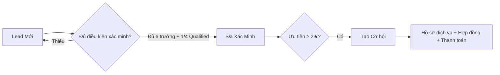

# 2 · Edupath ERP — CRM & Hồ sơ dịch vụ (`lead_view`)

!!! abstract "Tóm tắt"
    Module lõi tuỳ biến của Edupath trên nền **CRM / Sale / Project / Account**. Mở rộng **Lead/Cơ hội** cho quy trình tư vấn giáo dục (du học, định cư, du lịch, bảo lãnh), thêm **quy tắc xác minh & chấm Qualified**, **tự động hoá giao lead**, **hợp đồng & mẫu in**, **chiến dịch theo văn phòng** và **báo cáo CRM**.

!!! warning "Đây là module lớn, đa chức năng"
    Trang này mô tả **các mảng chính ở mức tổng quan**. Mỗi mảng nên tách thành trang đặc tả con khi đi sâu.

## 1. Thông tin chung

| Mục | Nội dung |
|-----|----------|
| **STT** | 2 |
| **Tên** | Edupath ERP — CRM & Hồ sơ dịch vụ |
| **Module kỹ thuật** | `lead_view` — *Edupath ERP* |
| **Phiên bản** | 17.0.0.16 |
| **Tác giả** | Edupath |
| **Phụ thuộc** | `base`, `crm`, `project`, `sale`, `product`, `account`, `web`, `mail`, `utm` |
| **Trạng thái** | 🔵 Đang phát triển / vận hành |
| **Ngày cập nhật** | 10/07/2026 |

## 2. Mục tiêu & bài toán

CRM chuẩn Odoo không đủ cho nghiệp vụ tư vấn giáo dục đa ngành của Edupath. Cần:

- Chuẩn hoá **vòng đời Lead** và **điều kiện "Đã Xác Minh"** để đảm bảo chất lượng dữ liệu.
- Quản lý **hồ sơ dịch vụ** theo ngành (du học/định cư/du lịch/bảo lãnh) gắn với khách hàng.
- **Tự động giao lead** theo văn phòng/đội và cảnh báo lead không hoạt động.
- Quản lý **hợp đồng, thanh toán, mẫu in** (hóa đơn/hợp đồng) theo mẫu Edupath.
- **Báo cáo CRM** (chuyển đổi lead, điểm, hiệu suất TVV/VP).

## 3. Phạm vi chức năng chính

### 3.1 CRM Lead nâng cao

- **Tình trạng lead** (`lead_status`): Hot · Mới · Liên Hệ Sau · **Đã Xác Minh** · Ngừng chăm sóc · Close.
- **Điều kiện "Đã Xác Minh"**: bắt buộc đủ **Khách hàng, Người phụ trách, Team, VP Tư vấn, Nguồn KH, Số điện thoại** *và* ít nhất **1/4 tiêu chí Qualified** (Tài chính · Năng lực hồ sơ · Mục tiêu · Thời điểm). Thiếu → **chặn lưu** kèm danh sách lỗi.
- **Gợi ý tạo Cơ hội**: Lead ưu tiên ≥ **2 sao** hiện banner *"Tạo Cơ hội ngay"* → wizard chuyển đổi.
- **Loại Sale** tự tính: *New Sell* / *Upsell* (theo lịch sử thanh toán của khách).
- Chống trùng lead, chuẩn hoá số điện thoại theo quốc gia, ẩn/gộp lead.

### 3.2 Hồ sơ dịch vụ theo ngành

| Nghiệp vụ | Model gốc | Dữ liệu danh mục kèm theo |
|-----------|-----------|---------------------------|
| **Du học** | `duhoc` | trạng thái, tiến trình hồ sơ |
| **Định cư** | `dinhcu` | loại hồ sơ, tiến trình |
| **Du lịch** | `dulich` | booking, chương trình |
| **Bảo lãnh** | `baolanh.*` | sub-status, tiến trình, loại hồ sơ, kết quả, người bảo lãnh / được bảo lãnh, tình trạng hồ sơ |

### 3.3 Tự động hoá & phân giao lead

- **Cấu hình automation** (`edupath.project.automation` + `edupath.automation.action`) theo công ty/chi nhánh.
- Chỉ số theo dõi: **Giờ kể từ khi giao lead**, **Giờ/Ngày không hoạt động** → dùng để nhắc/nhả lead.
- **Cron** chạy định kỳ để giao lead, cập nhật trạng thái, tính điểm.

### 3.4 Chiến dịch & khuyến mãi

- Mở rộng **`utm.campaign`**: thống kê đăng ký theo **văn phòng** (HCM · HN · HUẾ · ĐN · USA).
- **Chương trình khuyến mãi / bảng giá** riêng (discount program, price list).

### 3.5 Hợp đồng, thanh toán & mẫu in

- **Hợp đồng** (`contract`) gắn khách hàng/cơ hội.
- Mẫu in tuỳ biến (font Roboto): **Hóa đơn**, **Hợp đồng**, **Invoice move**.
- Mở rộng **thanh toán** (loại thanh toán) trên `account.payment`.

### 3.6 Báo cáo CRM

- `edupath.crm.report` (chuyển lead), `…report.maxscore` (điểm tối đa), `…report.leadid`.
- Chỉ số hiệu suất theo **TVV** và **VP**.

### 3.7 Tích hợp điện thoại

- Widget **gọi điện FPT** trên form (mã vùng, click-to-call).

## 4. Đối tượng sử dụng

| Vai trò | Dùng để |
|---------|---------|
| **Tư vấn viên (TVV)** | Tiếp nhận, xác minh, chấm Qualified, chuyển Cơ hội |
| **Trưởng VP / quản lý** | Theo dõi phân giao, báo cáo hiệu suất |
| **Bộ phận hồ sơ** | Xử lý hồ sơ du học/định cư/du lịch/bảo lãnh |
| **Kế toán** | Hợp đồng, thanh toán, mẫu in |

## 5. Luồng nghiệp vụ (CRM lõi)

## 6. Quy tắc nghiệp vụ nổi bật

- Không cho chuyển **"Đã Xác Minh"** nếu thiếu trường bắt buộc hoặc chưa có tiêu chí Qualified.
- `sale_type` = *Upsell* nếu khách đã từng thanh toán, ngược lại *New Sell*.
- Số điện thoại không hợp lệ được đánh dấu `*_valid = False`.

## 7. Tiêu chí nghiệm thu (UAT)

- [ ] Chặn xác minh khi thiếu 1 trong 6 trường hoặc chưa chọn tiêu chí Qualified.
- [ ] Banner tạo Cơ hội hiện/ẩn đúng theo mức sao và `type`.
- [ ] Hồ sơ du học/định cư/du lịch/bảo lãnh tạo & chuyển trạng thái đúng.
- [ ] Cron tự giao lead & cập nhật chỉ số giờ không hoạt động.
- [ ] Mẫu in hợp đồng/hóa đơn ra đúng bố cục, font.

## 8. Phụ thuộc & rủi ro

- **Phụ thuộc:** danh mục Edupath (`edupath.crmvptuvan`, `edupath.crmtag`, `edupath.crmnhucau`…) phải có dữ liệu — nhiều phần dùng chung [Bộ Danh Mục (7)](danhmuc.md).
- **Rủi ro:** module rất rộng, sửa một mảng dễ ảnh hưởng mảng khác → cần test hồi quy CRM + báo cáo.
- **Liên kết:** [Kho vận (1)](edupath-stock.md), [Dashboard hồ sơ (4)](edupath-project-dashboard.md).

## 9. Lịch sử thay đổi

| Ngày | Người sửa | Thay đổi |
|------|-----------|----------|
| 10/07/2026 | (tự động) | Khởi tạo đặc tả tổng quan từ mã nguồn `lead_view` |
