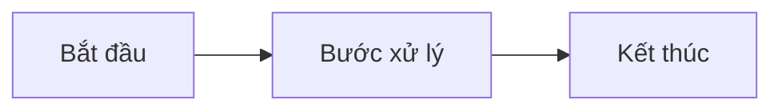

# Mẫu đặc tả chức năng

> **Cách dùng:** Sao chép trang này thành file mới trong `docs/functional/` (đặt tên theo chức năng, ví dụ `ten-chuc-nang.md`), rồi điền các mục bên dưới. Xoá phần chú thích _(in nghiêng)_ khi hoàn tất.

---

## 1. Thông tin chung

| Mục | Nội dung |
|-----|----------|
| **STT** | _(số thứ tự)_ |
| **Tên chức năng** | _..._ |
| **Module / Ứng dụng** | _CRM / Bán hàng / Kho / …_ |
| **Người đề xuất** | _..._ |
| **Người phụ trách (BA)** | _..._ |
| **Developer** | _..._ |
| **Trạng thái** | 🟡 Đề xuất / 🔵 Đang phát triển / 🟣 Thử nghiệm / 🟢 Hoàn thành |
| **Phiên bản Odoo** | 17 |
| **Ngày cập nhật** | _dd/mm/yyyy_ |

## 2. Mục tiêu & bài toán

_Nêu vấn đề nghiệp vụ hiện tại và kết quả mong muốn khi có chức năng này. Vì sao cần làm?_

## 3. Phạm vi

**Trong phạm vi (In-scope)**

- _..._

**Ngoài phạm vi (Out-of-scope)**

- _..._

## 4. Đối tượng sử dụng

| Vai trò | Sử dụng để làm gì |
|---------|-------------------|
| _..._ | _..._ |

## 5. Luồng nghiệp vụ

_Mô tả các bước xử lý. Có thể dùng sơ đồ:_

## 6. Màn hình & trường dữ liệu

_Liệt kê màn hình dự kiến và các trường chính (chưa cần tên field kỹ thuật)._

| Màn hình | Trường / Thành phần | Bắt buộc | Ghi chú |
|----------|---------------------|:--------:|---------|
| _..._ | _..._ | ✔/✘ | _..._ |

## 7. Quy tắc nghiệp vụ

_Các ràng buộc, điều kiện, công thức, trạng thái hợp lệ…_

- _..._

## 8. Phân quyền

| Nhóm quyền | Được phép |
|------------|-----------|
| _..._ | _Xem / Sửa / Duyệt …_ |

## 9. Tiêu chí nghiệm thu (UAT)

_Điều kiện để coi là hoàn thành — dạng “Given / When / Then” hoặc checklist._

- [ ] _..._
- [ ] _..._

## 10. Phụ thuộc & rủi ro

- **Phụ thuộc:** _module / chức năng / dữ liệu cần có trước_
- **Rủi ro:** _..._
- **Liên kết kỹ thuật:** _(link tới trang tab Kỹ thuật nếu có)_

## 11. Lịch sử thay đổi

| Ngày | Người sửa | Thay đổi |
|------|-----------|----------|
| _dd/mm/yyyy_ | _..._ | _Tạo mới_ |
