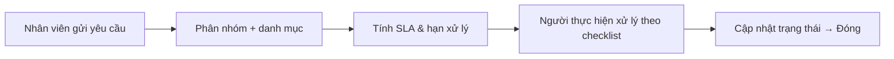

# 6 · Hỗ trợ CNTT / Service Desk (`th_service_desk`)

!!! abstract "Tóm tắt"
    Hệ thống **ticket hỗ trợ nội bộ** (IT Service Desk): nhân viên gửi yêu cầu → phân **nhóm hỗ trợ / danh mục** → xử lý theo **trạng thái** và **SLA/deadline**, có **checklist** công việc và theo dõi thời gian.

## 1. Thông tin chung

| Mục | Nội dung |
|-----|----------|
| **STT** | 6 |
| **Tên** | Hỗ trợ CNTT (Service Desk) |
| **Module kỹ thuật** | `th_service_desk` |
| **Phiên bản** | 14.0 (chạy trên Odoo 17) |
| **Phụ thuộc** | `project`, `hr`, `utm`, `base_automation` |
| **Trạng thái** | 🔵 Đang phát triển / vận hành |
| **Ngày cập nhật** | 10/07/2026 |

## 2. Mục tiêu & bài toán

- Tập trung **mọi yêu cầu hỗ trợ CNTT** vào một nơi thay vì chat/điện thoại rời rạc.
- Phân loại, giao đúng **nhóm hỗ trợ / người thực hiện**, đo **SLA** và **hạn xử lý**.
- Minh bạch tiến độ qua **trạng thái**, **checklist** và lịch sử trao đổi.

## 3. Phạm vi chức năng

### 3.1 Ticket hỗ trợ (`service.desk`)

- Trường chính: **Tiêu đề**, **Trạng thái** (`service.desk.stage` cấu hình được), **Độ ưu tiên**, **Công ty**, **Phòng Ban**, **Nhóm hỗ trợ**, **Danh mục** + **Danh mục chi tiết**, **Người thực hiện**.
- **TG gửi Y/C** và **Hạn thực hiện (deadline)** tính tự động theo SLA (trừ ngày nghỉ).
- Trao đổi qua chatter, hoạt động (activity), tags.

### 3.2 Cấu hình vận hành

| Đối tượng | Mô tả |
|-----------|-------|
| **Nhóm hỗ trợ** (`service.desk.team`) | Danh sách người thực hiện theo công ty |
| **Danh mục** + **chi tiết** (`service.desk.category[.detail]`) | Phân loại yêu cầu, gợi ý người xử lý |
| **SLA** (`service.desk.sla`) | Cam kết thời gian theo **danh mục × độ ưu tiên** |
| **Ngày nghỉ** (`global.time.off`) | Loại trừ khi tính deadline |
| **Checklist** (`service.desk.checklist`) | Đầu việc con của ticket (trạng thái từng mục) |
| **Tags** | Gắn nhãn phân loại nhanh |

## 4. Đối tượng sử dụng

| Vai trò | Dùng để |
|---------|---------|
| **Người yêu cầu** (nhân viên) | Tạo & theo dõi ticket của mình |
| **Người thực hiện / nhóm hỗ trợ** | Nhận, xử lý, cập nhật trạng thái, checklist |
| **Quản trị Service Desk** | Cấu hình nhóm, danh mục, SLA, ngày nghỉ |

## 5. Luồng nghiệp vụ

## 6. Quy tắc nghiệp vụ

- **Deadline** = thời điểm gửi + SLA theo danh mục/độ ưu tiên, **trừ ngày nghỉ** (`global.time.off`).
- Danh mục chi tiết lọc theo danh mục; nhóm/phòng ban lọc theo công ty.
- Trạng thái đóng khoá cập nhật tiếp (theo cấu hình stage).

## 7. Tiêu chí nghiệm thu (UAT)

- [ ] Tạo ticket, chọn danh mục/độ ưu tiên → deadline tính đúng theo SLA và ngày nghỉ.
- [ ] Ticket vào đúng nhóm hỗ trợ, hiển thị theo trạng thái (kanban).
- [ ] Checklist cập nhật trạng thái từng mục; đóng ticket khi hoàn tất.
- [ ] Báo cáo/lọc theo phòng ban, danh mục, người thực hiện chạy đúng.

## 8. Phụ thuộc & rủi ro

- **Phụ thuộc:** Project, Nhân sự (HR) — phòng ban/nhân sự phải khai đủ.
- **Rủi ro:** SLA/ngày nghỉ cấu hình thiếu → deadline sai; cần chuẩn hoá danh mục trước khi mở cho toàn công ty.

## 9. Lịch sử thay đổi

| Ngày | Người sửa | Thay đổi |
|------|-----------|----------|
| 10/07/2026 | (tự động) | Khởi tạo đặc tả từ mã nguồn `th_service_desk` |
