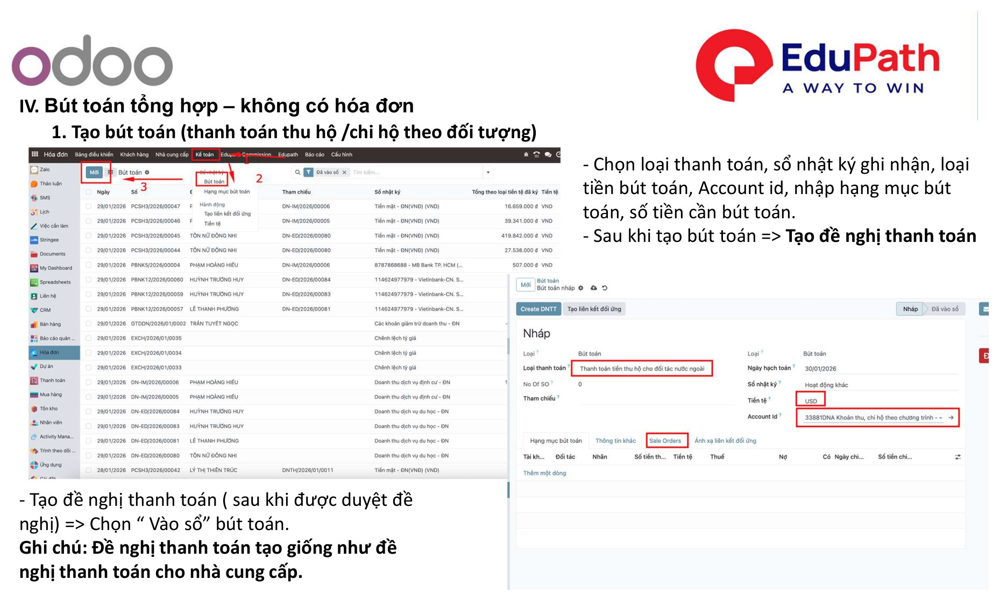
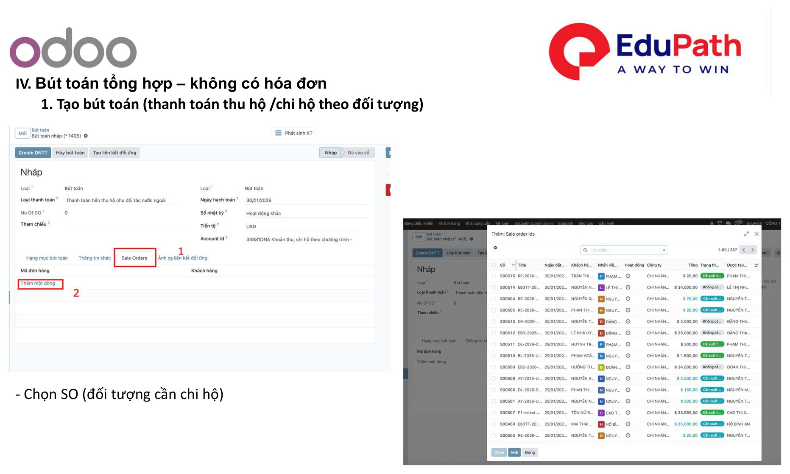
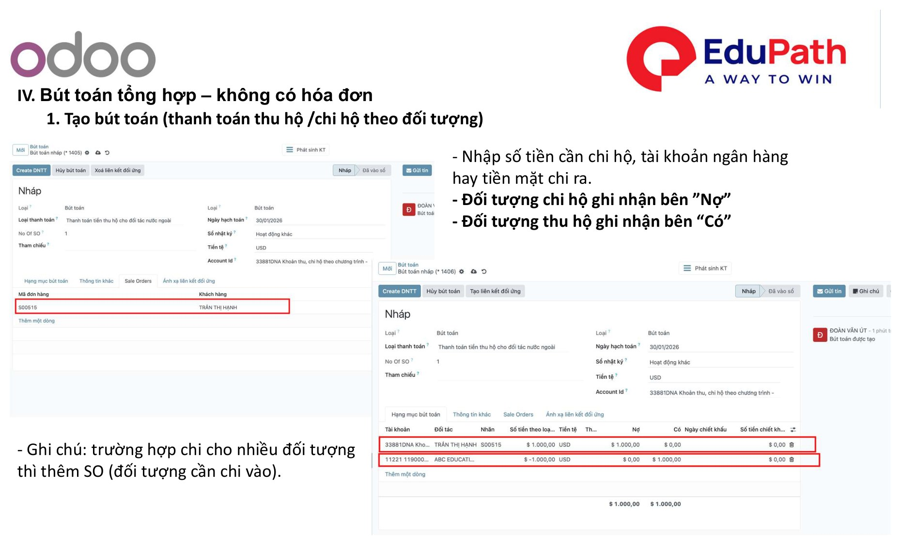
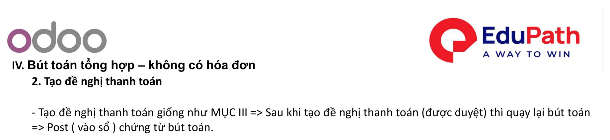

# IV. Bút toán tổng hợp – không có hóa đơn

!!! info "Nguồn tài liệu"
    Theo tài liệu **01. Quy trình xử lý nghiệp vụ kế toán — Odoo 18**. Áp dụng tương tự **Odoo 17**.

Áp dụng cho nghiệp vụ **thu hộ / chi hộ theo đối tượng** — không phát sinh hóa đơn (Bill).

## 1. Tạo bút toán (thu hộ / chi hộ theo đối tượng)

Nhập các thông tin:

- Chọn **loại thanh toán**, **sổ nhật ký** ghi nhận, **loại tiền** bút toán, **Account id**, **hạng mục** bút toán, **số tiền** cần bút toán.
- Sau khi tạo bút toán → **Tạo đề nghị thanh toán**.
- Đề nghị thanh toán (sau khi được duyệt) → chọn **"Vào sổ"** bút toán.

!!! note
    Đề nghị thanh toán tạo **giống như** đề nghị thanh toán cho nhà cung cấp ([Mục III](de-xuat-thanh-toan.md)).

{ .doc-screenshot-full }

### Chọn đối tượng (SO)

Chọn **SO** — đối tượng cần chi hộ.

{ .doc-screenshot-full }

### Ghi nhận Nợ / Có

- Trường hợp chi cho **nhiều đối tượng** → thêm SO (đối tượng cần chi) vào.
- Nhập **số tiền** cần chi hộ, chọn **tài khoản ngân hàng** hay **tiền mặt** chi ra.
- Đối tượng **chi hộ** ghi nhận bên **"Nợ"**.
- Đối tượng **thu hộ** ghi nhận bên **"Có"**.

{ .doc-screenshot-full }

## 2. Tạo đề nghị thanh toán

Tạo đề nghị thanh toán giống như [Mục III](de-xuat-thanh-toan.md). Sau khi đề nghị thanh toán **được duyệt** → quay lại bút toán → **Post (vào sổ)** chứng từ bút toán.

{ .doc-screenshot-full }

---

Quay lại: [Tổng quan Kế toán](index.md)
