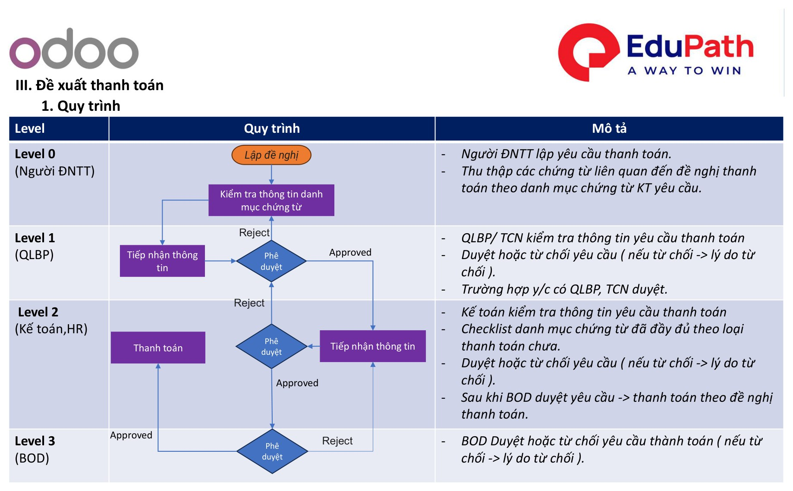
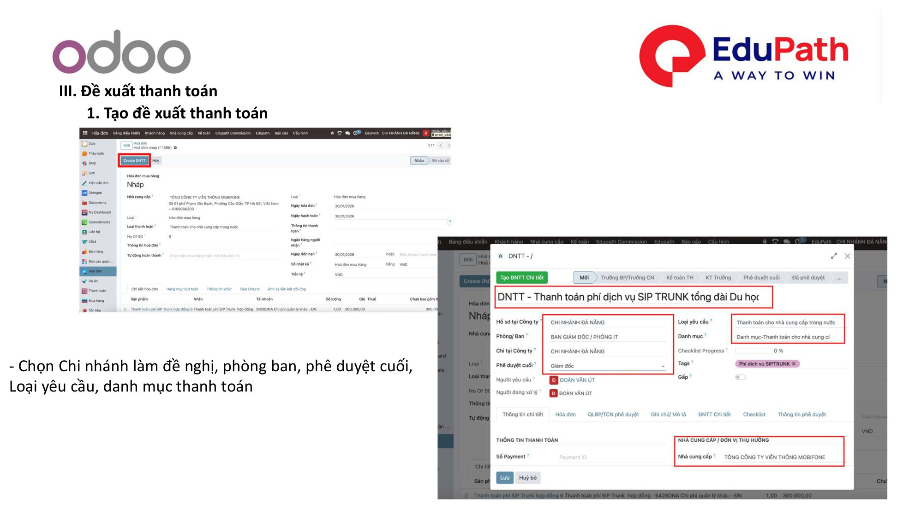
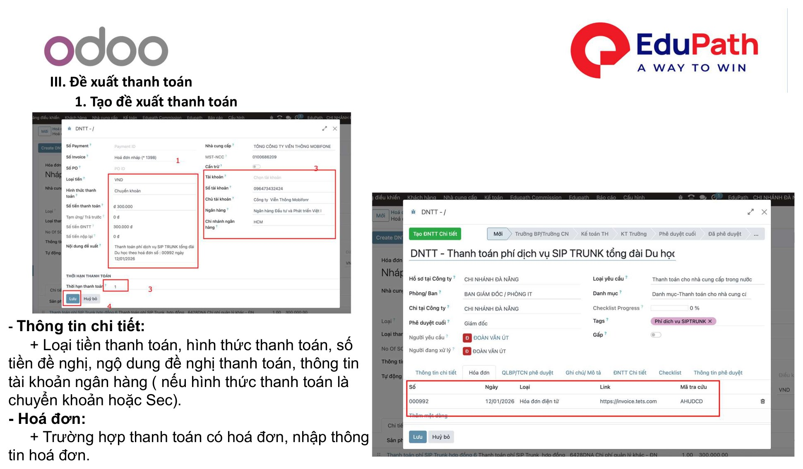
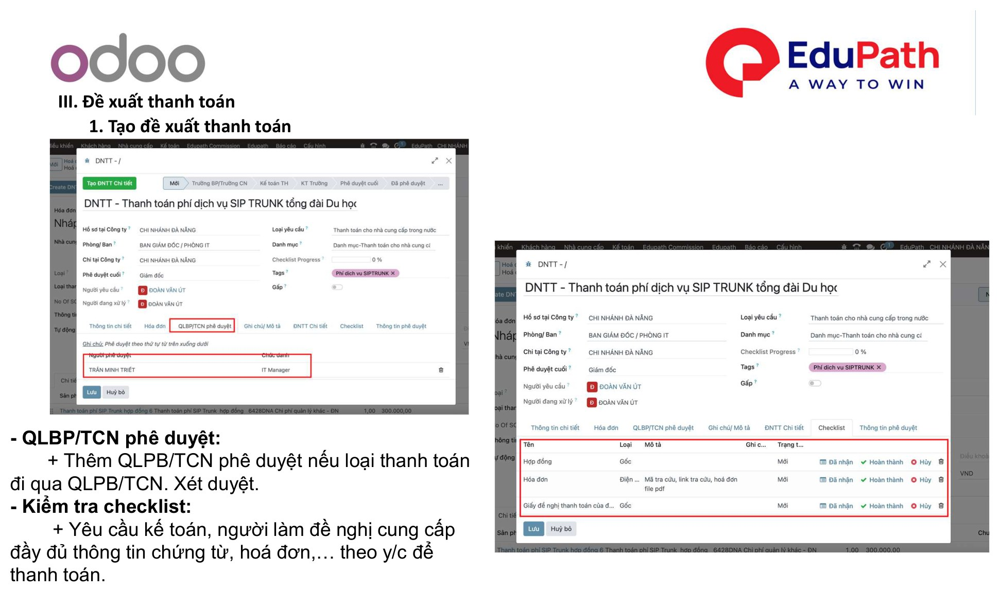
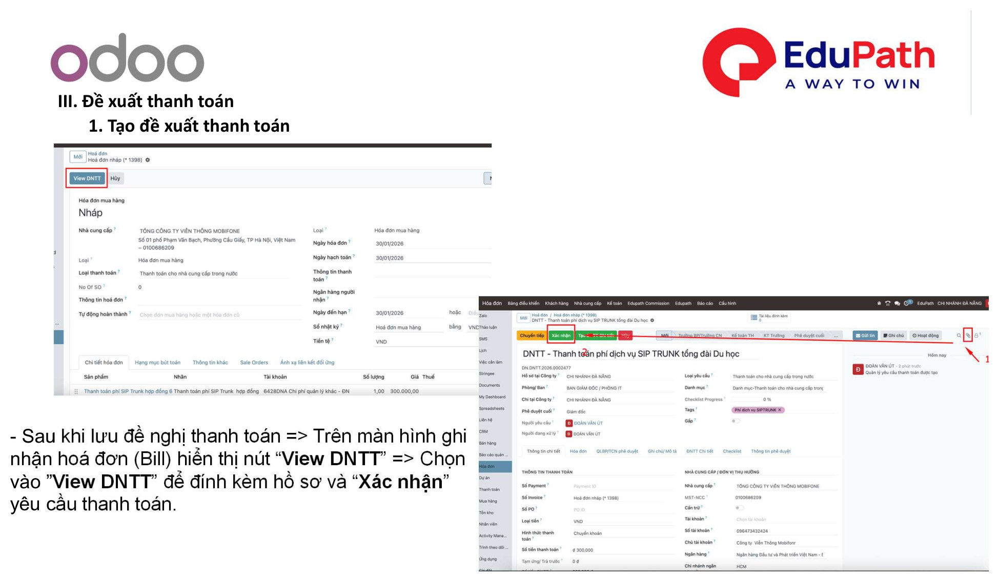
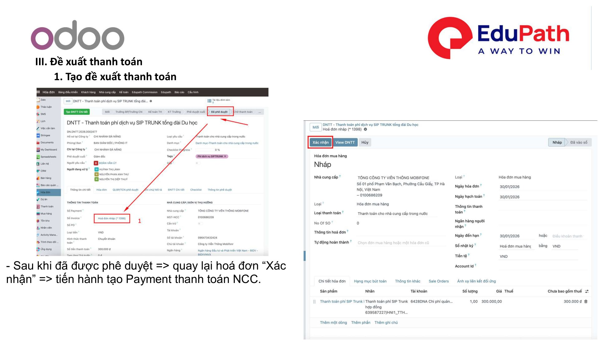

# III. Đề xuất thanh toán (ĐNTT)

!!! info "Nguồn tài liệu"
    Theo tài liệu **01. Quy trình xử lý nghiệp vụ kế toán — Odoo 18**. Áp dụng tương tự **Odoo 17**.

Đề nghị thanh toán (ĐNTT) là quy trình phê duyệt nhiều cấp trước khi chi tiền — áp dụng cho thanh toán NCC ([Mục II](thanh-toan-ncc.md)) và bút toán tổng hợp ([Mục IV](but-toan-tong-hop.md)).

## 1. Quy trình phê duyệt

| Level | Vai trò | Mô tả |
|-------|---------|-------|
| **Level 0** | Người ĐNTT | Lập yêu cầu thanh toán. Thu thập các chứng từ liên quan đến ĐNTT theo **danh mục chứng từ** KT yêu cầu. |
| **Level 1** | QLBP / TCN | QLBP/TCN kiểm tra thông tin yêu cầu thanh toán. **Duyệt** hoặc **từ chối** (nếu từ chối → ghi lý do). Áp dụng khi yêu cầu cần QLBP, TCN duyệt. |
| **Level 2** | Kế toán, HR | Kế toán kiểm tra thông tin yêu cầu thanh toán. **Checklist** danh mục chứng từ đã đầy đủ theo loại thanh toán chưa. **Duyệt** hoặc **từ chối** (nếu từ chối → ghi lý do). Sau khi BOD duyệt → thanh toán theo ĐNTT. |
| **Level 3** | BOD | BOD **duyệt** hoặc **từ chối** yêu cầu thanh toán (nếu từ chối → ghi lý do). |

{ .doc-screenshot-full }

## 2. Tạo đề xuất thanh toán

### Thông tin chung

Chọn **chi nhánh** làm đề nghị, **phòng ban**, **người phê duyệt cuối**, **loại yêu cầu**, **danh mục thanh toán**.

{ .doc-screenshot-full }

### Thông tin chi tiết & hóa đơn

- **Thông tin chi tiết:** loại tiền thanh toán, hình thức thanh toán, số tiền đề nghị, nội dung đề nghị thanh toán, thông tin tài khoản ngân hàng (nếu hình thức thanh toán là **chuyển khoản** hoặc **Sec**).
- **Hóa đơn:** trường hợp thanh toán có hóa đơn → nhập thông tin hóa đơn.

{ .doc-screenshot-full }

### QLBP/TCN phê duyệt & checklist

- **QLBP/TCN phê duyệt:** thêm QLBP/TCN phê duyệt nếu loại thanh toán đi qua QLBP/TCN xét duyệt.
- **Kiểm tra checklist:** yêu cầu kế toán / người lập đề nghị cung cấp đầy đủ thông tin chứng từ, hóa đơn… theo yêu cầu để thanh toán.

{ .doc-screenshot-full }

## 3. View ĐNTT trên Bill

Sau khi **lưu** đề nghị thanh toán → trên màn hình ghi nhận hóa đơn (Bill) hiển thị nút **"View DNTT"** → chọn **"View DNTT"** để đính kèm hồ sơ và **"Xác nhận"** yêu cầu thanh toán.

{ .doc-screenshot-full }

## 4. Thanh toán sau khi được duyệt

Sau khi đã được **phê duyệt** → quay lại hóa đơn, chọn **"Xác nhận"** → tiến hành tạo **Payment** thanh toán NCC.

{ .doc-screenshot-full }

---

Xem tiếp: [IV. Bút toán tổng hợp – không có hóa đơn](but-toan-tong-hop.md)
