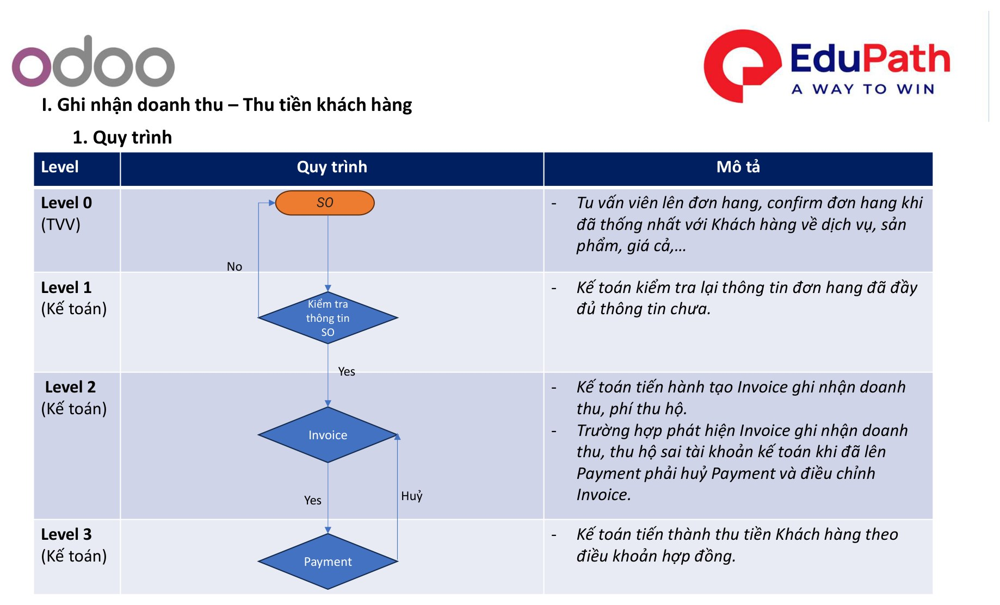
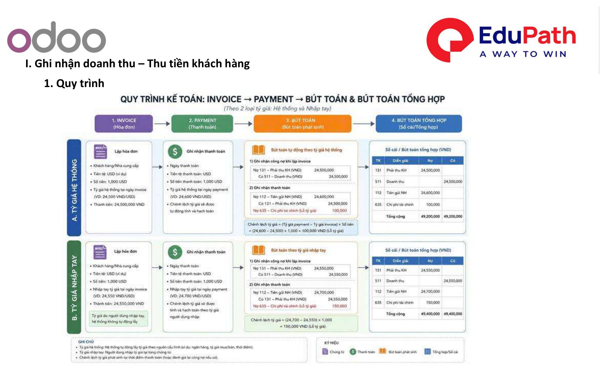
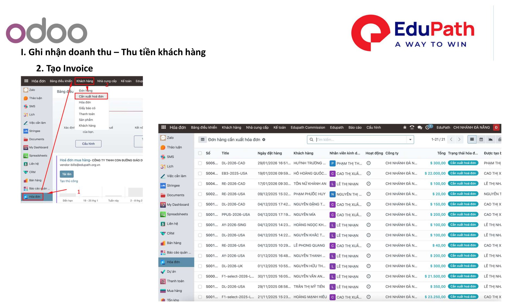
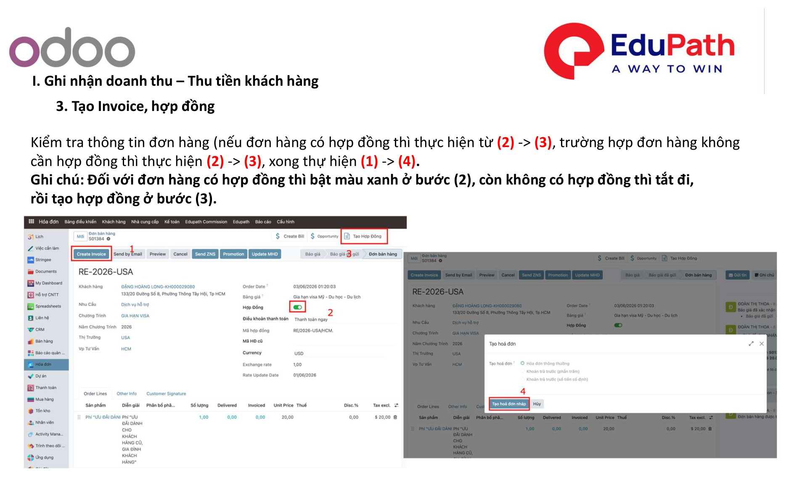
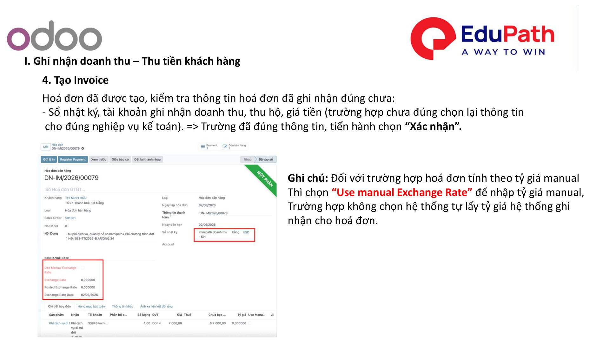
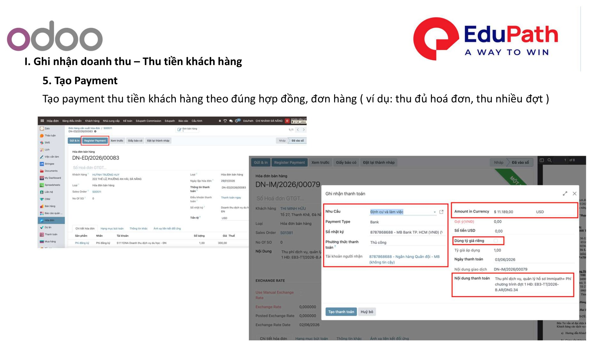
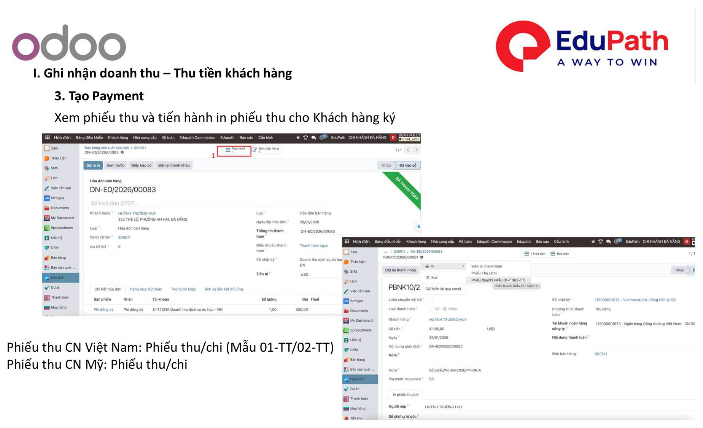
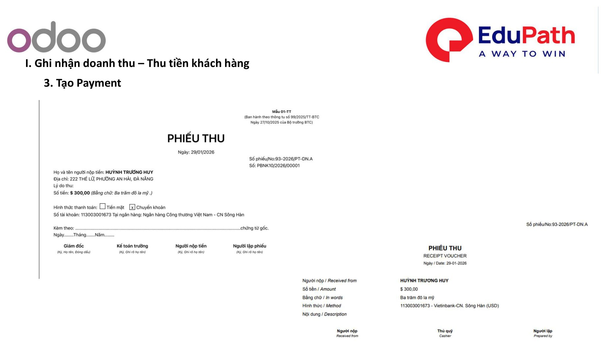

# I. Ghi nhận doanh thu – Thu tiền khách hàng

!!! info "Nguồn tài liệu"
    Theo tài liệu **01. Quy trình xử lý nghiệp vụ kế toán — Odoo 18**. Áp dụng tương tự **Odoo 17**.

Luồng nghiệp vụ: **SO → Kiểm tra thông tin SO → Invoice → Payment** (có nhánh huỷ / điều chỉnh nếu sai tài khoản).

## 1. Quy trình

| Level | Vai trò | Mô tả |
|-------|---------|-------|
| **Level 0** | TVV | Tư vấn viên lên đơn hàng, **confirm** đơn hàng khi đã thống nhất với khách hàng về dịch vụ, sản phẩm, giá cả… |
| **Level 1** | Kế toán | Kế toán kiểm tra lại thông tin đơn hàng đã đầy đủ chưa. |
| **Level 2** | Kế toán | Kế toán tạo **Invoice** ghi nhận doanh thu, phí thu hộ. Nếu phát hiện Invoice ghi nhận doanh thu / thu hộ **sai tài khoản** khi đã lên Payment → phải **huỷ Payment** và điều chỉnh Invoice. |
| **Level 3** | Kế toán | Kế toán thu tiền khách hàng theo **điều khoản hợp đồng**. |

{ .doc-screenshot-full }

Sơ đồ tổng quát toàn trình **Invoice → Payment → Bút toán & Bút toán tổng hợp**, minh hoạ theo 2 loại tỷ giá (hệ thống và nhập tay):

{ .doc-screenshot-full }

## 2. Tạo Invoice

Vào **Hóa đơn › Khách hàng › Cần xuất hóa đơn**, chọn đơn hàng cần xuất hóa đơn để tạo Invoice ghi nhận doanh thu.

{ .doc-screenshot-full }

## 3. Tạo Invoice, hợp đồng

Kiểm tra thông tin đơn hàng:

- Đơn hàng **có hợp đồng**: thực hiện từ **(2) → (3)**.
- Đơn hàng **không cần hợp đồng**: thực hiện **(2) → (3)**, xong thực hiện **(1) → (4)**.

!!! note "Cờ hợp đồng trên đơn hàng"
    - Đơn hàng **có** hợp đồng: **bật màu xanh** ở bước (2).
    - Đơn hàng **không** có hợp đồng: **tắt** ở bước (2), rồi tạo hợp đồng ở bước (3).

{ .doc-screenshot-full }

## 4. Kiểm tra & xác nhận Invoice

Hóa đơn đã được tạo — kiểm tra thông tin hóa đơn đã ghi nhận đúng chưa:

- **Sổ nhật ký**, **tài khoản** ghi nhận doanh thu / thu hộ, **giá tiền**.
- Trường hợp chưa đúng → chọn lại thông tin cho đúng nghiệp vụ kế toán.
- Đã đúng thông tin → chọn **"Xác nhận"**.

!!! note "Tỷ giá manual"
    Với hóa đơn tính theo tỷ giá manual: bật **"Use manual Exchange Rate"** để nhập tỷ giá thủ công. Nếu không chọn, hệ thống tự lấy tỷ giá hệ thống để ghi nhận cho hóa đơn.

{ .doc-screenshot-full }

## 5. Tạo Payment – thu tiền khách hàng

Tạo **Payment** thu tiền khách hàng theo đúng hợp đồng / đơn hàng (ví dụ: thu đủ hóa đơn, thu nhiều đợt).

{ .doc-screenshot-full }

## 6. In phiếu thu

Xem phiếu thu và tiến hành **in phiếu thu** cho khách hàng ký.

- Phiếu thu **CN Việt Nam**: Phiếu thu / chi (Mẫu **01-TT / 02-TT**).
- Phiếu thu **CN Mỹ**: Phiếu thu / chi theo mẫu chi nhánh.

{ .doc-screenshot-full }

{ .doc-screenshot-full }

---

Xem tiếp: [II. Ghi nhận chi phí / mua hàng – Thanh toán NCC](thanh-toan-ncc.md)
