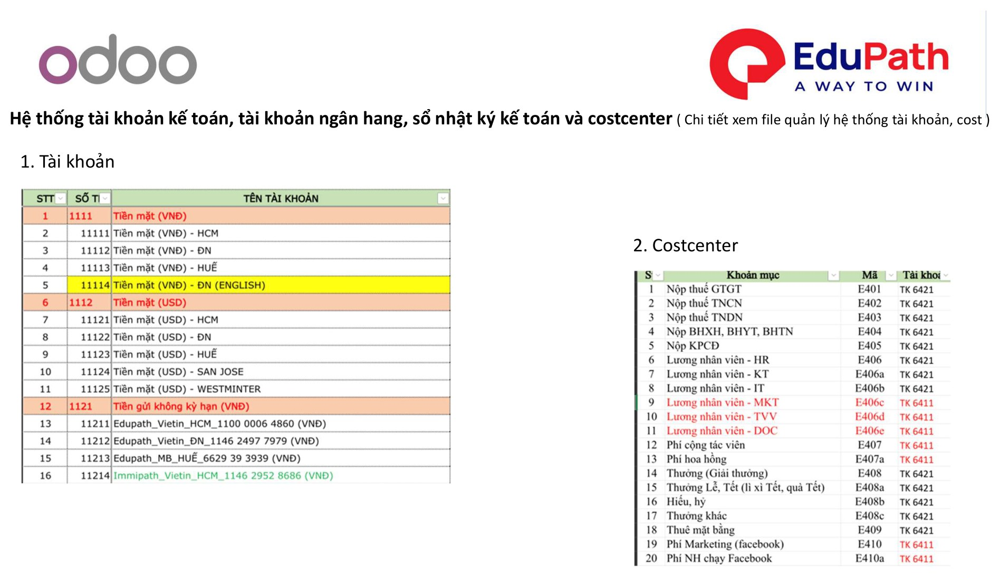
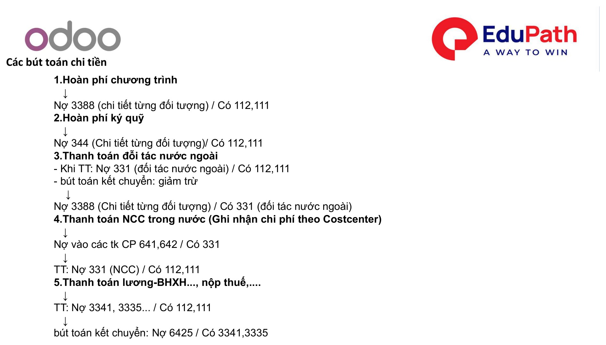

# Tổng quan Kế toán

Phần **Kế toán** mô tả **quy trình xử lý nghiệp vụ kế toán** trên Odoo tại Edupath: từ ghi nhận doanh thu, thu tiền khách hàng, ghi nhận chi phí / thanh toán nhà cung cấp, đề xuất thanh toán đến các bút toán tổng hợp.

!!! info "Nguồn tài liệu"
    Biên soạn theo tài liệu **01. Quy trình xử lý nghiệp vụ kế toán — Odoo 18**. Thao tác áp dụng tương tự trên **Odoo 17**.

## Mục lục

| # | Nội dung | Vai trò chính |
|---|----------|---------------|
| **I** | [Ghi nhận doanh thu – Thu tiền khách hàng](ghi-nhan-doanh-thu.md) | TVV, Kế toán |
| **II** | [Ghi nhận chi phí / mua hàng – Thanh toán NCC](thanh-toan-ncc.md) | User, Kế toán |
| **III** | [Đề xuất thanh toán (ĐNTT)](de-xuat-thanh-toan.md) | Người ĐNTT, QLBP, Kế toán, BOD |
| **IV** | [Bút toán tổng hợp – không có hóa đơn](but-toan-tong-hop.md) | Kế toán |

## Thiết lập hệ thống tài khoản

Trước khi vận hành, cần khai báo hệ thống **tài khoản kế toán**, **tài khoản ngân hàng**, **sổ nhật ký kế toán** và **Costcenter**.

| STT | Hạng mục | Ghi chú |
|-----|----------|---------|
| 1 | **Tài khoản** kế toán | Hệ thống tài khoản (Chart of Accounts) |
| 2 | **Tài khoản ngân hàng** | Phục vụ thu / chi qua ngân hàng |
| 3 | **Sổ nhật ký** kế toán | Journal ghi nhận theo nghiệp vụ |
| 4 | **Costcenter** | Ghi nhận chi phí theo trung tâm chi phí |

!!! note "Chi tiết cấu hình"
    Xem riêng file **quản lý hệ thống tài khoản & Costcenter** để biết chi tiết khai báo.

{ .doc-screenshot-full }

## Các bút toán chi tiền

Tổng hợp các bút toán chi tiền thường gặp:

| # | Nghiệp vụ | Bút toán |
|---|-----------|----------|
| 1 | **Hoàn phí chương trình** | Nợ **3388** (chi tiết từng đối tượng) / Có **112, 111** |
| 2 | **Hoàn phí ký quỹ** | Nợ **344** (chi tiết từng đối tượng) / Có **112, 111** |
| 3 | **Thanh toán đối tác nước ngoài** | Khi TT: Nợ **331** (đối tác NN) / Có **112, 111** Kết chuyển (giảm trừ): Nợ **3388** (chi tiết ĐT) / Có **331** (đối tác NN) |
| 4 | **Thanh toán NCC trong nước** (ghi nhận chi phí theo Costcenter) | Ghi nhận CP: Nợ **641, 642** / Có **331** Khi TT: Nợ **331** (NCC) / Có **112, 111** |
| 5 | **Thanh toán lương – BHXH…, nộp thuế…** | Khi TT: Nợ **3341, 3335…** / Có **112, 111** Kết chuyển: Nợ **6425** / Có **3341, 3335** |

{ .doc-screenshot-full }
