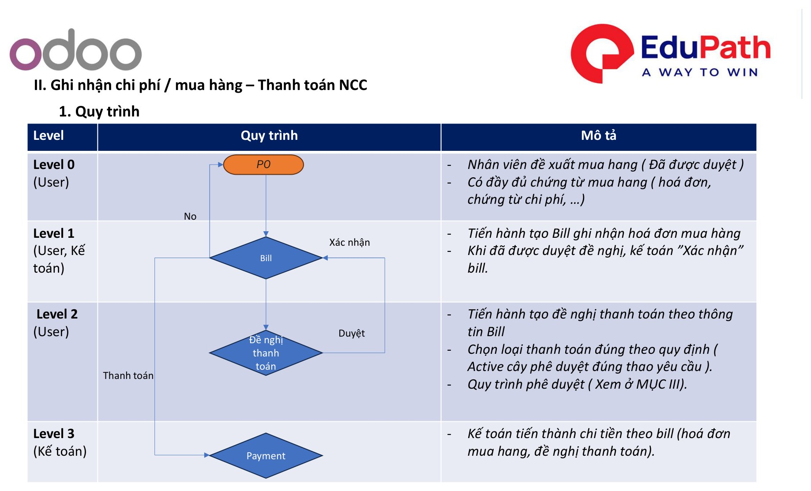
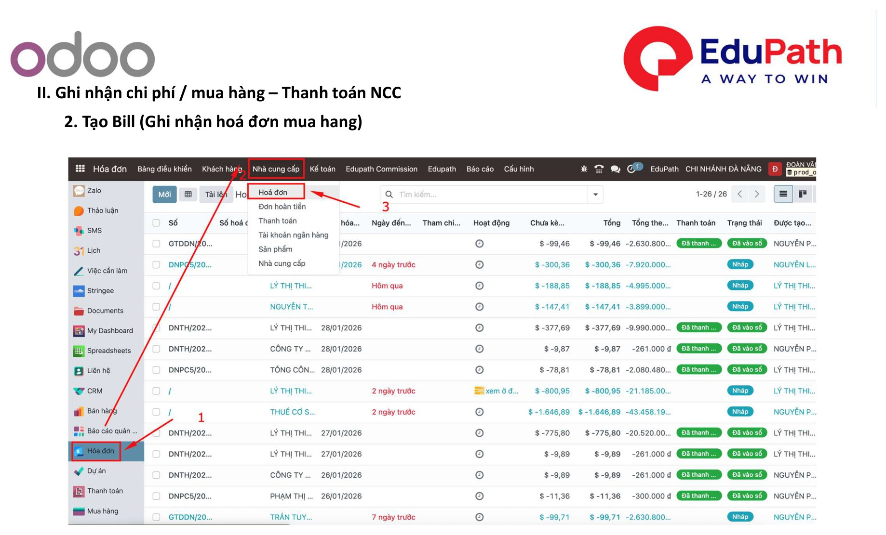
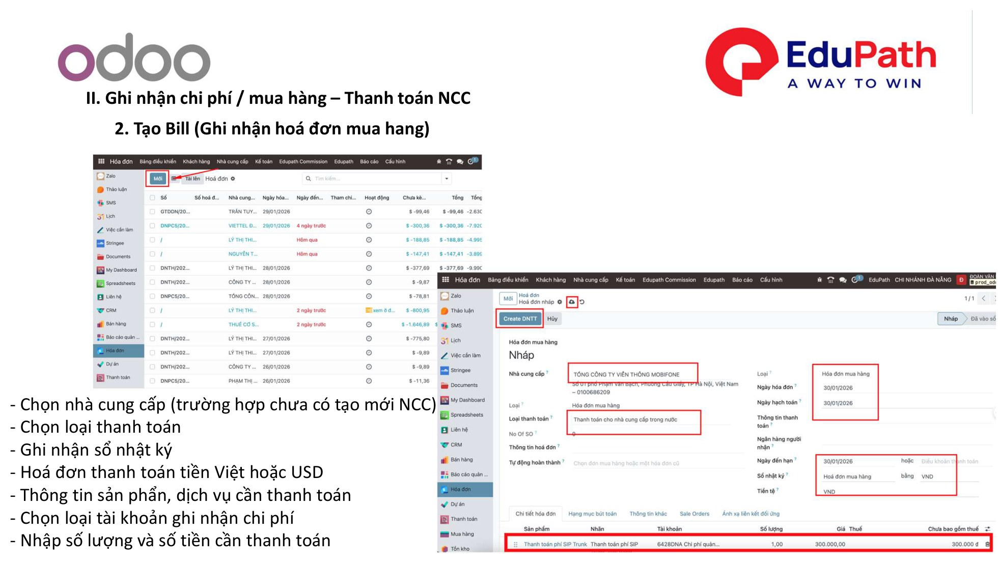
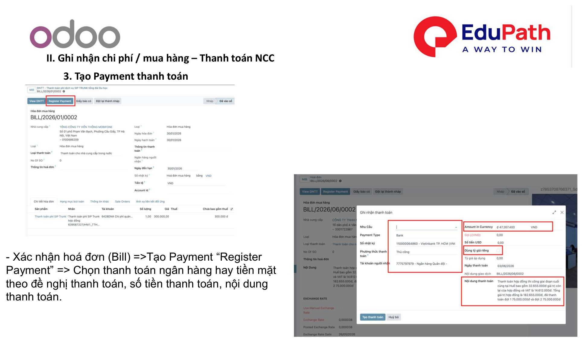
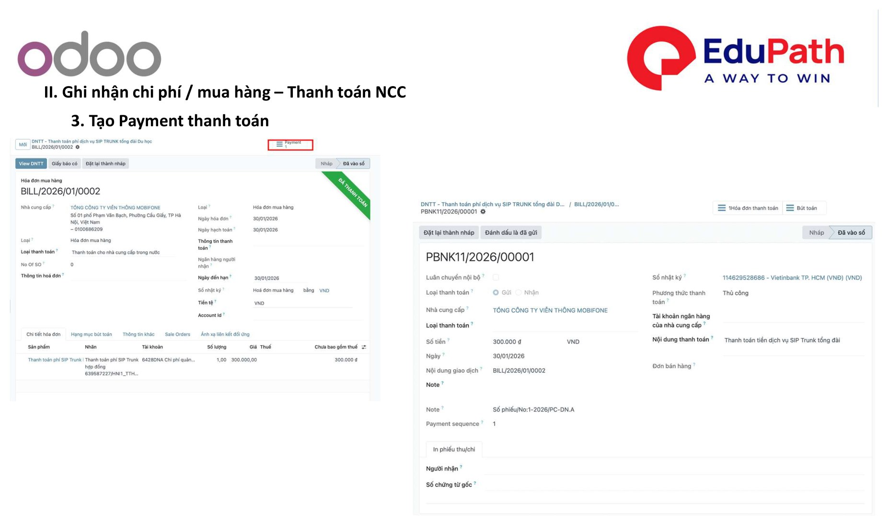
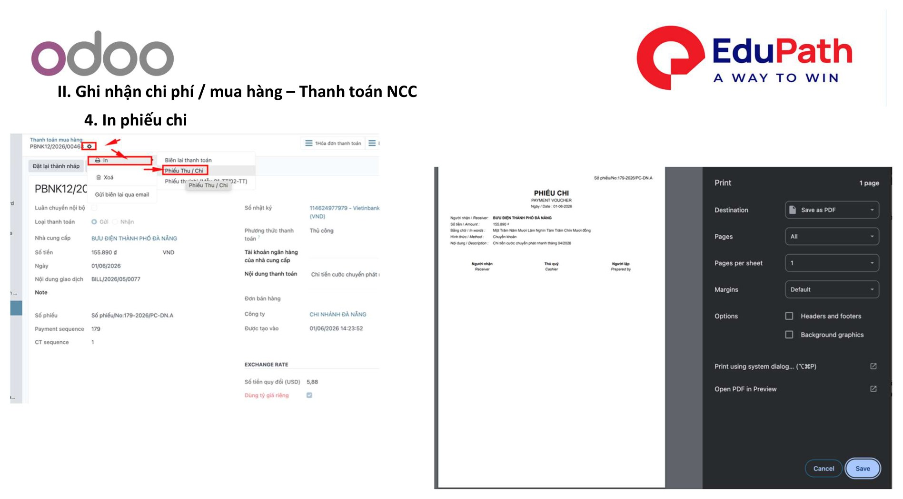

# II. Ghi nhận chi phí / mua hàng – Thanh toán NCC

!!! info "Nguồn tài liệu"
    Theo tài liệu **01. Quy trình xử lý nghiệp vụ kế toán — Odoo 18**. Áp dụng tương tự **Odoo 17**.

Luồng nghiệp vụ: **PO → Bill → Đề nghị thanh toán → Payment** (Bill được xác nhận sau khi đề nghị thanh toán được duyệt).

## 1. Quy trình

| Level | Vai trò | Mô tả |
|-------|---------|-------|
| **Level 0** | User | Nhân viên đề xuất mua hàng (đã được duyệt). Có đầy đủ chứng từ mua hàng (hóa đơn, chứng từ chi phí…). |
| **Level 1** | User, Kế toán | Tạo **Bill** ghi nhận hóa đơn mua hàng. Khi đã được duyệt đề nghị, kế toán **"Xác nhận"** Bill. |
| **Level 2** | User | Tạo **đề nghị thanh toán** theo thông tin Bill. Chọn loại thanh toán đúng theo quy định (active cây phê duyệt đúng yêu cầu). Quy trình phê duyệt — xem [Mục III](de-xuat-thanh-toan.md). |
| **Level 3** | Kế toán | Kế toán **chi tiền** theo Bill (hóa đơn mua hàng, đề nghị thanh toán). |

{ .doc-screenshot-full }

## 2. Tạo Bill (ghi nhận hóa đơn mua hàng)

{ .doc-screenshot-full }

Các thông tin cần nhập khi tạo Bill:

- Chọn **nhà cung cấp** (trường hợp chưa có → tạo mới NCC).
- Chọn **loại thanh toán**.
- Ghi nhận **sổ nhật ký**.
- Hóa đơn thanh toán tiền **Việt** hoặc **USD**.
- Thông tin **sản phẩm, dịch vụ** cần thanh toán.
- Chọn loại **tài khoản ghi nhận chi phí**.
- Nhập **số lượng** và **số tiền** cần thanh toán.

{ .doc-screenshot-full }

## 3. Tạo Payment thanh toán

**Xác nhận** hóa đơn (Bill) → tạo Payment bằng **"Register Payment"** → chọn thanh toán **ngân hàng** hay **tiền mặt** theo đề nghị thanh toán, nhập **số tiền** và **nội dung** thanh toán.

{ .doc-screenshot-full }

{ .doc-screenshot-full }

## 4. In phiếu chi

In phiếu chi sau khi thanh toán (mẫu theo chi nhánh).

{ .doc-screenshot-full }

---

Xem tiếp: [III. Đề xuất thanh toán](de-xuat-thanh-toan.md)
