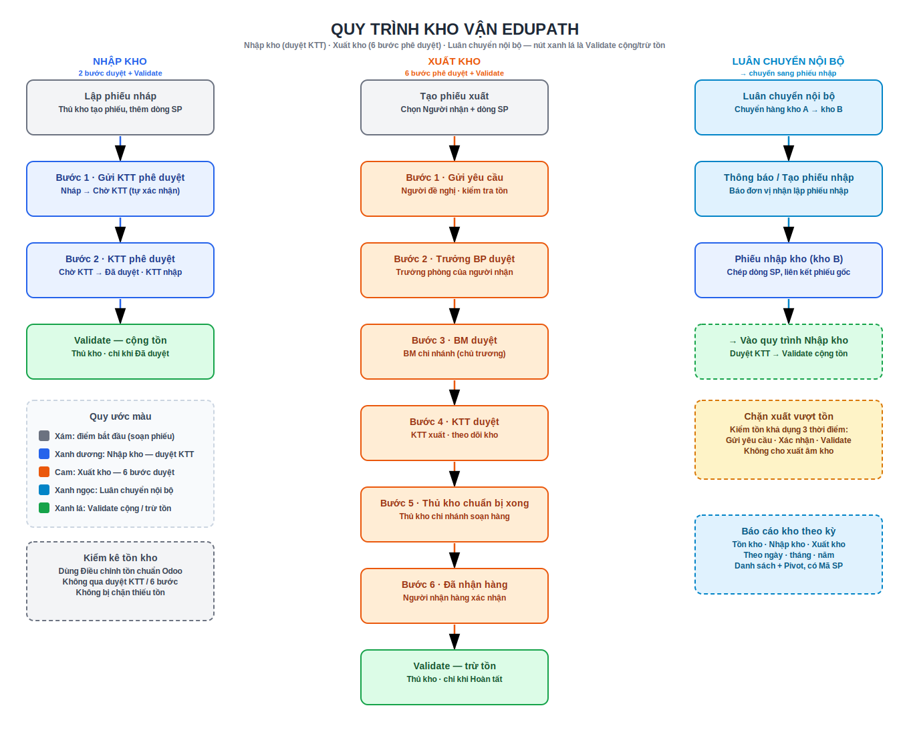

# Kho vận (Tồn kho)

Phần này hướng dẫn sử dụng app **Tồn kho** của Edupath — mở rộng module Inventory chuẩn của Odoo bằng module **`edupath_stock`** (*Edupath: Stock*). Điểm khác biệt lớn nhất so với Odoo gốc là **quy trình phê duyệt phiếu nhập/xuất kho**, **chặn xuất vượt tồn khả dụng** và **bộ báo cáo tồn/nhập/xuất theo kỳ**.

!!! abstract "Module thêm gì so với Kho chuẩn"
    - **Phiếu nhập kho** phải qua **Kế toán trưởng (KTT nhập)** duyệt mới được Validate cộng tồn.
    - **Phiếu xuất kho** đi qua **6 bước** (Người đề nghị → Trưởng BP → BM → KTT xuất → Thủ kho → Người nhận) rồi thủ kho mới Validate trừ tồn.
    - **Chặn xuất vượt tồn khả dụng** (tránh âm kho ngoài ý muốn) tại 3 thời điểm.
    - **Luân chuyển nội bộ** tự thông báo / tạo phiếu nhập cho đơn vị nhận.
    - **Báo cáo tồn kho / nhập kho / xuất kho** theo ngày · tháng · năm (danh sách + Pivot).
    - **Tự sinh mã sản phẩm** cho nhóm Marketing (M001, M002…) và cột **Mã SP** trong mọi danh sách.

## Vai trò & nhóm quyền

Quy trình dựa trên các **nhóm quyền** riêng của Edupath (khai trong nhóm *Inventory*):

| Vai trò | Việc phụ trách | Nhóm quyền (Odoo) |
|---------|----------------|-------------------|
| **Người đề nghị / nhận hàng** | Lập phiếu xuất, bấm **Đã nhận hàng** (bước cuối) | *Người dùng Tồn kho* (`stock.group_stock_user`) |
| **Trưởng BP** | Duyệt bước 1 phiếu xuất | Suy ra từ **sơ đồ tổ chức HR** (không cần nhóm riêng) |
| **BM** (Business Manager) | Duyệt **chủ trương** xuất | *Edupath: Approve outgoing BM (chủ trương)* |
| **KTT xuất** | Duyệt **theo dõi kho** ở phiếu xuất (bước 4) | *Edupath: Approve outgoing KTT (theo dõi kho)* |
| **KTT nhập** | Duyệt **phiếu nhập kho** | *Edupath: Approve incoming receipts (KTT)* |
| **Thủ kho** | Xác nhận **chuẩn bị hàng xong**, **Validate** cộng/trừ tồn | *Người dùng Tồn kho* + cấu hình trên **Kho** |

!!! warning "Hai nhóm KTT tách biệt"
    Quyền duyệt **nhập kho** và quyền duyệt **xuất kho (bước 4)** là **hai nhóm riêng biệt**. Một kế toán trưởng thường được gán **cả hai**, nhưng về kỹ thuật đây là hai quyền độc lập — có thể trao riêng.

!!! note "Người phụ trách tự suy ra"
    - **Trưởng BP** ← phòng ban của *người nhận hàng*: đọc hồ sơ **Nhân viên** → phòng ban → `manager_id`, leo cấp phòng cha nếu thiếu.
    - **BM** và **Thủ kho** ← cấu hình trên **Kho** của phiếu.
    - Thiếu cấu hình → hệ thống **báo lỗi rõ ràng** và chỉ đúng chỗ khai báo (hồ sơ Nhân viên / Related User / Kho). Vì vậy module **Nhân viên (HR)** phải được cài và khai đủ phòng ban/quản lý.

## Sơ đồ tổng quan quy trình kho

Ba luồng nghiệp vụ chính của module (số bước đếm theo **nút bấm** trên phiếu). Node **xanh lá** là **Validate** cộng/trừ tồn.

{ .doc-screenshot-full }

```text
Nhập kho (2 bước duyệt):
    Lập nháp → Gửi KTT → KTT duyệt → Validate (cộng tồn)

Xuất kho (6 bước):
    Tạo phiếu → Gửi yêu cầu → Trưởng BP → BM → KTT → Thủ kho chuẩn bị → Đã nhận → Validate (trừ tồn)

Luân chuyển nội bộ:
    Kho A → Kho B → Thông báo/Tạo phiếu nhập → vào quy trình Nhập kho (duyệt KTT)
```

!!! warning "Chặn xuất vượt tồn"
    Hệ thống kiểm tra **tồn khả dụng** ở 3 thời điểm — **Gửi yêu cầu** (bước 1), **Xác nhận**, và **Validate** — không cho xuất vượt tồn (xem [Xuất kho](xuat-kho.md#kiem-tra-ton-kha-dung-chan-xuat-vuot-ton)).

## Bản đồ menu

```text
Tồn kho (app)
├── Yêu cầu phê duyệt                          (đầu menu; hiện theo nhóm quyền)
│   ├── Tất cả yêu cầu (nhập kho)              [KTT nhập]
│   ├── Chờ tôi phê duyệt / xử lý (nhập kho)   [KTT nhập]
│   ├── Tất cả yêu cầu (xuất kho)              [Người dùng Tồn kho]
│   └── Chờ tôi phê duyệt / xử lý (xuất kho)   [Người dùng Tồn kho]
├── Tổng quan                                  (dashboard chuẩn Odoo)
├── Vận hành
│   ├── Nhận hàng (Receipts)                   → phiếu nhập kho
│   ├── Phiếu xuất kho                         → thay "Giao hàng" chuẩn (đã ẩn)
│   ├── Luân chuyển nội bộ
│   └── Điều chỉnh tồn kho                     → Kiểm kê
├── Sản phẩm
├── Báo cáo
│   ├── Báo cáo tồn kho
│   ├── Báo cáo nhập kho
│   └── Báo cáo xuất kho
└── Cấu hình
    ├── Kho              → BM · Thủ kho · Nhân viên nhận (Edupath)
    └── Cài đặt          → Xuất khi thiếu tồn (Edupath)
```

Menu **Chờ tôi phê duyệt / xử lý** chỉ hiện phiếu **đang đợi chính bạn** xử lý (theo vai trò và bước hiện tại) — nên dùng nó làm việc hằng ngày. Menu **Báo cáo** yêu cầu nhóm *Người dùng Tồn kho* hoặc *Quản lý Tồn kho*.

## Khái niệm nền

| Khái niệm | Mô tả |
|-----------|--------|
| **Sản phẩm** | Hàng lưu kho (*storable*), tiêu hao (*consumable*) hoặc dịch vụ |
| **Vị trí** (Location) | Vị trí vật lý/ảo trong kho; báo cáo tính trên vị trí **nội bộ** |
| **Phiếu** (Picking) | Phiếu nhập (incoming) / xuất (outgoing) / luân chuyển nội bộ (internal) |
| **Tồn khả dụng** | Tồn thực − số đang giữ cho **phiếu khác** (dùng khi chặn xuất) |
| **Bước quy trình** | Trạng thái duyệt riêng của Edupath, tách khỏi trạng thái kho gốc |

## Mục lục

- [1. Sản phẩm](san-pham.md) — tạo sản phẩm, cột Mã SP, quy tắc tự sinh mã Marketing
- [2. Nhập kho](nhap-kho.md) — phiếu nhập + duyệt KTT, luân chuyển nội bộ
- [3. Xuất kho](xuat-kho.md) — quy trình xuất 6 bước, kiểm tra tồn, thông tin giao hàng
- [4. Tồn kho](ton-kho.md) — xem tồn & báo cáo tồn/nhập/xuất theo kỳ
- [5. Kiểm kê](kiem-ke.md) — điều chỉnh tồn & đối chiếu

!!! info "Đặc tả kỹ thuật"
    Chi tiết model, migration, hook, phân quyền → [1 · Phiếu nhập/xuất kho Edupath (`edupath_stock`)](../functional/edupath-stock.md).
