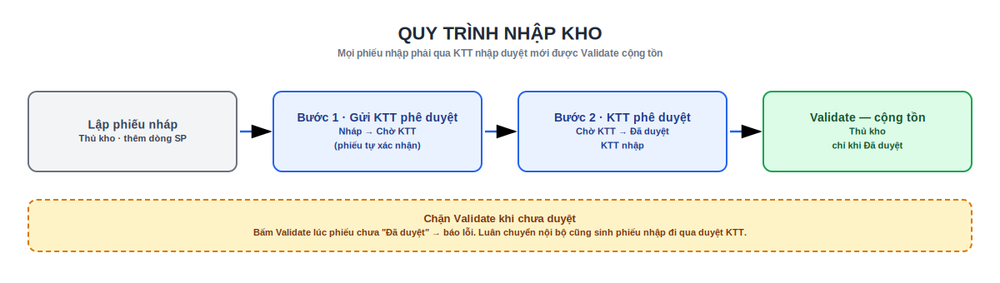

# 2. Nhập kho

**Mọi phiếu nhập kho (Receipt)** của Edupath **phải được Kế toán trưởng (KTT nhập) duyệt** trước khi Validate cộng tồn. Đây là điểm khác biệt so với Kho chuẩn (vốn cho Validate ngay).

## Quy trình nhập kho

{ .doc-screenshot-full }

```text
Thủ kho lập phiếu nháp (thêm dòng SP)
→ [Gửi KTT phê duyệt]        (Nháp → Chờ KTT; phiếu tự xác nhận)
→ KTT bấm [KTT phê duyệt]    (Chờ KTT → Đã duyệt)
→ Thủ kho bấm [Validate]     (chỉ khi Đã duyệt → cộng tồn)
```

Trạng thái duyệt nhập (`edupath_incoming_approval_state`) có 3 nấc, hiển thị bằng **huy hiệu** cạnh **Nguồn** (Origin):

| Trạng thái | Huy hiệu | Ý nghĩa |
|-----------|----------|---------|
| **Nháp** (*Warehouse draft*) | (ẩn) | Kho đang soạn phiếu |
| **Chờ KTT** (*Waiting for KTT*) | Vàng | Đã gửi, đợi KTT duyệt |
| **Đã duyệt** (*KTT approved*) | Xanh | KTT đã duyệt — được Validate |

**Không Validate được** khi phiếu chưa **Đã duyệt**.

### Các bước chi tiết

1. **Tồn kho › Vận hành › Nhận hàng** → mở/ tạo phiếu nhập, thêm các **dòng sản phẩm** và số lượng.
2. Bấm **Gửi KTT phê duyệt** (nhóm *Người dùng Tồn kho*).
    - Điều kiện: phiếu đang **Nháp**, chưa bị huỷ, có **ít nhất một dòng sản phẩm**.
    - Hệ thống ghi **Người lập** (*Prepared by* — mặc định chính người bấm) và thời điểm, chuyển sang **Chờ KTT**, đồng thời **xác nhận** phiếu (`action_confirm`).
3. **KTT** mở phiếu (hoặc vào **Yêu cầu phê duyệt › Chờ tôi phê duyệt / xử lý (nhập kho)**) → bấm **KTT phê duyệt** (nhóm *Edupath: Approve incoming receipts (KTT)*).
    - Hệ thống ghi **Người duyệt (KTT)** và thời điểm, chuyển sang **Đã duyệt**.
4. **Thủ kho** bấm **Validate** để **cộng tồn**. Nếu bật theo dõi **Lô/Serial**, nhập lô trước khi Validate.

!!! warning "Chặn Validate khi chưa duyệt"
    Bấm Validate lúc phiếu chưa **Đã duyệt** sẽ báo lỗi: *"Incoming receipts must be approved by KTT before stock is increased."* Hãy gửi KTT và chờ duyệt xong.

### Thông tin phê duyệt trên phiếu

Ngay dưới **Nguồn** (Origin) của phiếu nhập hiển thị:

| Trường | Ý nghĩa |
|--------|---------|
| **Trạng thái duyệt** | Huy hiệu *Chờ KTT* (vàng) / *Đã duyệt* (xanh) |
| **Người lập** (*Prepared by*) | Người bấm *Gửi KTT phê duyệt* (sửa được khi còn Nháp) |
| **Người duyệt (KTT)** | KTT đã duyệt & thời điểm (chỉ đọc) |

## Nguồn phát sinh phiếu nhập

- **Nhập mua / trả hàng / điều chỉnh tăng** — tạo phiếu nhập thủ công hoặc từ nghiệp vụ liên quan.
- **Luân chuyển nội bộ** — kho gửi báo cho đơn vị nhận lập phiếu nhập (mục dưới).

## Luân chuyển nội bộ → lập phiếu nhập

Khi chuyển hàng giữa hai kho, phiếu **Luân chuyển nội bộ** (*internal*) có thêm hai nút của Edupath (nhóm *Người dùng Tồn kho*):

- **Thông báo đơn vị nhận** — lên **hoạt động (activity) "To-Do"** cho từng **nhân viên nhận** của kho đích kèm nội dung phiếu, đồng thời đăng thông báo. Danh sách nhân viên nhận lấy từ ô *Nhân viên nhận (thông báo)* trên phiếu, hoặc mặc định cấu hình trên **Kho đích**. Thiếu cấu hình → báo lỗi và chỉ chỗ khai.
- **Tạo phiếu nhập kho** — tạo ngay một **phiếu nhập nháp** cho kho đích, chép các dòng sản phẩm, **liên kết** về phiếu luân chuyển gốc rồi mở phiếu nhập đó ra. Nếu đã có phiếu nhập nháp gắn với luân chuyển này, nút mở lại phiếu cũ thay vì tạo trùng.

Trên phiếu luân chuyển có nút thống kê **Phiếu nhập** đếm số phiếu nhập đã tạo từ nó; phiếu nhập sinh ra vẫn đi qua **duyệt KTT** như trên.

!!! note "Cấu hình nhân viên nhận"
    **Tồn kho › Cấu hình › Kho** → mục *Luân chuyển nội bộ (Edupath)* → chọn **Nhân viên nhận (luân chuyển nội bộ)** cho kho. Khi tạo luân chuyển đến kho đó, danh sách này được dùng làm mặc định.

!!! tip "Theo dõi phiếu chờ mình"
    KTT dùng **Yêu cầu phê duyệt › Chờ tôi phê duyệt / xử lý (nhập kho)** để thấy đúng các phiếu đang **Chờ KTT** cần mình duyệt; **Tất cả yêu cầu (nhập kho)** để xem toàn bộ phiếu đang *Chờ KTT* / *Đã duyệt*.

Xem tiếp: [3. Xuất kho](xuat-kho.md) · [4. Tồn kho](ton-kho.md)
