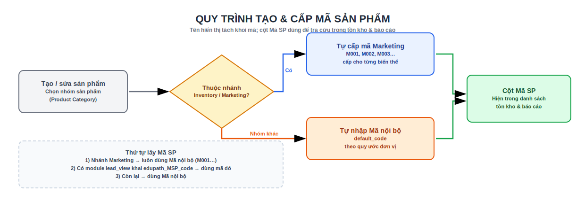

# 1. Sản phẩm

## Sơ đồ quy trình

{ .doc-screenshot-full }

## Tạo sản phẩm

**Tồn kho › Sản phẩm › Sản phẩm** → **Mới**.

| Loại sản phẩm | Dùng khi | Theo tồn kho? | Chịu chặn xuất? |
|---------------|----------|---------------|-----------------|
| **Có thể lưu kho** (Storable) | Vật tư, hàng hoá nhập/xuất/tồn | ✅ Có | ✅ Có |
| **Tiêu hao** (Consumable) | Dùng ngay, không theo dõi tồn chặt | ⚠️ Không chặt | ❌ Không chặn |
| **Dịch vụ** (Service) | Không phải hàng kho | ❌ Không | ❌ Không |

Chỉ hàng **Có thể lưu kho** mới chịu ràng buộc **kiểm tra tồn khả dụng** khi xuất (xem [Xuất kho](xuat-kho.md#kiem-tra-ton-kha-dung-chan-xuat-vuot-ton)). Hàng **Có thể lưu kho** và **Tiêu hao** đều nằm trong phạm vi tự sinh mã Marketing.

### Các tab chính

- **Thông tin chung** — tên, ảnh, **Mã nội bộ** (`default_code`), nhóm sản phẩm, đơn vị tính.
- **Bán hàng / Mua hàng** — giá, thuế, nhà cung cấp (nếu dùng).
- **Tồn kho** — tuyến (route), trọng lượng, theo dõi **Lô/Serial** nếu cần truy xuất.

## Tên hiển thị và Mã SP

Module Edupath **tách bạch tên và mã**:

- **Tên hiển thị** của sản phẩm **chỉ là tên** — không kèm tiền tố `[M001]` như Odoo gốc. Biến thể hiển thị dạng `Tên (thuộc tính)`.
- **Mã sản phẩm** nằm ở cột riêng: **Mã nội bộ** (`default_code`) hoặc cột **Mã SP** (`edupath_msp_code`).
- Trong **danh sách tồn kho theo vị trí** và các **báo cáo tồn/nhập/xuất**, cột **Mã SP** được thêm sẵn để tra cứu nhanh.

!!! note "Mã SP lấy từ đâu (thứ tự ưu tiên)"
    Cột **Mã SP** được tính như sau:

    1. Nếu sản phẩm thuộc **nhánh Marketing** → **luôn** lấy **Mã nội bộ** (quy tắc M001, M002…).
    2. Nếu có module hồ sơ sản phẩm ([lead-view](../functional/lead-view.md)) khai **Mã SP** (`edupath_MSP_code`) → ưu tiên mã đó.
    3. Nếu không → dùng **Mã nội bộ**.

## Tự sinh mã cho nhóm Marketing

Sản phẩm thuộc **nhánh Marketing** được **tự cấp mã** dạng **`M001`, `M002`, `M003`…** — không cần gõ tay.

- **Điều kiện áp dụng:** đường dẫn nhóm sản phẩm chứa **cả** `Inventory` **và** `Marketing` (ví dụ `All / … / Inventory / … / Marketing`, kể cả nhóm con dưới Marketing).
- **Khi nào cấp mã:** ngay khi **tạo mới** sản phẩm/biến thể trong nhánh đó, hoặc khi **đổi nhóm** một sản phẩm sang nhánh Marketing (ghi lại `categ_id`).
- **Cách đánh số:** hệ thống quét toàn hệ thống, lấy **số M### còn trống nhỏ nhất** (không trùng mã đã dùng) rồi cấp lần lượt cho **từng biến thể** — mỗi biến thể một mã riêng, không gán trùng mã cho template.

!!! tip "Muốn dùng auto-mã"
    Đặt sản phẩm vào đúng nhóm nằm dưới nhánh **Inventory / Marketing**. Sản phẩm ở nhóm khác **không** tự sinh mã — bạn tự nhập **Mã nội bộ** theo quy ước của đơn vị.

!!! warning "Không sửa mã M### thủ công tuỳ tiện"
    Mã Marketing dùng làm khoá tra cứu trong báo cáo tồn/nhập/xuất. Nếu cần gán lại hàng loạt, hãy nhờ **quản trị hệ thống** chạy tác vụ chuẩn hoá mã (`edupath_stock_apply_marketing_codes`) thay vì sửa tay từng bản ghi — tránh trùng/nhảy số.

## Nhóm sản phẩm & đơn vị tính

- **Nhóm sản phẩm** (Product Category): dùng để **lọc** trong báo cáo tồn/nhập/xuất và quyết định quy tắc **auto-mã Marketing**.
- **Đơn vị tính** (ĐVT): số lượng tồn, phép chặn xuất và báo cáo đều quy về ĐVT gốc của sản phẩm.

## Biến thể & Lô/Serial

- **Biến thể** (Attributes: Size, Color…) → nhiều SKU con; mỗi biến thể có **Mã nội bộ riêng** (nhóm Marketing tự cấp mã cho từng biến thể).
- Bật **theo dõi Lô/Serial** ở tab *Tồn kho* nếu cần truy xuất — khi đó phải nhập **Lô/Serial** trước khi Validate phiếu nhập/xuất, và tồn được tách **theo từng lô** trong báo cáo.

Xem tiếp: [2. Nhập kho](nhap-kho.md) · [4. Tồn kho](ton-kho.md)
