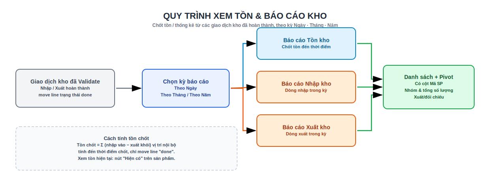

# 4. Tồn kho

## Sơ đồ quy trình

{ .doc-screenshot-full }

## Xem tồn hiện tại

- **Tồn kho › Sản phẩm** → nút thông minh **Hiện có** (On Hand) trên từng sản phẩm: xem **Số lượng hiện có** (tồn thực) và **Số lượng dự trữ** (đang giữ chỗ cho phiếu). Dự trữ = 0 nghĩa là chưa phiếu nào giữ.
- Danh sách tồn theo vị trí có thêm cột **Mã SP** (đặt trước tên) để tra cứu nhanh.

> **Tồn khả dụng để xuất = Số lượng hiện có − Số lượng dự trữ cho phiếu khác.** Đây là con số dùng khi [chặn xuất vượt tồn](xuat-kho.md#kiem-tra-ton-kha-dung-chan-xuat-vuot-ton).

## Báo cáo tồn kho (chốt theo kỳ)

**Tồn kho › Báo cáo › Báo cáo tồn kho** — chốt tồn tại một **thời điểm** trong quá khứ hoặc hiện tại. Hộp thoại mở ra để nhập tham số:

**Bước dùng:**

1. Chọn **Loại báo cáo** (radio): **Theo ngày** · **Theo tháng** · **Theo năm**.
2. Chọn **Ngày chốt tồn**:
    - *Theo ngày* → đúng ngày đó (đến 23:59:59 theo múi giờ người dùng).
    - *Theo tháng* → chọn bất kỳ ngày trong tháng (chốt **cuối tháng**).
    - *Theo năm* → chọn bất kỳ ngày trong năm (chốt **31/12**).
3. Lọc (tuỳ chọn): **Kho**, **Vị trí nội bộ**, **Nhóm sản phẩm**, **Sản phẩm**.
4. **Hiển thị tồn bằng 0** *(mặc định bật)*: giữ bật để thấy cả sản phẩm trong nhóm đã chọn nhưng tồn = 0; tắt để chỉ hiện dòng có tồn ≠ 0.
5. Bấm **Xem báo cáo**.

Kết quả mở ở dạng **danh sách + Pivot**, mặc định **nhóm theo Sản phẩm**. Cột: **Mã SP**, kỳ, **Kho**, **Vị trí**, **Sản phẩm**, **Nhóm SP**, **Lô/Serial**, **Tồn kho** (có dòng **Tổng**), **ĐVT**. Pivot mặc định: Sản phẩm (hàng) × Vị trí (cột). Nhóm nhanh theo: Sản phẩm · Vị trí · Kho · Nhóm SP · Lô/Serial.

!!! note "Cách tính"
    Tồn chốt = tổng các **dòng di chuyển đã hoàn thành** (move line, state *done*) **tính đến thời điểm chốt**: **cộng** khi nhập vào vị trí nội bộ, **trừ** khi xuất khỏi vị trí nội bộ (theo từng sản phẩm/vị trí/lô). Nhờ đó xem được **tồn quá khứ** đúng như tại thời điểm đó — không phụ thuộc tồn hiện tại.

## Báo cáo nhập kho / xuất kho (theo kỳ)

**Tồn kho › Báo cáo › Báo cáo nhập kho** và **Báo cáo xuất kho** — liệt kê các **dòng phiếu đã hoàn thành** trong kỳ.

1. Chọn **Loại báo cáo** (Ngày/Tháng/Năm) và **Ngày chốt** — kỳ được suy ra là **cả ngày / cả tháng / cả năm** chứa ngày đó.
2. Lọc (tuỳ chọn): **Kho**, **Nhóm sản phẩm**, **Sản phẩm**.
3. **Xem báo cáo** → danh sách + Pivot.

Cột chính: **Ngày hoàn thành**, **Số phiếu**, **Mã SP**, **Sản phẩm**, **Số lượng** (có **Tổng SL**), **ĐVT**, **Kho**, **Đối tác**; tuỳ chọn thêm **Nguồn gốc**, **Từ/Đến vị trí**, **TT phê duyệt nhập** / **Bước xuất kho**. Nhóm nhanh theo: Sản phẩm · Phiếu kho · Kho · Đối tác · Ngày. Chỉ tính phiếu đúng loại (nhập/xuất) và **đã hoàn thành** trong kỳ; nếu kỳ không có phiếu nào, hệ thống báo *"Không có phiếu … hoàn thành trong kỳ"*.

!!! tip "Đối chiếu"
    Dùng **Báo cáo tồn kho** để lấy tồn đầu/cuối kỳ, **Báo cáo nhập/xuất** để giải thích biến động trong kỳ. Cả ba đều lọc theo cùng bộ **Kho / Nhóm / Sản phẩm** để khớp số.

!!! info "Quyền xem báo cáo"
    Menu **Báo cáo** và cả 3 báo cáo trên yêu cầu nhóm **Người dùng Tồn kho** hoặc **Quản lý Tồn kho**.

## Dự trữ, tồn dự báo

- **Tồn dự báo** (Forecasted) = Hiện có − Dự trữ + Sắp về. Xem trên sản phẩm.
- Khi phiếu xuất **giữ chỗ** hàng, phần đó nằm ở **Số lượng dự trữ** và bị trừ khỏi **tồn khả dụng** của phiếu khác.

Xem tiếp: [5. Kiểm kê](kiem-ke.md) · [3. Xuất kho](xuat-kho.md)
