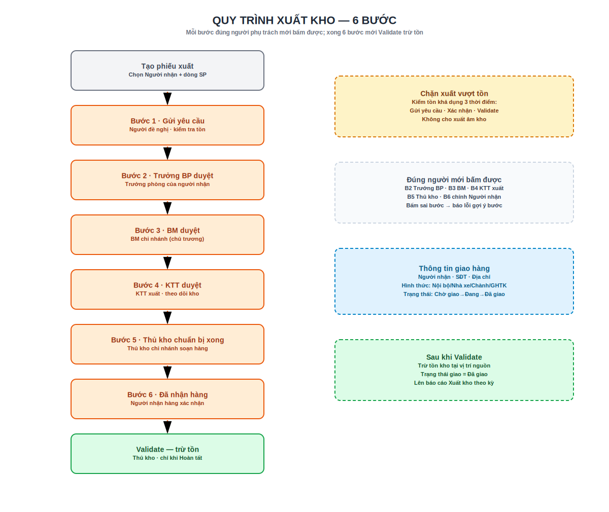

# 3. Xuất kho

Phiếu xuất kho của Edupath đi qua **6 bước phê duyệt** rồi thủ kho mới **Validate** trừ tồn. Thanh tiến trình trên đầu phiếu (statusbar Edupath, thay cho statusbar kho chuẩn) cho biết đang ở bước nào; cột **Đang chờ xử lý** trên danh sách cho biết **chờ ai**.

!!! info "Menu"
    **Tồn kho › Vận hành › Phiếu xuất kho** (menu này thay cho *Giao hàng* chuẩn của Odoo — đã được ẩn).

## Quy trình xuất kho — 6 bước

{ .doc-screenshot-full }

```text
1· Mới          → [Gửi yêu cầu]                    (Người đề nghị)
2· Trưởng BP    → [Trưởng BP duyệt]                (Trưởng phòng của người nhận)
3· BM           → [BM duyệt]                       (BM chi nhánh)
4· KT Trưởng    → [KTT duyệt]                      (KTT xuất — theo dõi kho)
5· Thủ Kho      → [Thủ kho: chuẩn bị hàng xong]    (Thủ kho chi nhánh)
6· Chờ nhận     → [Đã nhận hàng]                   (Người nhận hàng)
   Hoàn tất     → [Validate]                       (Thủ kho — trừ tồn)
```

Trạng thái (`edupath_outgoing_release_state`): **Mới → Trưởng BP → BM → KT Trưởng → Thủ Kho → Chờ nhận hàng → Hoàn tất**. Chỉ khi **Hoàn tất** (người nhận đã xác nhận) mới **Validate** được để trừ tồn.

### Chi tiết từng bước

| # | Nút bấm | Ai bấm (nhóm quyền) | Kết quả |
|---|---------|---------------------|---------|
| 1 | **Gửi yêu cầu** | Người đề nghị (*Người dùng Tồn kho*) | Kiểm tra tồn + cấu hình Trưởng BP; chuyển **Trưởng BP**, thông báo trưởng phòng |
| 2 | **Trưởng BP duyệt** | Trưởng phòng của **người nhận** | Kiểm tra cấu hình BM; ghi người/thời điểm; chuyển **BM** |
| 3 | **BM duyệt** | **BM** chi nhánh (*Approve outgoing BM*) | Ghi người/thời điểm; chuyển **KT Trưởng** |
| 4 | **KTT duyệt** | **KTT xuất** (*Approve outgoing KTT*) | Kiểm tra cấu hình thủ kho; chuyển **Thủ Kho**, thông báo thủ kho |
| 5 | **Thủ kho: chuẩn bị hàng xong** | **Thủ kho** chi nhánh | Chuyển **Chờ nhận hàng**, thông báo người nhận |
| 6 | **Đã nhận hàng** | **Người nhận hàng** (chính người đó) | Chuyển **Hoàn tất**; đặt *Trạng thái giao = Đã giao*, điền *Ngày giao* |
| — | **Validate** | Thủ kho | **Trừ tồn** (chỉ khi Hoàn tất) |

!!! warning "Không được nhảy bước — đúng người mới bấm được"
    Mỗi nút chỉ chạy đúng ở trạng thái của nó; bấm sai bước sẽ báo lỗi kèm gợi ý bước hiện tại. Ngoài admin hệ thống, **chỉ đúng người phụ trách** mới bấm được nút bước đó: Trưởng BP (bước 2), BM (3), thủ kho (5), và **chính người nhận hàng** (6). Bước 3 và 4 còn phải thuộc **đúng nhóm quyền** BM / KTT xuất.

### Tạo phiếu xuất

1. **Tồn kho › Vận hành › Phiếu xuất kho** → **Mới**.
2. Chọn **Loại hoạt động** (xuất) và **Kho xuất (nguồn hàng)**.
3. Ở khối **Thông tin giao hàng**, chọn **Người nhận hàng** — *mặc định là chính bạn*. Người nhận quyết định **phòng ban** (để suy ra Trưởng BP) và là người bấm **Đã nhận hàng** ở bước cuối.
4. Thêm các **dòng sản phẩm** cần xuất.
5. Bấm **Gửi yêu cầu**.

!!! tip "Tab Phê duyệt xuất kho"
    Trên form phiếu xuất có tab **Phê duyệt xuất kho**: xem người đang chờ xử lý, huy hiệu bước, người nhận, phòng ban, Trưởng BP/BM, và **lịch sử phê duyệt** (ai duyệt bước nào, lúc nào). Các nút bước cũng lặp lại trong tab này.

## Người phụ trách tự suy ra

- **Trưởng BP** = trưởng phòng ban của **người nhận hàng**: đọc hồ sơ **Nhân viên** (Related User → Phòng ban → `manager_id`, leo cấp phòng cha nếu phòng con chưa có quản lý). Cần module **Nhân viên (HR)**.
- **BM** và **Thủ kho** = lấy theo cấu hình trên **Kho** của phiếu.

!!! note "Thiếu cấu hình → báo lỗi rõ ràng"
    - Chưa cài **Nhân viên (HR)** → yêu cầu cài module Employees trước.
    - Không suy ra được phòng ban / Trưởng BP → thông báo chỉ rõ cần sửa hồ sơ Nhân viên (**Phòng ban**, **Quản lý trực tiếp**, **Related User**, đúng **công ty** của phiếu).
    - Kho chưa chọn **BM** / **Thủ kho** → thông báo *"Vào Kho → Cấu hình → Kho, mở kho tương ứng và chọn BM/Thủ kho"*.

## Kiểm tra tồn khả dụng (chặn xuất vượt tồn)

Hệ thống **chặn** xuất khi số lượng yêu cầu **vượt tồn khả dụng** tại vị trí nguồn:

> **Tồn khả dụng = Tồn thực − Số đang giữ cho phiếu khác.**

- Kiểm tra ở **3 thời điểm**: **Gửi yêu cầu** (bước 1), **Xác nhận** phiếu (`action_confirm`), và **Validate**.
- Vị trí kiểm là **kho hàng (Stock)** của kho xuất; số liệu lấy cùng nguồn với màn **Hiện có** (`stock.quant`).
- Trên form hiện **cảnh báo đỏ** *"Không đủ tồn kho để xuất"* kèm bảng chi tiết mỗi dòng: sản phẩm **[Mã SP]** · vị trí, **cần** bao nhiêu, **xuất được** bao nhiêu *(tồn thực, giữ phiếu khác)*.
- Được **xuất hết phần khả dụng về 0**, **không xuất âm**. Thông báo lỗi khi Gửi/Validate còn liệt kê các **phiếu khác đang giữ hàng**.

!!! tip "Xử lý khi thiếu tồn"
    Giảm số lượng dòng sản phẩm · huỷ/giảm phiếu khác đang giữ hàng · điều chuyển thêm hàng vào vị trí nguồn · hoặc nhập thêm — rồi thử lại. Mở **Hiện có** trên sản phẩm để xem *Số lượng hiện có* (tồn thực) và *Số lượng dự trữ* (giữ chỗ; 0 = chưa ai giữ).

!!! warning "Bỏ chặn thiếu tồn (thận trọng)"
    **Tồn kho › Cấu hình › Cài đặt** → khối *Vận hành* → bật **Xuất khi thiếu tồn (Edupath)** để tắt kiểm tra. Khi bật, phiếu có thể Gửi/Xác nhận/Validate dù khả dụng = 0 (có nguy cơ **âm tồn**). Mặc định **tắt**.

## Thông tin giao hàng

Trên phiếu xuất có khối **Thông tin giao hàng**:

| Trường | Ghi chú |
|--------|---------|
| **Người nhận hàng** | Nhân viên nội bộ; đồng bộ với người ở bước phê duyệt (bước 6) |
| **SĐT người nhận**, **Địa chỉ nhận hàng** | Thông tin liên hệ giao |
| **Hình thức giao** | Nội bộ · Nhà xe · Chành xe · GHTK |
| **Trạng thái giao hàng** | Chờ giao · Đang giao · Đã giao (tự thành *Đã giao* khi xác nhận nhận) |
| **Đơn vị vận chuyển**, **Mã vận đơn**, **Ngày giao thực tế** | Theo dõi vận chuyển |
| **Ghi chú giao hàng**, **Ký nhận** | Ghi chú & chữ ký người nhận (widget signature) |

Bộ lọc nhanh trong danh sách xuất kho: **Chờ giao / Đang giao / Đã giao**.

## Theo dõi công việc của tôi

- **Yêu cầu phê duyệt › Chờ tôi phê duyệt / xử lý (xuất kho)** — chỉ hiện phiếu **đang đợi chính bạn** theo vai trò: Trưởng BP đang chờ bạn, BM (nếu bạn thuộc nhóm BM), KTT xuất, thủ kho chuẩn bị (đúng thủ kho kho đó), hoặc bạn là người nhận cần xác nhận.
- **Tất cả yêu cầu (xuất kho)** — toàn bộ phiếu xuất đang xử lý (chưa done/cancel).

Trên danh sách phiếu có cột **Đang chờ xử lý** (đang chờ bước nào, ai) và **Bước xuất kho** (huy hiệu trạng thái: xám *Mới* · vàng các bước chờ · xanh *Hoàn tất*).

Xem tiếp: [4. Tồn kho](ton-kho.md) · [2. Nhập kho](nhap-kho.md)
