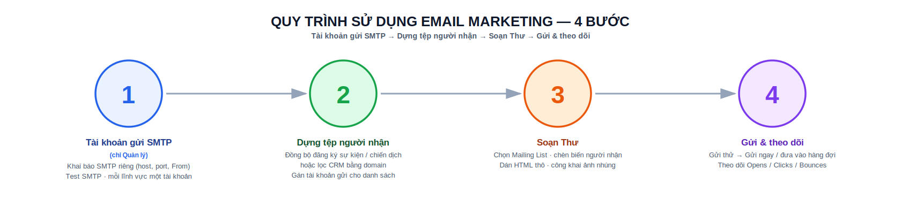
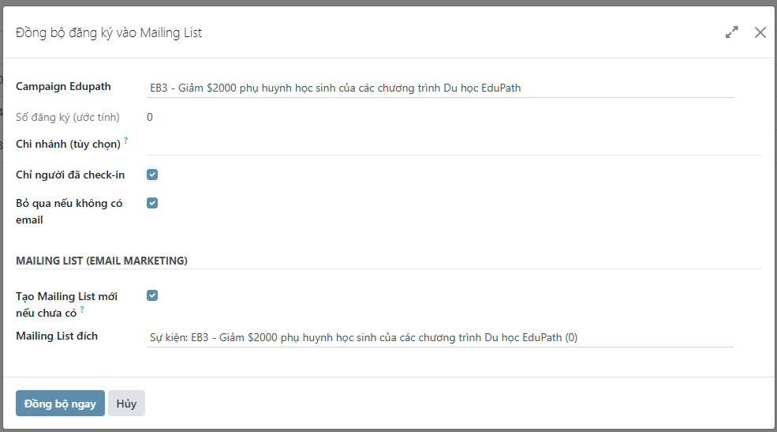
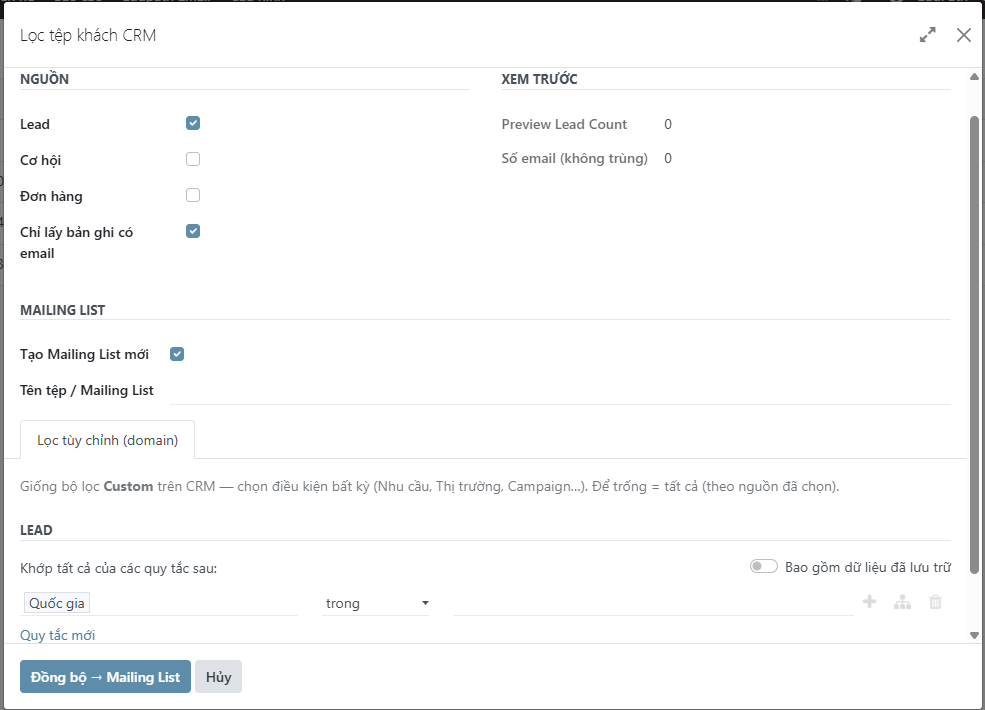
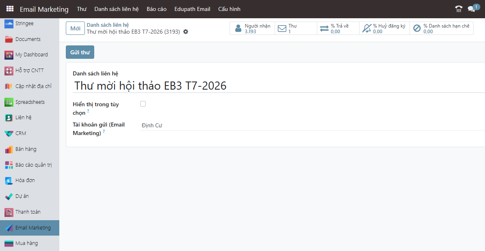
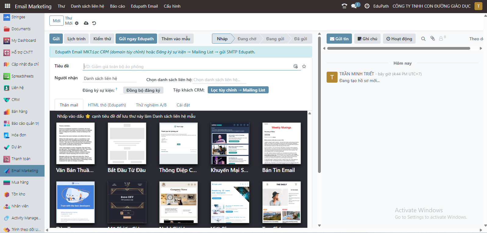
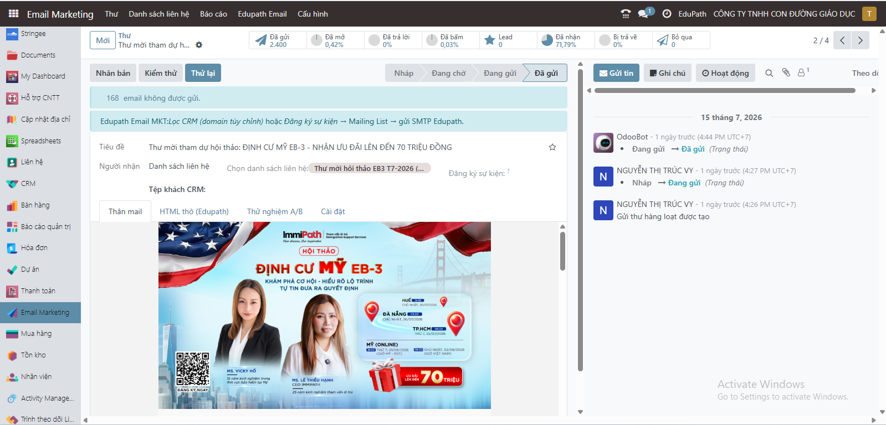

# Email marketing

Edupath dùng module **Email Marketing Edupath** (`Edupath_Email_Marketing`) — mở rộng app *Email Marketing* của Odoo — để gửi email chăm sóc/quảng bá qua **SMTP riêng**, **tách hoàn toàn** khỏi mail của CRM / báo giá / hệ thống. Luồng chuẩn: **dựng tệp người nhận → gán tài khoản gửi → soạn Thư → gửi & theo dõi**.

## Quy trình xử lý

{ .doc-screenshot-full .doc-center }

Thực hiện lần lượt 4 bước dưới đây; bấm số bước để xem hướng dẫn chi tiết:

- **① [Tài khoản gửi SMTP](#1-tai-khoan-gui-smtp-quan-ly)** *(chỉ Quản lý)* — khai báo SMTP riêng, Test kết nối; mỗi lĩnh vực (Định cư, Du học, Anh Ngữ, F&B…) một tài khoản.
- **② [Dựng tệp người nhận](#2-dung-tep-nguoi-nhan-mailing-list)** — đồng bộ đăng ký sự kiện/chiến dịch hoặc lọc CRM bằng domain, rồi gán tài khoản gửi cho danh sách.
- **③ [Soạn Thư](#3-soan-thu)** — chọn Mailing List, chèn biến người nhận, dán HTML thô, công khai ảnh nhúng.
- **④ [Gửi & theo dõi](#4-gui-theo-doi)** — gửi thử → gửi ngay / đưa vào hàng đợi, rồi theo dõi Opens / Clicks / Bounces.

!!! info "Đường dẫn menu"
    App được đổi tên thành **Email Marketing**. Các chức năng riêng của Edupath nằm trong cụm **Email Marketing › Edupath Email**. Việc soạn Thư và quản lý danh sách vẫn dùng menu chuẩn **Mailings** và **Mailing Lists**.

!!! abstract "4 bước sử dụng"
    1. (Quản lý) Khai báo **tài khoản gửi SMTP** → [Bước 1](#1-tai-khoan-gui-smtp-quan-ly)
    2. Dựng **tệp người nhận** (Mailing List) từ đăng ký sự kiện hoặc lọc CRM → [Bước 2](#2-dung-tep-nguoi-nhan-mailing-list)
    3. **Soạn Thư** và chèn biến người nhận → [Bước 3](#3-soan-thu)
    4. **Gửi & theo dõi** → [Bước 4](#4-gui-theo-doi)

---

## 1. Tài khoản gửi SMTP (Quản lý)

**Email Marketing › Edupath Email › SMTP Email Marketing** *(chỉ nhóm Quản lý thấy menu này).*

Mỗi tài khoản gửi tương ứng một domain/hộp thư riêng (ví dụ mỗi lĩnh vực **Định cư, Du học, Anh Ngữ, F&B** một tài khoản). Tạo mới và điền:

| Trường | Ý nghĩa |
|--------|---------|
| **Tên** | Tên gợi nhớ (ví dụ *Du học*) |
| **Gửi từ (From)** *(bắt buộc)* | Địa chỉ hiển thị khi gửi. Nên dùng domain đã cấu hình **SPF/DKIM/DMARC**. |
| Reply-To | Tuỳ chọn (hiện chỉ lưu tham khảo) |
| **SMTP Server / Port / Mã hoá / Username / Password** | Thông tin kết nối hộp thư. Port mặc định **587**, mã hoá **TLS (STARTTLS)**. *Password chỉ Quản lý xem/sửa.* |
| **Chỉ dùng cho Email Marketing** | Bật (mặc định): mọi Thư dùng SMTP này; mail CRM/báo giá/hệ thống vẫn dùng server mặc định. |
| **Tài khoản mặc định** | Dùng cho Thư chưa gắn danh sách nào. Mỗi công ty **chỉ một** tài khoản mặc định. |

Sau đó bấm **Test SMTP** để kiểm tra kết nối (kết quả lưu ở *Lần test gần nhất*). Khi lưu, hệ thống **tự tạo Outgoing Mail Server** `[Edupath] <tên>` tương ứng — xem nhanh bằng nút **Xem Mail Server Odoo**.

!!! tip "Nhiều tài khoản gửi theo lĩnh vực"
    Tạo nhiều tài khoản SMTP, rồi vào từng **Mailing List** gán ô **Tài khoản gửi (Email Marketing)**. Thư gửi cho danh sách nào sẽ tự dùng đúng tài khoản/domain của danh sách đó (xem [Bước 2.3](#23-gan-tai-khoan-gui-cho-danh-sach)).

!!! warning "Cách ly với mail hệ thống"
    Tài khoản SMTP Edupath chỉ nhận **đúng địa chỉ From** đã khai (không phải cả `@domain`), nên **không chiếm** email CRM/hệ thống cùng domain. Nếu đổi domain gửi, hãy Test lại để chắc chắn.

---

## 2. Dựng tệp người nhận (Mailing List)

Có **hai cách** đổ người nhận vào một Mailing List. Cả hai đều **chuẩn hoá email, khử trùng, và tự loại email đã nằm trong Blacklist** — nên số liên hệ trong danh sách xấp xỉ số thực gửi được.

### 2.1 Từ người đăng ký sự kiện / chiến dịch

**Email Marketing › Edupath Email › Đăng ký → Mailing List** *(hoặc nút **Đăng ký → Mailing List** trên form Chiến dịch, và nút **Đồng bộ đăng ký** trên form Thư).*

1. Chọn **Campaign Edupath** (danh sách chỉ hiện campaign thủ công, bỏ campaign tự động).
2. Tuỳ chọn: **Chi nhánh** (VP tư vấn), **Chỉ người đã check-in**, **Bỏ qua nếu không có email**.
3. Xem **Số đăng ký (ước tính)**. Để trống Mailing List → hệ thống tự tạo list tên **`Sự kiện: <campaign>`**.
4. Bấm **Đồng bộ ngay**. Kết quả báo số **tạo mới / cập nhật / bỏ qua** và mở danh sách liên hệ.

{ .doc-screenshot .doc-center }

### 2.2 Lọc khách CRM bằng bộ lọc domain

**Email Marketing › Edupath Email › Lọc CRM → Email MKT** *(hoặc nút **Lọc tùy chỉnh → Mailing List** trên form Thư).*

1. Chọn **một hoặc nhiều nguồn**: **Lead**, **Cơ hội**, **Đơn hàng**. Bật **Chỉ lấy bản ghi có email** nếu cần.
2. Với mỗi nguồn, dùng **ô lọc (domain)** — **giống bộ lọc *Custom* trên CRM** — để đặt điều kiện bất kỳ (Nhu cầu, Thị trường, Chương trình, Giai đoạn, Nguồn KH, Team, Trạng thái đơn, ngày đặt hàng…). Để trống ô = lấy **tất cả** bản ghi của nguồn đó.
3. Xem **Xem trước**: số Lead / Cơ hội / Đơn hàng và **số email không trùng**.
4. Chọn đích: **Tạo Mailing List mới** (nhập tên) hoặc chọn **Mailing List đích** có sẵn để cộng thêm.
5. Bấm **Đồng bộ → Mailing List**.

{ .doc-screenshot .doc-center }

!!! note "Email lấy từ đâu"
    - **Lead / Cơ hội:** lấy email hợp lệ đầu tiên theo thứ tự *Email chính → Email liên hệ → Email người đại diện → Email đối tác*.
    - **Đơn hàng:** lấy email của đối tác (khách hàng).

### 2.3 Gán tài khoản gửi cho danh sách

Mở **Mailing List** cần gửi, đặt ô **Tài khoản gửi (Email Marketing)** = tài khoản SMTP tương ứng lĩnh vực. Bỏ trống = dùng **tài khoản mặc định**.

{ .doc-screenshot-crm .doc-center }

---

## 3. Soạn Thư

**Email Marketing › Mailings › Mới.**

{ .doc-screenshot-crm .doc-center }

1. Nhập **Chủ đề (Subject)**.
2. Ở **Recipients**, chọn **Mailing List** đã dựng ở Bước 2. Hệ thống **tự chọn tài khoản gửi** theo danh sách (danh sách đầu tiên có gắn tài khoản; nếu không có → tài khoản mặc định).
3. Thiết kế nội dung. Hai công cụ hỗ trợ của Edupath:
    - **Chèn biến người nhận:** trong trình soạn thảo gõ `/` → nhóm **Marketing Tools** → *Chèn tên người nhận*, *Chèn email người nhận*, *Chèn lời chào mẫu* (“Kính chào …,”), *Chèn username email*, *Chèn tên + email*. Biến có sẵn văn bản dự phòng **“Anh/Chị”** khi thiếu tên.
    - **Dán HTML thô** (tab **HTML thô (Edupath)**): dùng khi trình soạn thảo trực quan làm **vỡ bố cục** (chữ rớt từng ký tự). Dán HTML chuẩn email (table + CSS inline) vào ô, bấm **Áp dụng HTML → Body**. Sau khi áp dụng, **đừng mở lại trình soạn thảo trực quan**.

!!! tip "Ảnh trong email"
    Ảnh chèn vào thân email được **tự công khai** ngay trước khi gửi để người nhận (chưa đăng nhập) xem được. Yêu cầu hệ thống đang chạy trên **tên miền công khai** (không phải `localhost`).

---

## 4. Gửi & theo dõi

- **Gửi thử:** bấm **Gửi thử**, nhập email nội bộ để xem trước (đã áp đúng SMTP Edupath và công khai ảnh).
- **Gửi ngay:** bấm **Gửi ngay Edupath** để đẩy Thư đi **không phải chờ cron**. Hoặc **Đưa vào hàng đợi** rồi để hệ thống gửi tự động.
- **Tự động:** hai tác vụ nền chạy **mỗi 5 phút** xử lý hàng đợi và gửi mail của các Thư dùng SMTP Edupath.
- **Theo dõi:** sau khi gửi, xem thống kê **Opens / Clicks / Bounces** trên Thư.

{ .doc-screenshot-crm .doc-center }

!!! warning "Thư không có người nhận sẽ bị chặn"
    Nếu Mailing List chưa có liên hệ nào có email, hệ thống **không cho gửi** và nhắc dùng *Đăng ký → Mailing List* hoặc thêm liên hệ thủ công. (Một danh sách rỗng chỉ là cái “nhãn”.)

---

## 5. Nguồn Email Marketing tách khỏi CRM

Các **Nguồn (UTM Source)** do chiến dịch Email Marketing sinh ra được đánh dấu riêng và **ẩn khỏi** danh sách *Nguồn* của CRM cũng như mọi ô chọn Nguồn trên form (Lead, Cơ hội, Liên hệ/KH, Booking, Đơn bán). Nhờ đó báo cáo nguồn khách của CRM **không bị lẫn** với nguồn do gửi mail hàng loạt tạo ra — bạn không cần thao tác gì thêm.

---

!!! danger "Tuân thủ khi gửi email"
    Chỉ gửi cho người **đã đồng ý nhận**; luôn có link **huỷ đăng ký (unsubscribe)**; nội dung phải rõ người gửi. Gửi sai đối tượng dễ bị đánh dấu **spam**, ảnh hưởng uy tín toàn bộ domain.

!!! note "Ladiflow"
    Tích hợp Ladiflow **mặc định tắt** và **ẩn menu**. Luồng chuẩn ở trên chạy hoàn toàn trong Odoo, không cần Ladiflow.

*Chi tiết kỹ thuật (model, cron, phân quyền, hook…) xem đặc tả chức năng: [3 · Email Marketing Edupath](../functional/edupath-email-marketing.md).*
