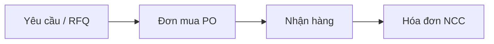

# Mua hàng

Module **Purchase** quản lý yêu cầu mua, đơn đặt hàng nhà cung cấp (PO) và nhận hàng vào kho.

## Quy trình

## Cài đặt

1. **Cài đặt › Ứng dụng › Purchase** — Cài
2. **Mua hàng › Cấu hình › Cài đặt** — bật **Purchase Agreements**, **Warnings** nếu cần

## Tài liệu liên quan

- [Nhà cung cấp](nha-cung-cap.md)
- [Đơn mua](don-mua.md)
- [Nhận hàng](nhan-hang.md)
