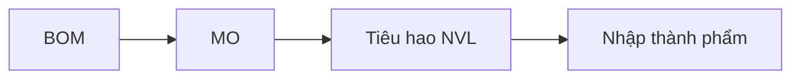

# Sản xuất (MRP)

**Manufacturing** — lệnh sản xuất, BOM, lập kế hoạch và tiêu hao nguyên vật liệu.

## Cài đặt

**Cài đặt › Manufacturing** — kèm **Inventory**, **Purchase** nếu mua NVL.

## Quy trình

## Mục lục

- [Định mức BOM](bom.md)
- [Lệnh sản xuất](lenh-san-xuat.md)
