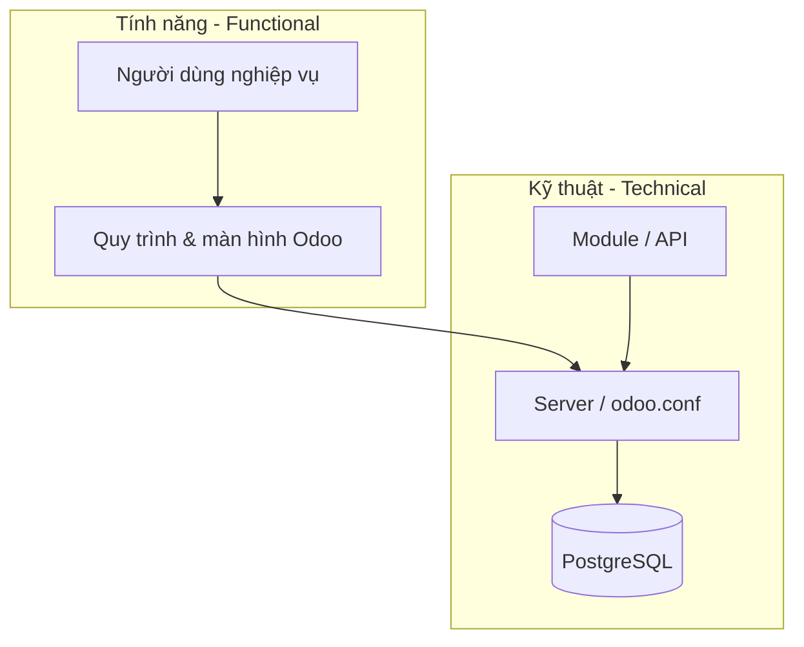

# Kỹ thuật (Technical)

Phần **Technical** dành cho **IT, quản trị hệ thống và developer**: triển khai, vận hành, database, module tùy chỉnh, tích hợp và bảo mật hạ tầng.

## Ai nên đọc phần này?

- **System admin** — server, backup, SSL
- **Odoo implementer** — cài module, nâng cấp, debug
- **Developer** — Python, XML, API

## Không nằm trong phần Technical

Hướng dẫn *“bấm nút nào để tạo báo giá”*, *“phê duyệt nghỉ phép”* → tab **[Tính năng (Functional)](../functional/index.md)**.

## Cấu trúc

| STT | Nhóm | Nội dung |
|-----|------|----------|
| I | [Tổng quan](tong-quan/kien-truc.md) | Kiến trúc Odoo, phiên bản, mô hình triển khai |
| II | [Cài đặt & vận hành](van-hanh/cai-dat-server.md) | Server, `odoo.conf`, khởi động, nâng cấp |
| III | [Cơ sở dữ liệu](database/postgresql.md) | PostgreSQL, backup |
| IV | [Module & mã nguồn](module/cau-truc-module.md) | Cấu trúc addon, developer mode |
| V | [Tích hợp & API](tich-hop/xml-rpc.md) | XML-RPC, REST, email gateway |
| VI | [Bảo mật kỹ thuật](bao-mat/quyen-ky-thuat.md) | Record rules, SSL, system parameters |

!!! danger "Môi trường production"
    Thao tác backup, nâng cấp, sửa database chỉ thực hiện trên bản **staging** trước, có kế hoạch rollback.
