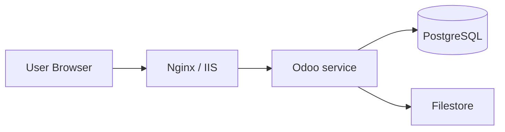

# Mô hình triển khai

## On-premise (tự host)

- **Reverse proxy** — SSL termination, static cache
- **Filestore** — thư mục `data/filestore/<db>` lưu attachment
- **PostgreSQL** — riêng server khuyến nghị production

## Odoo.sh

- Push Git → build → staging / production
- Không SSH sửa code trực tiếp trên production
- Backup tự động theo gói

## Odoo Online

- Không truy cập server
- Custom module hạn chế (Studio, approved apps)

## Môi trường khuyến nghị

| Môi trường | Mục đích |
|------------|----------|
| **Dev** | Lập trình, `-u module` thử nghiệm |
| **Staging** | UAT, clone data masked |
| **Production** | Người dùng thật |

!!! warning
    Không develop trực tiếp trên production. Không bật `dev_mode` trên production.

Xem: [Cài đặt server](../van-hanh/cai-dat-server.md)
